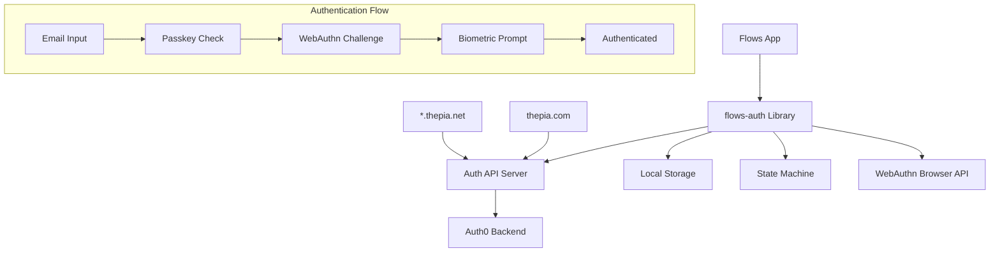

# Thepia Flows Authentication Documentation

**Comprehensive documentation for the @thepia/flows-auth library and authentication system**

## 📚 Documentation Overview

The Thepia authentication system implements a **passwordless-only, 100% cookie-free** approach using WebAuthn/passkeys with a unified backend serving both `thepia.com` and `thepia.net` domains. This library provides the complete authentication solution for Thepia Flows applications with zero privacy compliance concerns.

### **🚀 Quick Start**

- **[Getting Started](./GETTING_STARTED.md)** - Installation and basic setup
- **[Zero-Cookie Architecture](./privacy/zero-cookie-architecture.md)** - 🍪 **Cookie-free privacy advantage**
- **[Authentication Overview](./auth/README.md)** - Complete system overview
- **[Flows Integration](./flows/README.md)** - Flows-specific implementation guide

### **🔧 Core Documentation**

#### Authentication System
- **[Authentication Architecture](./auth/architecture.md)** - System design and components
- **[Authentication Flow](./auth/flow.md)** - Step-by-step authentication process
- **[State Management](./auth/state-management.md)** - Auth store and state machine
- **[API Reference](./auth/api-reference.md)** - Complete API documentation

#### Flows Integration
- **[Multi-Domain Strategy](./flows/multi-domain.md)** - thepia.com and thepia.net integration
- **[Deployment Guide](./flows/deployment.md)** - Production deployment for flows
- **[Security Model](./flows/security.md)** - Security architecture for flows

### **🛠️ Implementation Guides**

#### Components
- **[SignInForm Component](./components/signin-form.md)** - Main authentication component
- **[Auth Store Usage](./components/auth-store.md)** - State management integration
- **[Event Handling](./components/events.md)** - Authentication events and callbacks

#### Configuration
- **[Configuration Guide](./configuration/README.md)** - Complete configuration options
- **[Environment Setup](./configuration/environment.md)** - Environment variables and setup
- **[Domain Configuration](./configuration/domains.md)** - Multi-domain setup

### **🧪 Testing & Development**

- **[API Server Architecture](./development/api-server-architecture.md)** - Understanding the API server structure
- **[Testing Guide](./testing/README.md)** - Testing strategies and examples
- **[Development Setup](./development/README.md)** - Local development environment
- **[Troubleshooting](./troubleshooting/README.md)** - Common issues and solutions

## Key Features

### **Passwordless Authentication**
- ✅ **WebAuthn/Passkeys Only** - No traditional passwords supported
- ✅ **Biometric Authentication** - TouchID, FaceID, Windows Hello
- ✅ **Hardware Security Keys** - FIDO2 compatible devices
- ✅ **Magic Link Fallback** - Email-based authentication for unsupported devices

### **Multi-Domain Support**
- ✅ **Unified Backend** - Single API serves both thepia.com and thepia.net
- ✅ **Cross-Domain Sessions** - Seamless authentication across domains
- ✅ **Subdomain Support** - Works with all *.thepia.net subdomains
- ✅ **Employer Isolation** - Complete data segregation between organizations

### **Developer Experience**
- ✅ **Svelte Components** - Ready-to-use authentication UI
- ✅ **TypeScript Support** - Full type safety and IntelliSense
- ✅ **State Management** - Reactive stores with XState-inspired state machine
- ✅ **Event System** - Comprehensive event handling for auth flows

### **Security & Privacy**
- ✅ **Cookie-Free by Default** - Zero cookies in standard implementation
- ✅ **Enterprise Flexible** - Additional auth methods when required by customers
- ✅ **GDPR Compliant** - Privacy-by-design architecture
- ✅ **Zero-Knowledge** - No biometric data transmitted
- ✅ **Phishing Resistant** - WebAuthn prevents credential theft
- ✅ **Device-Bound** - Credentials tied to specific devices
- ✅ **Browser Storage First** - Session data stays under user control

## Architecture Overview



## Current Implementation Status

### **✅ Implemented**
- Complete passwordless authentication flow
- WebAuthn/passkey support with conditional mediation
- Magic link fallback for unsupported devices
- Multi-domain authentication (thepia.com + thepia.net)
- State machine-based auth flow management
- Comprehensive error handling and reporting
- TypeScript support with full type definitions

### **🔄 In Progress**
- Enhanced documentation and examples
- Additional testing coverage
- Performance optimizations

### **📋 Planned**
- Additional authentication methods (if needed)
- Enhanced developer tools
- Advanced security features

## Quick Reference

### Installation
```bash
pnpm add @thepia/flows-auth
```

### Basic Usage
```svelte
<script>
  import { SignInForm, createAuthStore } from '@thepia/flows-auth';
  
  const authStore = createAuthStore({
    apiBaseUrl: 'https://api.thepia.com',
    enablePasskeys: true,
    enableMagicLinks: true
  });
</script>

<SignInForm 
  config={authConfig}
  on:success={handleAuthSuccess}
  on:error={handleAuthError}
/>
```

### Configuration
```javascript
const config = {
  apiBaseUrl: 'https://api.thepia.com',
  enablePasskeys: true,
  enableMagicLinks: true,
  domain: 'thepia.net' // or 'thepia.com'
};
```

---

For detailed implementation guides, see the specific documentation sections. For questions or issues, refer to the [Troubleshooting Guide](./troubleshooting/README.md) or check the [GitHub Issues](https://github.com/thepia/flows-auth/issues).
