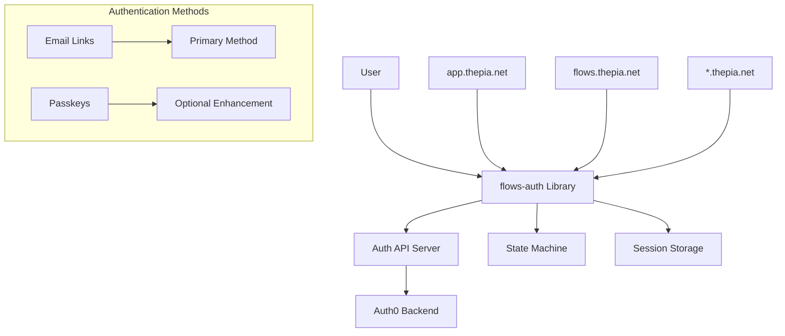

# Thepia Flows Authentication Documentation

**Documentation for the @thepia/flows-auth library - Email-first authentication with optional passkey enhancement**

## Overview

The Thepia authentication system is designed around **two primary user scenarios**:

1. **Individual Registration** (`app.thepia.net`) - Public self-service registration with mandatory email verification
2. **Invitation-Based Registration** (`flows.thepia.net` + subdomains) - Private invitation-only access with pre-verified emails

Both scenarios use:
- **Email Links** (magic links) as the primary authentication method
- **Passkeys** (WebAuthn) as an optional enhancement for security and convenience

## Quick Start

### Essential Documentation

- **[Authentication System](./auth/README.md)** - START HERE - Complete system specification and scenarios
- **[Framework Integration](./integrations/README.md)** - **ESSENTIAL** - Svelte, SvelteKit, Astro integration patterns
- **[ADR 0004: Svelte Store Architecture](./adr/0004-global-svelte-store-architecture.md)** - **AUTHORITY** - Context vs props patterns
- **[Authentication State Machine](./auth/authentication-state-machine.md)** - State flow for both scenarios
- **[Getting Started](./GETTING_STARTED.md)** - Installation and basic setup
- **[Internationalization (i18n)](./i18n/README.md)** - **NEW** - Translation system and multi-platform support
- **[API Integration Status](./auth/api-integration-status.md)** - Current implementation status

### Core Documentation

#### Authentication
- **[Authentication System](./auth/README.md)** - Two scenarios, methods, and requirements
- **[State Machine](./auth/authentication-state-machine.md)** - Complete state flow specification
- **[API Integration](./auth/api-integration-status.md)** - Implementation status and token handling

#### Components
- **[SignInForm Component](./components/README.md)** - Main authentication UI component
- **[AccountCreationForm](./components/AccountCreationForm.md)** - Registration component
- **[Component Architecture](./components/ARCHITECTURE_PATTERNS.md)** - Design patterns

#### Configuration
- **[Storage Configuration](./STORAGE_CONFIGURATION.md)** - Session and token storage
- **[Session Management](./SESSION_MANAGEMENT_REQUIREMENTS.md)** - Session handling requirements

#### Internationalization
- **[i18n Guide](./i18n/README.md)** - **NEW** - Translation system using Paraglide JS with dot notation

#### Testing
- **[Testing Strategy](./testing/README.md)** - Overall testing approach
- **[API Contract Testing](./testing/API_CONTRACT_TESTING_POLICY.md)** - No-mocking integration test policy
- **[API Contracts](./testing/thepia-com-api-contracts/)** - Backend API specifications

#### Development
- **[Development Setup](./development/README.md)** - Local development environment
- **[API Server Architecture](./development/api-server-architecture.md)** - Backend structure
- **[Error Reporting](./development/error-reporting-principles.md)** - Error handling patterns
- **[Svelte 5 Migration Plan](./SVELTE_5_MIGRATION_PLAN.md)** - Framework upgrade strategy

## Key Features

### Email-First Authentication

- ✅ **Magic Links Primary** - Email-based authentication as foundation
- ✅ **Universal Compatibility** - Works on all devices and browsers
- ✅ **Passkey Enhancement** - Optional WebAuthn for convenience
- ✅ **Scenario-Driven** - Tailored flows for each use case

Since most devices support passkeys, but logins should be with passkeys ranther than e-mail.

### Multi-Domain Support
- ✅ **app.thepia.net** - Individual registration with email verification
- ✅ **flows.thepia.net** - Invitation-based access with pre-verified emails
- ✅ **Client Subdomains** - Isolated instances for each client
- ✅ **Domain Isolation** - Separate sessions and passkeys per domain

### Security & Privacy
- ✅ **Email Verification** - Mandatory for public registration
- ✅ **Invitation Tokens** - Cryptographic proof of email ownership
- ✅ **Cookie-Free** - Privacy-compliant session management
- ✅ **Rate Limiting** - Protection against abuse

## Architecture



## Implementation Status

### ✅ Implemented
- Email verification flow for individual registration
- WebAuthn/passkey registration and authentication
- State machine for scenario routing
- User existence checking with verification status

### ⚠️ In Progress
- Magic link email authentication endpoints
- Invitation token validation and registration
- Proper JWT token generation (currently placeholder)

### 📋 Planned
- Enhanced error recovery flows
- Multi-device passkey management
- Session synchronization across tabs

## Installation

```bash
pnpm add @thepia/flows-auth
```

## Basic Usage

```svelte
<script>
  import { createAuthStore, SignInForm } from '@thepia/flows-auth';
  
  const authStore = createAuthStore({
    apiBaseUrl: 'https://api.thepia.com',
    clientId: 'your-client-id',
    enablePasskeys: true,
    enableMagicLinks: false,
    domain: 'app.thepia.net' // or 'flows.thepia.net'
  });

  // React to authentication state
  $: isAuthenticated = $authStore.state === 'authenticated';
  $: currentUser = $authStore.user;

  function handleAuthSuccess(event) {
    console.log('Authentication successful:', event.detail);
  }

  function handleAuthError(event) {
    console.error('Authentication error:', event.detail);
  }
</script>

{#if isAuthenticated}
  <h1>Welcome, {currentUser?.name || currentUser?.email}!</h1>
  <button on:click={() => authStore.signOut()}>Sign Out</button>
{:else}
  <SignInForm 
    {authStore}
    on:success={handleAuthSuccess}
    on:error={handleAuthError}
  />
{/if}
```

## Testing

The library follows a strict **no-mocking policy** for integration tests. All tests must run against real backend services.

```bash
# Run all tests
pnpm test

# Unit tests only (mocking allowed)
pnpm test:unit

# Integration tests (no mocking)
pnpm test:integration
```

## Contributing

When updating the authentication system:

1. **Start with Scenarios**: Ensure changes align with the two primary scenarios
2. **Update State Machine**: Modify state flow if needed
3. **Document API Changes**: Update API integration status
4. **Test Both Scenarios**: Verify individual and invitation flows work
5. **No Breaking Changes**: Maintain backward compatibility

## Support

For questions or issues:
- Review the [Authentication System documentation](./auth/README.md)
- Check the [API Integration Status](./auth/api-integration-status.md)
- File issues in the GitHub repository

---

This library implements email-first authentication with optional passkey enhancement, supporting both public registration and private invitation-based access patterns.