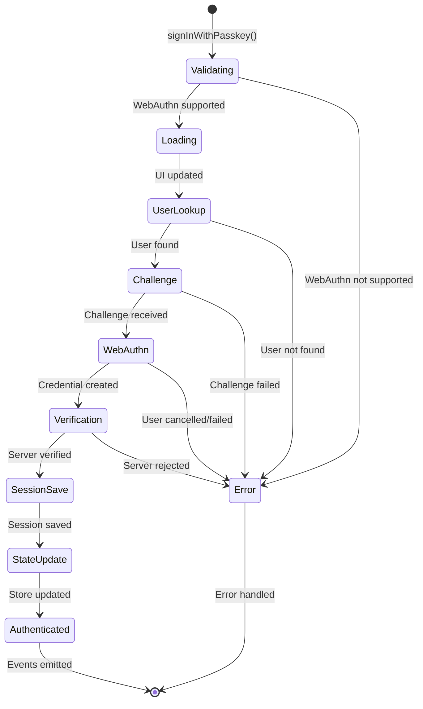

# signInWithPasskey API Documentation

## Overview

The `signInWithPasskey` method authenticates a user using WebAuthn passkeys and manages the complete authentication flow including session management, state updates, and event emission.

## Method Signature

```typescript
async function signInWithPasskey(email: string, conditional?: boolean): Promise<SignInResponse>
```

## Parameters

### `email: string` (Required)
- **Description**: User's email address for authentication
- **Validation**: Must be a valid email format
- **Example**: `"user@example.com"`

### `conditional: boolean` (Optional)
- **Description**: Whether this is a conditional authentication (background/silent)
- **Default**: `false`
- **Behavior**: 
  - `false`: Shows loading state, emits events, reports analytics
  - `true`: Silent authentication, minimal UI updates

## Return Value

### `Promise<SignInResponse>`

```typescript
interface SignInResponse {
  step: SignInStep;
  user?: User;
  access_token?: string;
  refresh_token?: string;
  expires_in?: number;
  requiresPasskey?: boolean;
  requiresPassword?: boolean;
  magicLinkSent?: boolean;
  challengeId?: string;
}
```

## API Response Formats

The method handles two response formats from the backend:

### Format 1: New Format (Current)
```typescript
{
  success: true,
  tokens: {
    access_token: "webauthn-verified",  // Currently placeholder token
    refresh_token: "webauthn-verified", // Currently placeholder token
    expiresAt: number  // Unix timestamp
  },
  user: {
    id: string,
    email: string,
    name?: string,
    // ... other user fields
  }
}
```

### Format 2: Legacy Format (Backward Compatibility)
```typescript
{
  step: 'success',
  access_token: string,
  refresh_token: string,
  expires_in: number,  // Seconds from now
  user: {
    id: string,
    email: string,
    name?: string,
    // ... other user fields
  }
}
```

## Authentication Flow

### 1. Pre-Authentication
- Validates WebAuthn support
- Updates UI state (if not conditional)
- Emits `sign_in_started` event
- Reports analytics event

### 2. User Lookup
- Calls `api.checkEmail(email)` to get `userId`
- Validates user exists and has passkey credentials
- Throws error if user not found

### 3. Challenge Generation
- Calls `api.getPasskeyChallenge(email)` 
- Receives WebAuthn challenge options
- Validates challenge format

### 4. WebAuthn Authentication
- Calls `authenticateWithPasskey(challenge, conditional)`
- User interacts with passkey (biometric/PIN)
- Serializes credential response

### 5. Server Verification
- Calls `api.signInWithPasskey({userId, authResponse})`
- Makes request to `POST /auth/webauthn/verify` endpoint
- Server verifies credential and returns tokens (currently placeholder tokens)
- Handles response format normalization

### 6. Session Management
- Normalizes response to `SignInResponse` format
- Calls `saveAuthSession(normalizedResponse, 'passkey')`
- Session saved to configured storage (sessionStorage/localStorage)

### 7. State Updates
- Updates auth store state to `'authenticated'`
- Sets user, tokens, and expiration
- Schedules automatic token refresh

### 8. Event Emission
- Emits `sign_in_success` event
- Emits `passkey_used` event
- Reports success analytics

## State Transitions



## Error Conditions

### WebAuthn Not Supported
- **Condition**: `!isWebAuthnSupported()`
- **Action**: Throw error immediately
- **Message**: "Passkeys are not supported on this device"

### User Not Found
- **Condition**: `!userCheck.exists || !userCheck.userId`
- **Action**: Throw error
- **Message**: "User not found or missing userId"

### Challenge Failed
- **Condition**: API call to `/auth/webauthn/challenge` fails
- **Action**: Throw error with API message

### WebAuthn Failed
- **Condition**: User cancels or biometric fails
- **Action**: Throw error with WebAuthn message

### Server Verification Failed
- **Condition**: API call to `/auth/webauthn/verify` fails
- **Action**: Throw error with server message

### Invalid Response Format
- **Condition**: Response missing required fields
- **Action**: Log error, don't save session, don't update state

## Side Effects

### Session Storage
- Creates/updates session in configured storage
- Key: `'thepia_auth_session'`
- Format: `SignInData`

### Auth Store State
- Updates `state` to `'authenticated'`
- Sets `user`, `access_token`, `refresh_token`, `expiresAt`
- Clears any previous errors

### Events Emitted
- `sign_in_started` (if not conditional)
- `sign_in_success` (on success)
- `passkey_used` (on success)
- `sign_in_error` (on failure, if not conditional)

### Analytics
- Reports WebAuthn start/success/failure events
- Includes timing, user ID, and context

### Token Management
- Schedules automatic token refresh
- Sets up refresh timer based on expiration

## Dependencies

### Internal
- `api.checkEmail()` - User lookup
- `api.getPasskeyChallenge()` - Challenge generation  
- `api.signInWithPasskey()` - Server verification
- `saveAuthSession()` - Session management
- `updateState()` - Store updates
- `emit()` - Event emission

### External
- `authenticateWithPasskey()` - WebAuthn interaction
- `isWebAuthnSupported()` - Feature detection
- `serializeCredential()` - Credential formatting

## Configuration Dependencies

### Storage Configuration
- Respects `storageConfig.type` (sessionStorage/localStorage)
- Uses `storageConfig.sessionTimeout` for expiration

### Auth Configuration
- Uses `config.apiBaseUrl` for API calls
- Respects `config.enablePasskeys` flag

## Thread Safety

- Method is async and handles concurrent calls
- Session storage operations are atomic
- State updates are synchronous and consistent

## Performance Considerations

- WebAuthn operations can take 5-30 seconds
- Network calls for user lookup and verification
- Session storage operations are fast (< 1ms)
- State updates trigger reactive subscriptions
