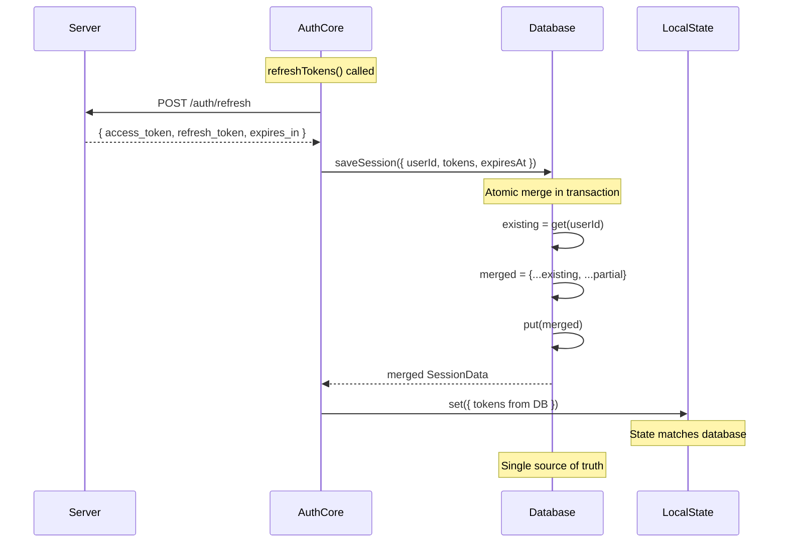

# Database as Single Source of Truth

**Status**: Proposed
**Date**: 2025-01-20
**Related**: ATOMIC_PARTIAL_UPDATES.md

## Core Principle

**Database is the authoritative source for session state. Application state is derived from database.**

```
Server API → Database → Application State
            (authority)   (derived view)
```

## Current Problem: Dual Sources of Truth

```typescript
refreshTokens: async () => {
  const response = await api.refreshToken();

  // Update local state directly
  set({
    access_token: response.access_token,
    refresh_token: response.refresh_token,
    expiresAt: Date.now() + response.expires_in * 1000
  });

  // Also save to database
  await db.saveSession({
    userId: user.id,
    accessToken: response.access_token,  // Duplicate data
    refreshToken: response.refresh_token,
    expiresAt: Date.now() + response.expires_in * 1000
  });

  // ❌ Problem: Two sources of truth
  // ❌ Problem: Can diverge if save fails
  // ❌ Problem: Other tabs don't know about update
}
```

## Proposed Solution: Database First

### Pattern 1: Write Then Read

```typescript
refreshTokens: async () => {
  // 1. Get new tokens from server
  const response = await api.refreshToken({
    refresh_token: get().refresh_token
  });

  // 2. Write to database (atomic partial update)
  await db.saveSession({
    userId: get().user.id,
    accessToken: response.access_token,
    refreshToken: response.refresh_token ?? get().refresh_token,
    expiresAt: Date.now() + response.expires_in * 1000,
    refreshedAt: Date.now()
  });

  // 3. Read back from database (get merged result)
  const session = await db.loadSession();

  // 4. Update local state from database
  set({
    access_token: session.accessToken,
    refresh_token: session.refreshToken,
    expiresAt: session.expiresAt,
    refreshedAt: session.refreshedAt,
    state: 'authenticated'
  });

  // ✅ Database is authoritative
  // ✅ Local state matches what's persisted
  // ✅ Other tabs can read same data
}
```

### Pattern 2: Write Returns Merged Result (Better)

**Change SessionPersistence to return merged session:**

```typescript
export interface SessionPersistence {
  /**
   * Save partial session data and return the complete merged session
   *
   * @returns The complete session after merging partial update
   */
  saveSession(
    partial: Partial<SessionData> & { userId: string }
  ): Promise<SessionData>;

  loadSession(): Promise<SessionData | null>;
  clearSession(): Promise<void>;

  // User methods unchanged
  saveUser(user: UserData): Promise<void>;
  getUser(userId?: string): Promise<UserData | null>;
  clearUser(userId?: string): Promise<void>;
}
```

**Implementation:**

```typescript
class IndexedDBAdapter implements SessionPersistence {
  async saveSession(
    partial: Partial<SessionData> & { userId: string }
  ): Promise<SessionData> {
    const db = await this.getDb();
    const tx = db.transaction('sessions', 'readwrite');
    const store = tx.objectStore('sessions');

    // Read existing session (in transaction = atomic)
    const existing = await store.get(partial.userId);

    // Merge partial update with existing
    const merged: SessionData = existing
      ? { ...existing, ...partial }
      : this.validateCompleteSession(partial);

    // Write merged result
    await store.put(merged);
    await tx.complete;

    // Return what was actually persisted
    return merged;
  }

  private validateCompleteSession(partial: any): SessionData {
    // Ensure all required fields present for new session
    if (!partial.email || !partial.accessToken) {
      throw new Error('Incomplete session data for new session');
    }
    return partial as SessionData;
  }
}
```

**Usage:**

```typescript
refreshTokens: async () => {
  const response = await api.refreshToken({
    refresh_token: get().refresh_token
  });

  // Write to DB, get merged result back
  const session = await db.saveSession({
    userId: get().user.id,
    accessToken: response.access_token,
    refreshToken: response.refresh_token ?? get().refresh_token,
    expiresAt: Date.now() + response.expires_in * 1000,
    refreshedAt: Date.now(),
    supabaseToken: response.supabase_token,
    supabaseExpiresAt: response.supabase_expires_at
      ? Date.now() + response.supabase_expires_at * 1000
      : undefined
  });

  // Update local state from database's merged result
  set({
    access_token: session.accessToken,
    refresh_token: session.refreshToken,
    expiresAt: session.expiresAt,
    refreshedAt: session.refreshedAt,
    supabase_token: session.supabaseToken,
    supabase_expires_at: session.supabaseExpiresAt,
    state: 'authenticated'
  });

  // ✅ Single operation
  // ✅ Guaranteed consistency
  // ✅ Database is source of truth
}
```

## Benefits

### 1. Single Source of Truth

```typescript
// Before: Two separate updates
set({ access_token: newToken });          // State source #1
await db.saveSession({ accessToken });    // State source #2
// Can diverge if save fails or partial

// After: Database is authoritative
const session = await db.saveSession({ accessToken: newToken });
set({ access_token: session.accessToken });  // Derived from DB
```

### 2. Atomic Operations

```typescript
// Database handles atomicity
async saveSession(partial) {
  const tx = db.transaction('sessions', 'readwrite');

  // All of this is atomic:
  const existing = await tx.objectStore('sessions').get(userId);
  const merged = { ...existing, ...partial };
  await tx.objectStore('sessions').put(merged);

  return merged;  // Guaranteed to be what was written
}
```

### 3. Cross-Tab Consistency

```typescript
// Tab A refreshes tokens
const session = await db.saveSession({ accessToken: 'new' });
set({ access_token: session.accessToken });

// Tab B can read the same data
const session = await db.loadSession();
// Gets 'new' token that Tab A wrote
```

### 4. Recovery from Failures

```typescript
// If app state gets corrupted somehow
if (get().access_token !== expectedToken) {
  // Reload from database (source of truth)
  const session = await db.loadSession();
  set({
    access_token: session.accessToken,
    refresh_token: session.refreshToken,
    expiresAt: session.expiresAt
  });
}
```

## Implementation Pattern

### Core Principle

**All state mutations follow this pattern:**

```typescript
1. Receive data (from API, user input, etc.)
2. Write to database (with partial update)
3. Read result from database
4. Update local state from database result
```

### Examples

#### Token Refresh

```typescript
refreshTokens: async () => {
  // 1. Get data from server
  const response = await api.refreshToken({ refresh_token: get().refresh_token });

  // 2. Write to database
  const session = await db.saveSession({
    userId: get().user.id,
    accessToken: response.access_token,
    refreshToken: response.refresh_token ?? get().refresh_token,
    expiresAt: Date.now() + response.expires_in * 1000
  });

  // 3. Update local state from database
  set({
    access_token: session.accessToken,
    refresh_token: session.refreshToken,
    expiresAt: session.expiresAt,
    state: 'authenticated'
  });

  // 4. Schedule next refresh
  scheduleTokenRefresh(get, refreshTimeout, config.refreshBefore);
}
```

#### User Profile Update

```typescript
updateUserProfile: async (updates: Partial<UserData>) => {
  // 1. Save to database
  await db.saveUser({
    userId: get().user.id,
    ...updates
  });

  // 2. Read back user data
  const user = await db.getUser(get().user.id);

  // 3. Update local state
  set({
    user: {
      ...get().user,
      name: user.name,
      avatar: user.avatar,
      emailVerified: user.emailVerified
    }
  });
}
```

#### Sign In

```typescript
signIn: async (credentials) => {
  // 1. Authenticate with server
  const response = await api.signIn(credentials);

  // 2. Write session to database
  const session = await db.saveSession({
    userId: response.user.id,
    email: response.user.email,
    name: response.user.name,
    accessToken: response.access_token,
    refreshToken: response.refresh_token,
    expiresAt: Date.now() + response.expires_in * 1000,
    refreshedAt: Date.now(),
    authMethod: 'email-code'
  });

  // 3. Save user profile
  await db.saveUser({
    userId: response.user.id,
    email: response.user.email,
    name: response.user.name,
    emailVerified: response.user.emailVerified,
    createdAt: response.user.createdAt
  });

  // 4. Update local state from database
  const user = await db.getUser(response.user.id);
  set({
    user: {
      id: user.userId,
      email: user.email,
      name: user.name,
      emailVerified: user.emailVerified,
      createdAt: user.createdAt
    },
    access_token: session.accessToken,
    refresh_token: session.refreshToken,
    expiresAt: session.expiresAt,
    state: 'authenticated'
  });
}
```

## Migration Strategy

### Phase 1: Change SessionPersistence Interface

```typescript
// Update interface to return SessionData
export interface SessionPersistence {
  saveSession(
    partial: Partial<SessionData> & { userId: string }
  ): Promise<SessionData>;  // Changed from Promise<void>
}
```

### Phase 2: Update Database Adapters

```typescript
// IndexedDB, localStorage, Service Worker adapters
// All must return merged session
async saveSession(partial): Promise<SessionData> {
  // ... merge logic ...
  return merged;
}
```

### Phase 3: Update Auth Core Methods

```typescript
// Change all methods to use write-then-derive pattern
updateTokens: async (tokens) => {
  const session = await db.saveSession({ userId, ...tokens });
  set({ access_token: session.accessToken, ... });
}
```

### Phase 4: Remove Stale Token Guard (Optional)

```typescript
// No longer needed - database handles atomicity
// But keep as defense in depth
```

## Testing

```typescript
it('should derive local state from database after refresh', async () => {
  // Setup initial state
  const store = createAuthStore(config);

  // Mock API to return new tokens
  mockApi.refreshToken.mockResolvedValue({
    access_token: 'new-token',
    refresh_token: 'new-refresh',
    expires_in: 900
  });

  // Refresh tokens
  await store.refreshTokens();

  // Verify local state matches database
  const dbSession = await db.loadSession();
  const localState = store.core.getState();

  expect(localState.access_token).toBe(dbSession.accessToken);
  expect(localState.refresh_token).toBe(dbSession.refreshToken);
  expect(localState.expiresAt).toBe(dbSession.expiresAt);
});

it('should handle partial updates atomically', async () => {
  // Write token update
  const session1 = await db.saveSession({
    userId: 'u1',
    accessToken: 'token-1'
  });

  // Write user update
  const session2 = await db.saveSession({
    userId: 'u1',
    name: 'New Name'
  });

  // Both updates should be present
  expect(session2.accessToken).toBe('token-1');
  expect(session2.name).toBe('New Name');
});
```

## Complete Flow Diagram



## Success Criteria

✅ Database is single source of truth
✅ All state updates go through database first
✅ Local state is always derived from database
✅ Atomic operations at database layer
✅ No state divergence between app and DB
✅ Cross-tab consistency guaranteed

## Related Documents

- [ATOMIC_PARTIAL_UPDATES.md](./ATOMIC_PARTIAL_UPDATES.md)
- [SESSION_SYNC_STRATEGY.md](./SESSION_SYNC_STRATEGY.md)
- [STALE_TOKEN_GUARD.md](./STALE_TOKEN_GUARD.md)
