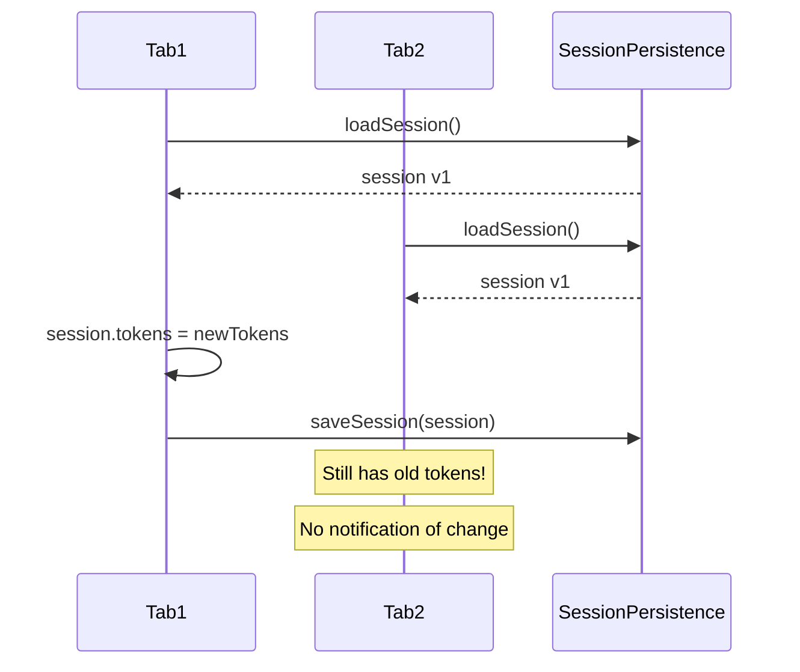
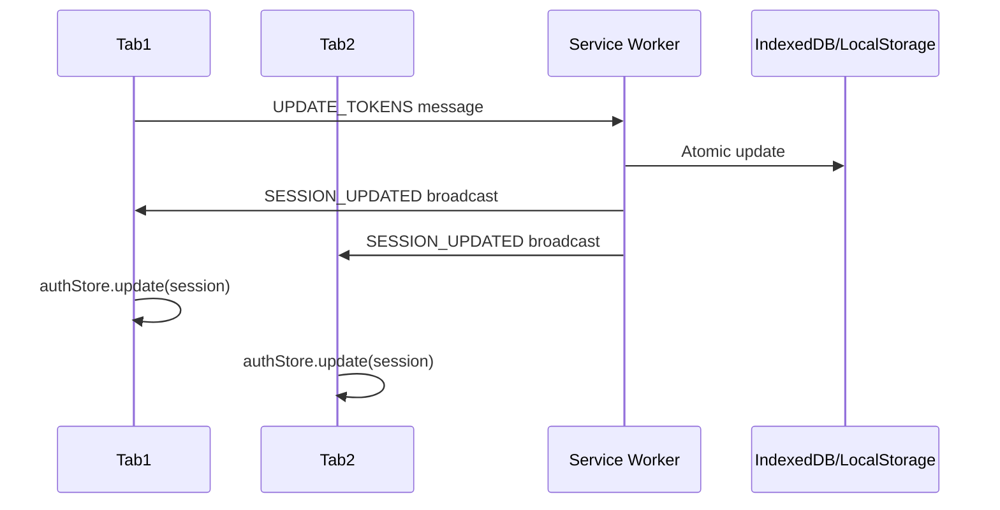

# Session Synchronization Strategy

**Status**: Proposal
**Created**: 2025-01-20
**Problem**: Race conditions and cross-tab sync issues with SessionData

## Problem Statement

### Issue 1: Read-Modify-Write Race Conditions

Current pattern in [auth-core.ts:326](../../src/stores/core/auth-core.ts#L326):

```typescript
// UNSAFE: Read-modify-write creates race window
const session = await db.loadSession();  // Read
session.tokens = newTokens;              // Modify
await db.saveSession(session);           // Write (may overwrite concurrent changes)
```

**Race scenario**:
1. Tab A reads session at T0
2. Tab B reads session at T1
3. Tab A modifies tokens, writes at T2
4. Tab B modifies user, writes at T3 → **overwrites Tab A's token update**

### Issue 2: No Cross-Tab Synchronization

- Service Worker updates SessionData via postMessage
- Other tabs don't receive notifications of changes
- Each tab has stale auth state until manual reload
- User can be signed out in one tab but appear signed in another

### Issue 3: Concurrent Token Refresh with Stale State ⚠️ CRITICAL

**This is the most dangerous scenario** - multiple tabs attempt token refresh simultaneously:

```typescript
// Tab A and Tab B both have tokens expiring at 10:00:00

// 10:00:01 - Tab A's refresh timer fires
Tab A: const token = get().refresh_token;  // "token_v1"
Tab A: POST /auth/refresh { refresh_token: "token_v1" }

// 10:00:02 - Tab B's timer also fires (before Tab A completes)
Tab B: const token = get().refresh_token;  // Still "token_v1" (stale!)
Tab B: POST /auth/refresh { refresh_token: "token_v1" }

// 10:00:03 - Tab A receives new tokens
Server → Tab A: { access_token: "new", refresh_token: "token_v2" }
Tab A: updateTokens("token_v2")
Tab A: saveSession() // Saves "token_v2"

// 10:00:04 - Tab B's request completes
Server → Tab B: ERROR 400 "Refresh token already used/exchanged"
Tab B: signOut() // User gets signed out ❌

// 10:00:05 - Tab B finally receives broadcast (too late)
Tab B: Already signed out, session cleared ❌
```

**Why this happens:**
1. Each tab schedules its own refresh timer (`scheduleTokenRefresh`)
2. Timers fire concurrently across tabs (~same millisecond)
3. Each tab reads from its own local state via `get()`
4. First refresh invalidates the refresh token on server (token rotation)
5. Second refresh fails with "already exchanged" error
6. Tab with failed refresh signs user out

**Real-world impact:**
- User signed in with 3 tabs open
- All 3 tabs attempt refresh at same time
- 1 succeeds, 2 fail and sign out
- Inconsistent auth state across tabs
- Poor user experience

**Related test:** [tests/regression/token-refresh-server-omits-refresh-token.test.ts](../../tests/regression/token-refresh-server-omits-refresh-token.test.ts) validates single-tab refresh behavior, but doesn't cover concurrent multi-tab scenario.

## Current Architecture



## Proposed Solution: Atomic Operations + Event Broadcasting

### Architecture Overview

**Service Worker becomes authoritative state manager**:
- All session mutations go through SW
- SW performs atomic operations
- SW broadcasts changes to all tabs
- Tabs subscribe to session updates



### Implementation Strategy

#### Phase 1: Atomic Operation Messages

Define granular operations instead of full object writes:

```typescript
// src/types/service-worker-messages.ts
export type SessionOperation =
  | { type: 'UPDATE_TOKENS'; tokens: TokenPair; expiresAt: number }
  | { type: 'UPDATE_USER'; user: Partial<UserRecord> }
  | { type: 'UPDATE_ACTIVITY'; timestamp: number }
  | { type: 'CLEAR_SESSION' }
  | { type: 'SAVE_SESSION'; session: SessionData }; // Fallback for full writes

export interface SessionOperationRequest {
  operation: SessionOperation;
  requestId: string; // For correlating responses
}

export interface SessionOperationResponse {
  requestId: string;
  success: boolean;
  session?: SessionData; // Return updated session
  error?: string;
}

export interface SessionBroadcast {
  type: 'SESSION_UPDATED';
  session: SessionData;
  operation: SessionOperation; // What changed
  timestamp: number;
}
```

#### Phase 2: Service Worker Session Manager

```typescript
// sw.ts or dedicated session-manager-sw.ts
class SessionManager {
  private async updateTokens(tokens: TokenPair, expiresAt: number): Promise<SessionData> {
    // Atomic: Read-modify-write in single transaction
    const session = await storage.getSession() || createEmptySession();

    session.tokens = tokens;
    session.expiresAt = expiresAt;
    session.version = (session.version || 0) + 1;

    await storage.saveSession(session);

    return session;
  }

  private async updateUser(updates: Partial<UserRecord>): Promise<SessionData> {
    const session = await storage.getSession();
    if (!session) throw new Error('No active session');

    session.userId = updates.id || session.userId;
    session.email = updates.email || session.email;
    session.name = updates.name || session.name;
    session.version = (session.version || 0) + 1;

    await storage.saveSession(session);

    return session;
  }

  async handleOperation(op: SessionOperation): Promise<SessionData> {
    let updatedSession: SessionData;

    switch (op.type) {
      case 'UPDATE_TOKENS':
        updatedSession = await this.updateTokens(op.tokens, op.expiresAt);
        break;
      case 'UPDATE_USER':
        updatedSession = await this.updateUser(op.user);
        break;
      case 'UPDATE_ACTIVITY':
        updatedSession = await this.updateActivity(op.timestamp);
        break;
      case 'CLEAR_SESSION':
        await storage.clearSession();
        updatedSession = null;
        break;
      case 'SAVE_SESSION':
        // Fallback for full session writes
        await storage.saveSession(op.session);
        updatedSession = op.session;
        break;
    }

    // Broadcast to all tabs
    await this.broadcastSessionUpdate(updatedSession, op);

    return updatedSession;
  }

  private async broadcastSessionUpdate(session: SessionData, operation: SessionOperation) {
    const clients = await self.clients.matchAll({ type: 'window' });

    const broadcast: SessionBroadcast = {
      type: 'SESSION_UPDATED',
      session,
      operation,
      timestamp: Date.now()
    };

    for (const client of clients) {
      client.postMessage(broadcast);
    }
  }
}

// Message handler in SW
self.addEventListener('message', async (event) => {
  if (event.data.type === 'SESSION_OPERATION') {
    const request: SessionOperationRequest = event.data;

    try {
      const session = await sessionManager.handleOperation(request.operation);

      const response: SessionOperationResponse = {
        requestId: request.requestId,
        success: true,
        session
      };

      event.ports[0]?.postMessage(response);
    } catch (error) {
      const response: SessionOperationResponse = {
        requestId: request.requestId,
        success: false,
        error: error.message
      };

      event.ports[0]?.postMessage(response);
    }
  }
});
```

#### Phase 3: Client-Side Session Bridge

```typescript
// src/utils/session-bridge.ts
export class SessionBridge {
  private messageChannel: MessageChannel | null = null;

  constructor(private onSessionUpdate: (session: SessionData) => void) {
    this.setupBroadcastListener();
  }

  private setupBroadcastListener() {
    if (typeof navigator === 'undefined') return;

    navigator.serviceWorker?.addEventListener('message', (event) => {
      if (event.data.type === 'SESSION_UPDATED') {
        const broadcast: SessionBroadcast = event.data;
        console.log('[Session Bridge] Received session update:', broadcast.operation.type);
        this.onSessionUpdate(broadcast.session);
      }
    });
  }

  async updateTokens(tokens: TokenPair, expiresAt: number): Promise<SessionData> {
    return this.sendOperation({
      type: 'UPDATE_TOKENS',
      tokens,
      expiresAt
    });
  }

  async updateUser(user: Partial<UserRecord>): Promise<SessionData> {
    return this.sendOperation({
      type: 'UPDATE_USER',
      user
    });
  }

  async clearSession(): Promise<void> {
    await this.sendOperation({ type: 'CLEAR_SESSION' });
  }

  private async sendOperation(operation: SessionOperation): Promise<SessionData> {
    const sw = await navigator.serviceWorker?.ready;
    if (!sw?.active) {
      throw new Error('Service Worker not available');
    }

    const requestId = crypto.randomUUID();
    const messageChannel = new MessageChannel();

    return new Promise((resolve, reject) => {
      messageChannel.port1.onmessage = (event) => {
        const response: SessionOperationResponse = event.data;

        if (response.success) {
          resolve(response.session);
        } else {
          reject(new Error(response.error));
        }
      };

      sw.active.postMessage(
        {
          type: 'SESSION_OPERATION',
          operation,
          requestId
        },
        [messageChannel.port2]
      );
    });
  }
}
```

#### Phase 4: Integrate with Auth Core

```typescript
// src/stores/core/auth-core.ts
export function createAuthCoreStore(config, db, sessionBridge?: SessionBridge) {
  // ... existing code ...

  // Subscribe to session updates from other tabs
  if (sessionBridge) {
    sessionBridge.onSessionUpdate = (session: SessionData) => {
      console.log('[Auth Core] Session updated from Service Worker');

      set({
        user: session.userId ? {
          id: session.userId,
          email: session.email,
          name: session.name
        } : null,
        access_token: session.tokens?.access_token,
        refresh_token: session.tokens?.refresh_token,
        expiresAt: session.expiresAt,
        state: session.tokens ? 'authenticated' : 'unauthenticated'
      });

      // Reschedule token refresh with new expiry
      if (session.expiresAt) {
        scheduleTokenRefresh(store, session.expiresAt);
      }
    };
  }

  return {
    // ... existing methods ...

    updateTokens: async (tokens) => {
      if (sessionBridge) {
        // Use atomic Service Worker operation
        const session = await sessionBridge.updateTokens(tokens, tokens.expiresAt);
        // Session update will come via broadcast listener
      } else {
        // Fallback to direct DB write (current behavior)
        const currentState = get();
        if (currentState.user && tokens.access_token) {
          await db.saveSession({
            userId: currentState.user.id,
            email: currentState.user.email,
            // ... rest of session data
          });
        }
      }

      // Update local state
      set({
        access_token: tokens.access_token,
        refresh_token: tokens.refresh_token,
        expiresAt: tokens.expiresAt,
        state: 'authenticated'
      });

      scheduleTokenRefresh(store, tokens.expiresAt);
    }
  };
}
```

## Migration Path

### Phase 1: Add Atomic Operations (No Breaking Changes)
- ✅ Define SessionOperation types
- ✅ Implement SessionManager in SW
- ✅ Add SessionBridge utility
- ✅ Make SessionBridge optional in createAuthCoreStore

### Phase 2: Gradual Adoption
- ✅ Enable SessionBridge in demos
- ✅ Monitor for issues
- ✅ Add integration tests

### Phase 3: Make Default
- ✅ Enable SessionBridge by default
- ✅ Keep fallback for non-SW environments
- ✅ Update documentation

### Phase 4: Remove Fallback (Breaking)
- ⚠️ Require Service Worker for session management
- ⚠️ Major version bump

## Alternative: BroadcastChannel API (Simpler)

If Service Worker complexity is too high, use BroadcastChannel for cross-tab sync:

```typescript
// Simpler alternative without SW involvement
export class SessionBroadcaster {
  private channel: BroadcastChannel;

  constructor(private onUpdate: (session: SessionData) => void) {
    this.channel = new BroadcastChannel('thepia-auth-session');

    this.channel.onmessage = (event) => {
      if (event.data.type === 'SESSION_UPDATE') {
        onUpdate(event.data.session);
      }
    };
  }

  broadcast(session: SessionData) {
    this.channel.postMessage({ type: 'SESSION_UPDATE', session });
  }
}

// In auth-core.ts updateTokens():
async updateTokens(tokens) {
  // Save to DB
  await db.saveSession(session);

  // Broadcast to other tabs
  sessionBroadcaster.broadcast(session);

  // Update local state
  set({ ... });
}
```

**Pros**:
- ✅ Much simpler implementation
- ✅ No Service Worker dependency
- ✅ Good browser support
- ✅ Solves cross-tab sync

**Cons**:
- ❌ Doesn't solve race conditions
- ❌ Still need optimistic locking
- ❌ Can't use SW as single source of truth

## Recommendation

### Short-term (Next Sprint): BroadcastChannel + Refresh Coordination

**Priority 1: Fix concurrent refresh (solves Problem 3)**
```typescript
// Use BroadcastChannel to coordinate which tab refreshes
const refreshChannel = new BroadcastChannel('auth-refresh-coordinator');

// Before attempting refresh, check if another tab is already doing it
refreshChannel.postMessage({ type: 'REFRESH_STARTING', tabId: myTabId });

// Listen for other tabs' refresh results
refreshChannel.onmessage = (event) => {
  if (event.data.type === 'REFRESH_COMPLETE') {
    // Another tab succeeded - cancel my refresh timer
    clearTimeout(myRefreshTimer);
    // Use their new tokens (via session broadcast)
  }
};
```

**Priority 2: Broadcast session updates (solves Problem 2)**
- Implement BroadcastChannel for cross-tab session sync
- Broadcast after every `updateTokens()` and `updateUser()`
- All tabs receive updates within ~1ms

**Priority 3: Add version conflicts (mitigates Problem 1)**
- Add version field to SessionData for conflict detection
- Simple retry on version conflict (less critical with broadcast)

### Long-term (Q2 2025): Service Worker Atomic Operations

- Full SW-based session management
- Eliminates races completely
- Enables offline session updates
- Better architecture for multi-tab apps

## Proposed Implementation: Refresh Coordination

### Problem 3 Solution - Coordinated Token Refresh

**Key insight**: Only ONE tab should refresh tokens. Others wait for the result.

```typescript
// src/utils/refresh-coordinator.ts
export class RefreshCoordinator {
  private channel: BroadcastChannel;
  private isRefreshing = false;
  private tabId = crypto.randomUUID();
  private pendingRefreshResolvers: Array<(tokens: TokenPair) => void> = [];

  constructor() {
    this.channel = new BroadcastChannel('auth-refresh-coordinator');

    this.channel.onmessage = (event) => {
      switch (event.data.type) {
        case 'REFRESH_STARTING':
          // Another tab is refreshing - mark it
          if (event.data.tabId !== this.tabId) {
            console.log('[Refresh Coordinator] Another tab is refreshing, waiting...');
            this.isRefreshing = true;
          }
          break;

        case 'REFRESH_COMPLETE':
          // Another tab completed refresh - use their tokens
          if (event.data.tabId !== this.tabId) {
            console.log('[Refresh Coordinator] Received refresh result from another tab');
            this.isRefreshing = false;

            // Resolve any pending refresh promises with the new tokens
            for (const resolve of this.pendingRefreshResolvers) {
              resolve(event.data.tokens);
            }
            this.pendingRefreshResolvers = [];
          }
          break;

        case 'REFRESH_FAILED':
          // Another tab failed - allow retry
          if (event.data.tabId !== this.tabId) {
            console.log('[Refresh Coordinator] Another tab failed refresh');
            this.isRefreshing = false;
          }
          break;
      }
    };
  }

  /**
   * Coordinate token refresh across tabs.
   * Returns a promise that resolves with new tokens.
   * Only one tab actually calls the refresh API.
   */
  async coordinateRefresh(
    refreshFn: () => Promise<TokenPair>
  ): Promise<TokenPair> {
    // If another tab is already refreshing, wait for their result
    if (this.isRefreshing) {
      console.log('[Refresh Coordinator] Waiting for in-progress refresh...');
      return new Promise((resolve) => {
        this.pendingRefreshResolvers.push(resolve);

        // Timeout after 10s in case other tab fails silently
        setTimeout(() => {
          console.warn('[Refresh Coordinator] Timeout waiting for refresh, proceeding anyway');
          this.isRefreshing = false;
        }, 10000);
      });
    }

    // This tab will perform the refresh
    this.isRefreshing = true;
    this.channel.postMessage({
      type: 'REFRESH_STARTING',
      tabId: this.tabId,
      timestamp: Date.now()
    });

    try {
      const tokens = await refreshFn();

      // Broadcast success to other tabs
      this.channel.postMessage({
        type: 'REFRESH_COMPLETE',
        tabId: this.tabId,
        tokens,
        timestamp: Date.now()
      });

      this.isRefreshing = false;
      return tokens;

    } catch (error) {
      // Broadcast failure to other tabs
      this.channel.postMessage({
        type: 'REFRESH_FAILED',
        tabId: this.tabId,
        error: error.message,
        timestamp: Date.now()
      });

      this.isRefreshing = false;
      throw error;
    }
  }

  destroy() {
    this.channel.close();
  }
}
```

### Integration with auth-core.ts

```typescript
// In createAuthCoreStore()
const refreshCoordinator = new RefreshCoordinator();

return {
  // ... existing methods ...

  refreshTokens: async () => {
    const currentState = get();
    const refreshToken = currentState.refresh_token;

    if (!refreshToken) {
      throw new Error('No refresh token available');
    }

    // Coordinate refresh across tabs
    const tokens = await refreshCoordinator.coordinateRefresh(async () => {
      // Only ONE tab will actually execute this function
      const response = await apiClient.refreshToken({ refresh_token: refreshToken });

      return {
        access_token: response.access_token,
        refresh_token: response.refresh_token || refreshToken,
        expiresAt: Date.now() + response.expires_in * 1000
      };
    });

    // Update tokens (will trigger session broadcast)
    await get().updateTokens(tokens);
  }
};
```

### How It Solves Problem 3

**Before (3 tabs, all refresh concurrently):**
```
Tab A → POST /auth/refresh ✅ (succeeds)
Tab B → POST /auth/refresh ❌ (fails: token already used)
Tab C → POST /auth/refresh ❌ (fails: token already used)
Result: 2 tabs sign out
```

**After (coordinated refresh):**
```
Tab A → broadcasts "REFRESH_STARTING"
Tab B → sees broadcast, waits
Tab C → sees broadcast, waits

Tab A → POST /auth/refresh ✅ (succeeds)
Tab A → broadcasts "REFRESH_COMPLETE" with new tokens

Tab B → receives new tokens, resolves promise ✅
Tab C → receives new tokens, resolves promise ✅

Result: All 3 tabs stay signed in!
```

### Performance Impact

- **Best case**: Only 1 API call instead of N calls (N = number of tabs)
- **Latency**: Waiting tabs add ~10-50ms for broadcast round-trip
- **Network savings**: Significant for users with many tabs

### Edge Cases Handled

1. **Coordinating tab crashes**: 10s timeout allows others to retry
2. **Simultaneous starts**: First to send "REFRESH_STARTING" wins (small race window, but harmless)
3. **No BroadcastChannel support**: Fallback to current behavior (each tab refreshes)

## Testing Requirements

### Unit Tests
- SessionManager atomic operations
- SessionBridge message handling
- Version conflict detection

### Integration Tests
- Multi-tab session sync scenarios
- Concurrent token updates
- SW restart recovery
- Fallback behavior without SW

### Manual Testing
- Open 3 tabs, sign in one tab
- Verify all tabs update
- Update tokens in one tab
- Verify others sync within 100ms
- Test with SW disabled

## Security Considerations

- ✅ BroadcastChannel is same-origin only
- ✅ Service Worker is same-origin only
- ⚠️ Validate session data from broadcasts
- ⚠️ Don't trust client-side version counters for security

## Performance Impact

- BroadcastChannel: ~1ms overhead per update
- Service Worker postMessage: ~5-10ms round-trip
- Worth the cost for correctness

## Open Questions

1. **Should we use both BroadcastChannel AND Service Worker?**
   - BroadcastChannel for immediate sync
   - SW for atomic operations

2. **How to handle offline scenarios?**
   - Queue operations in SW?
   - Conflict resolution when back online?

3. **What about React Native / Capacitor?**
   - No Service Worker support
   - Need fallback strategy

## References

- [MDN: BroadcastChannel API](https://developer.mozilla.org/en-US/docs/Web/API/BroadcastChannel)
- [Service Worker Lifecycle](https://web.dev/service-worker-lifecycle/)
- [IndexedDB Transactions](https://developer.mozilla.org/en-US/docs/Web/API/IDBTransaction)
- [Optimistic Locking Patterns](https://martinfowler.com/eaaCatalog/optimisticOfflineLock.html)
