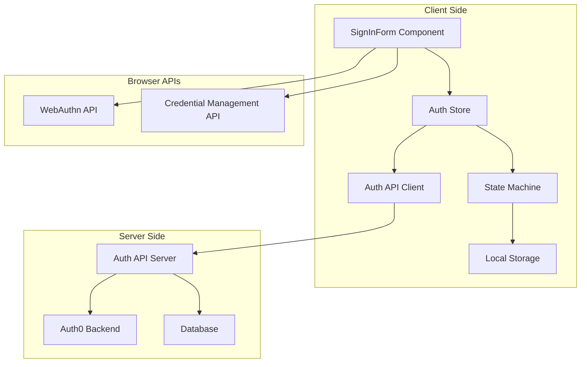
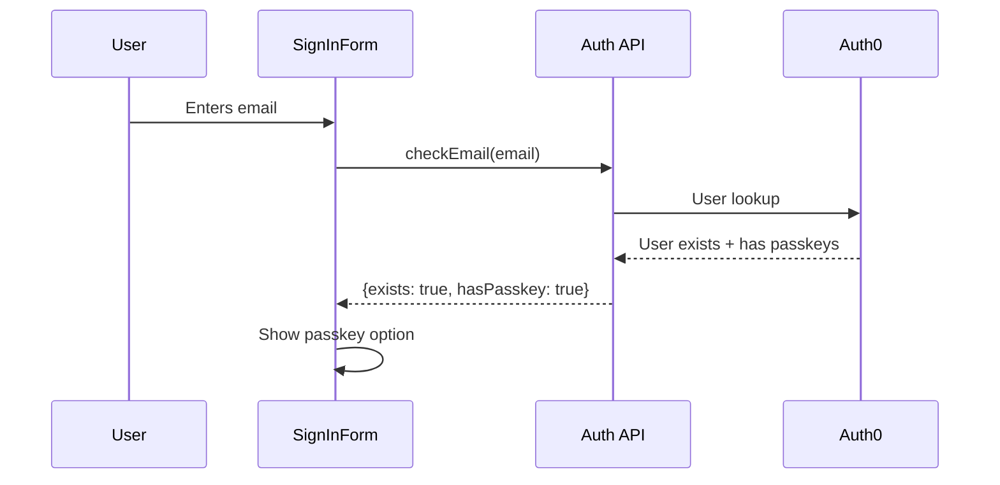
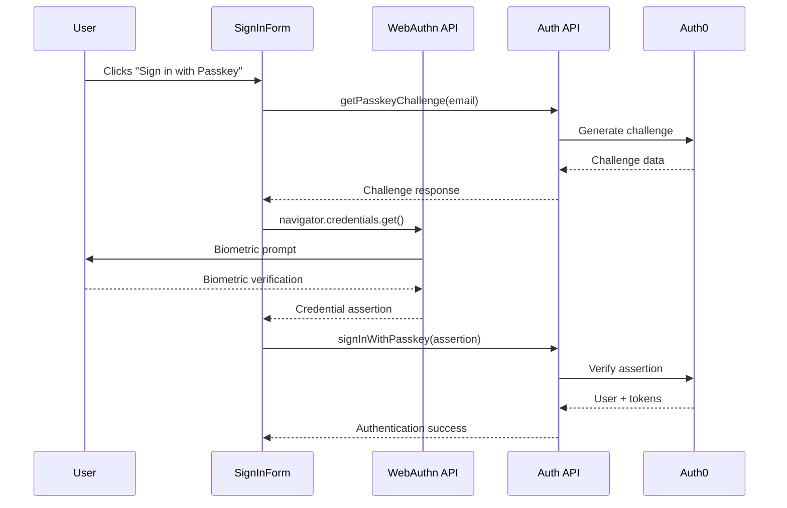
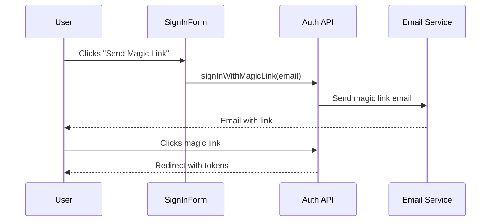

# Authentication System Overview

This document provides a comprehensive overview of the Thepia authentication system as implemented in the `@thepia/flows-auth` library.

## System Architecture

The Thepia authentication system is built on a **passwordless-only** foundation using WebAuthn/passkeys with Auth0 as the identity provider. The system serves both `thepia.com` and `thepia.net` domains through a unified API backend.

### Core Components



### Authentication Principles

1. **Passwordless Only**: No traditional password authentication is supported
2. **WebAuthn First**: Passkeys and biometric authentication are the primary method
3. **Progressive Enhancement**: Magic links provide fallback for unsupported devices
4. **Multi-Domain**: Single backend serves both thepia.com and thepia.net
5. **Privacy by Design**: No biometric data leaves the device

## Authentication Flow

### 1. Initial State Check

When a user visits a Thepia application, the system:

1. Checks for existing session tokens in localStorage
2. Validates token expiration
3. Attempts automatic session restoration
4. Falls back to unauthenticated state if no valid session

### 2. Email-Based Discovery



The system uses email addresses to:
- Determine if a user exists in the system
- Check what authentication methods are available
- Decide whether to show passkey or magic link options

### 3. WebAuthn/Passkey Authentication

For users with registered passkeys:



### 4. Magic Link Fallback

For users without passkeys or on unsupported devices:



## State Management

The authentication system uses a sophisticated state machine to manage the authentication flow:

### Auth Store States

- **`unauthenticated`** - No valid session
- **`authenticating`** - Authentication in progress
- **`authenticated`** - Valid session exists
- **`error`** - Authentication failed

### State Machine States

The internal state machine has more granular states:

- **`checkingSession`** - Initial session validation
- **`sessionValid`** - Valid session found
- **`sessionInvalid`** - No valid session
- **`combinedAuth`** - Email input phase
- **`conditionalMediation`** - WebAuthn conditional mediation
- **`biometricPrompt`** - User biometric verification
- **`authenticated`** - Successfully authenticated

## Security Model

### WebAuthn Security

- **Phishing Resistant**: Credentials are bound to the origin
- **Device Bound**: Private keys never leave the device
- **Biometric Local**: Biometric data stays on device
- **Replay Protection**: Each authentication uses unique challenges

### Token Management

- **Short-lived Access Tokens**: 1-hour expiration
- **Refresh Tokens**: Longer-lived for session renewal
- **Secure Storage**: Tokens stored in localStorage with expiration checks
- **Automatic Refresh**: Background token renewal

### Multi-Domain Security

- **Unified Backend**: Single API serves both domains
- **Domain Validation**: API validates request origins
- **Cross-Domain Sessions**: Secure session sharing between domains
- **Employer Isolation**: Complete data segregation

## API Integration

### Auth API Endpoints

The library integrates with these API endpoints:

- **`POST /auth/signin`** - Initiate authentication
- **`POST /auth/signin/passkey`** - Complete passkey authentication
- **`POST /auth/signin/magic-link`** - Request magic link
- **`POST /auth/passkey/challenge`** - Get WebAuthn challenge
- **`POST /auth/refresh`** - Refresh access token
- **`POST /auth/logout`** - Sign out user

### Configuration

The system requires these configuration options:

```typescript
interface AuthConfig {
  apiBaseUrl: string;           // API server URL
  enablePasskeys: boolean;      // Enable WebAuthn
  enableMagicLinks: boolean;    // Enable magic link fallback
  domain?: string;              // Domain for cookies/storage
}
```

## Error Handling

The system provides comprehensive error handling:

### Error Types

- **Network Errors**: API connectivity issues
- **WebAuthn Errors**: Browser API failures
- **Authentication Errors**: Invalid credentials
- **Session Errors**: Token expiration/validation

### Error Reporting

- Automatic error reporting to monitoring systems
- User-friendly error messages
- Detailed logging for debugging
- Graceful fallbacks for recoverable errors

## Browser Compatibility

### WebAuthn Support

- **Chrome 67+**: Full support
- **Firefox 60+**: Full support  
- **Safari 14+**: Full support
- **Edge 18+**: Full support

### Fallback Strategy

For unsupported browsers:
1. Magic link authentication
2. Clear messaging about browser requirements
3. Guidance for browser upgrades

## Related Documentation

- **[Authentication Flow](./flow.md)** - Detailed flow diagrams
- **[State Management](./state-management.md)** - State machine details
- **[API Reference](./api-reference.md)** - Complete API documentation
- **[Security Model](../flows/security.md)** - Security architecture

For implementation details, see the [thepia.com authentication documentation](https://github.com/thepia/thepia.com/tree/main/docs/auth) which provides the complete backend architecture and Auth0 integration details.
