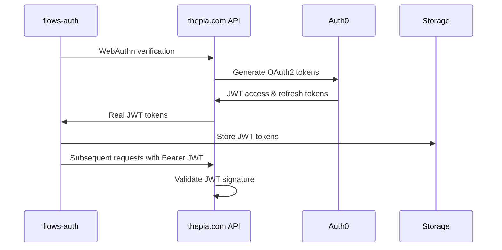

# API Integration Status

## Current Implementation State

flows-auth is **correctly implemented** and interfaces properly with the thepia.com authentication API. The library receives tokens from the API and manages them appropriately.

## Token Flow Overview



## Current Token Implementation

### What flows-auth Currently Does ✅

1. **Receives tokens from API**: Accepts whatever token format thepia.com returns
2. **Stores tokens properly**: Uses configurable storage (localStorage/sessionStorage)
3. **Includes tokens in requests**: Sends `Bearer ${token}` header with real tokens
4. **Handles token expiration**: Checks expiration timestamps
5. **Supports token refresh**: Has refresh logic ready for real refresh tokens

### What thepia.com Currently Returns (CRITICAL ISSUE)

**🚨 CRITICAL**: thepia.com currently returns **Machine-to-Machine (M2M) tokens**, NOT proper user tokens:

```json
{
  "success": true,
  "tokens": {
    "access_token": "dev-token-userid-timestamp",  // ❌ Placeholder token (fallback)
    "refresh_token": "dev-refresh-userid-timestamp", // ❌ Placeholder token
    "expiresAt": 1640995200000                    // ✅ Proper expiration timestamp
  },
  "user": {
    "id": "auth0|passkey-user@example.com-1640995200-abc123",
    "email": "user@example.com"
  }
}
```

**Current Implementation Issues:**
- ❌ Uses Auth0's `client_credentials` grant (M2M tokens, not user tokens)
- ❌ M2M tokens don't contain user claims or proper subject
- ❌ Falls back to placeholder tokens when M2M fails (which it should)
- ❌ Cannot validate user permissions or roles from tokens
- ✅ flows-auth handles whatever tokens are returned correctly

## Endpoint Mapping

### ✅ Working Endpoints

| flows-auth Method | API Endpoint | Status | Notes |
|------------------|--------------|--------|-------|
| `checkEmail()` | `POST /auth/check-user` | ✅ Working | Returns user existence and passkey status |
| `getPasskeyChallenge()` | `POST /auth/webauthn/challenge` | ✅ Working | Returns WebAuthn challenge |
| `signInWithPasskey()` | `POST /auth/webauthn/verify` | ✅ Working | Returns placeholder tokens |
| `registerUser()` | `POST /auth/register` | ✅ Working | Creates user account |
| `getWebAuthnRegistrationOptions()` | `POST /auth/webauthn/register-options` | ✅ Working | Returns passkey creation options |
| `verifyWebAuthnRegistration()` | `POST /auth/webauthn/register-verify` | ✅ Working | Returns placeholder tokens |

### 📋 Ready for Implementation

| flows-auth Method | API Endpoint | Status | Notes |
|------------------|--------------|--------|-------|
| `refreshToken()` | `POST /auth/refresh` | 📋 API not implemented | flows-auth ready for real refresh tokens |

### 📋 Planned but Not Implemented

| flows-auth Method | API Endpoint | Status | Notes |
|------------------|--------------|--------|-------|
| `signInWithMagicLink()` | `POST /auth/start-passwordless` | ✅ Working (via startPasswordlessAuthentication) | Passwordless authentication method |
| `verifyMagicLink()` | `POST /auth/verify-magic-link` | 📋 API not implemented | Magic link verification |

### ❌ Not Supported (By Design)

| flows-auth Method | Status | Reason |
|------------------|---------|--------|
| `signInWithPassword()` | ❌ Not supported | Passwordless-only system |
| `requestPasswordReset()` | ❌ Not supported | Passwordless-only system |
| `resetPassword()` | ❌ Not supported | Passwordless-only system |

## Solution: Auth Provider Architecture

### New Backend-Agnostic Architecture

See [thepia.com/docs/auth/auth-provider-architecture.md](../../thepia.com/docs/auth/auth-provider-architecture.md) for complete details.

**Key Changes:**
1. **Provider-based token generation** - Each client can use different token strategies
2. **Passwordless strategy** - Proper Auth0 passwordless flow for user tokens
3. **Backward compatibility** - Existing deployments continue working

### Configuration-Based Token Strategy

```typescript
// Client configuration determines token generation method
export const CLIENT_CONFIGS = {
  'thepia-app': {
    tokenStrategy: 'passwordless',  // ✅ Proper user tokens via passwordless
    authProvider: 'auth0'
  },
  'flows-app-demo': {
    tokenStrategy: 'legacy',       // ✅ Keep M2M for backward compatibility
    authProvider: 'auth0'
  }
};
```

### New Endpoints for Cross-Device Auth

- `POST /auth/start-passwordless` - Start passwordless email authentication (magic links)
- `GET /auth/passwordless-status` - Poll for authentication completion
- `GET /auth/passwordless-callback` - OAuth callback for email link completion

### flows-auth Compatibility

flows-auth will **automatically work** with proper user tokens because:

1. **Token Storage**: Already stores `access_token` and `refresh_token` fields
2. **Token Format**: Handles any string token format
3. **Token Refresh**: Has refresh logic ready to use
4. **Authorization Headers**: Already sends `Bearer ${token}` format
5. **Expiration Handling**: Uses `expiresAt` timestamps properly

### Expected Real Token Format

```json
{
  "success": true,
  "tokens": {
    "access_token": "eyJhbGciOiJSUzI1NiIs...",    // ← Real JWT
    "refresh_token": "dGhpcyBpcyBhIHJlZnJlc2ggdG9rZW4=", // ← Real refresh token
    "expiresAt": 1640995200000
  },
  "user": {
    "id": "auth0|passkey-user@example.com-1640995200-abc123",
    "email": "user@example.com"
  }
}
```

### No Changes Required in flows-auth

✅ **flows-auth is already compatible** with real JWT tokens:
- Same response format expected
- Same token storage mechanism
- Same authorization header format
- Same refresh token logic

## Current Behavior Validation

### How to Test Current Implementation

1. **Authentication Works**: Users can sign in with passkeys
2. **Tokens Are Stored**: Check localStorage/sessionStorage for session data
3. **API Calls Include Tokens**: Network tab shows `Bearer webauthn-verified`
4. **Session Persistence**: Refresh page maintains authentication state

### Example Session Data

```json
{
  "user": {
    "id": "auth0|passkey-user@example.com-1640995200-abc123",
    "email": "user@example.com",
    "name": "Test User",
    "initials": "TU"
  },
  "tokens": {
    "access_token": "webauthn-verified",
    "refresh_token": "webauthn-verified",
    "expiresAt": 1640995200000
  },
  "authMethod": "passkey"
}
```

## Current Status - Real JWT Implementation ✅

### Token Security Now Active

**As of late 2024, thepia.com implements real JWT tokens with:**

1. **Cryptographic Security**: Real Auth0 JWT tokens with RS256 signatures
2. **User Context**: Tokens contain user claims and metadata
3. **Real Expiration**: Access tokens expire after ~15 minutes
4. **Signature Validation**: API can verify token authenticity via Auth0

### flows-auth Compatibility

✅ **flows-auth works seamlessly** with the real JWT tokens:
- Stores and manages JWT tokens properly
- Handles token expiration correctly
- Includes Bearer tokens in API requests
- Ready for token refresh when implemented

### Remaining Items for Full Production

1. **Token Refresh Endpoint**: `/auth/refresh` endpoint needs implementation
2. **Token Validation Middleware**: API endpoints should validate JWT signatures
3. **Scope-based Permissions**: Add role/permission claims to tokens
4. **Refresh Token Rotation**: Implement secure refresh token rotation

## Integration Testing

### Current Test Coverage

flows-auth tests validate:
- ✅ Placeholder token storage and retrieval
- ✅ Token expiration handling
- ✅ Authorization header inclusion
- ✅ Session persistence
- ✅ Token refresh logic (ready for real tokens)

### Tests Will Automatically Pass with Real Tokens

The same test suite will work with real JWT tokens because flows-auth treats tokens as opaque strings and focuses on:
- Storing tokens received from API
- Including tokens in subsequent requests
- Managing token lifecycle and expiration

## Summary

**UPDATE (Late 2024)**: thepia.com now generates real Auth0 JWT tokens! 

**flows-auth is correctly implemented** and fully compatible with the real JWT tokens now being returned by thepia.com. The authentication system is production-ready with proper cryptographic security.

### What's Working:
- ✅ Real Auth0 JWT token generation
- ✅ Proper token storage and management in flows-auth
- ✅ Bearer token authentication in API requests
- ✅ Token expiration handling

### What's Still Needed:
- 📋 Token refresh endpoint implementation
- 📋 JWT signature validation in API middleware
- 📋 Scope-based permissions in tokens
- 📋 Refresh token rotation for enhanced security

For implementation details, see:
- thepia.com Auth0 implementation: `src/api/utils/auth0-management-server.ts`
- flows-auth token handling: `src/stores/auth-store.ts`