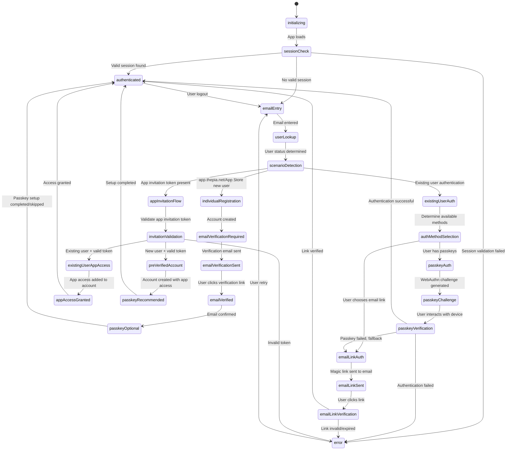

# Authentication State Machine

This document defines the complete authentication state machine for the flows-auth library, designed around the **two primary user scenarios**: Individual Registration (app.thepia.net + App Store) and App Invitation Access (specific thepia.net subdomains).

## State Machine Overview

The state machine supports both **email links** and **passkeys** as authentication methods across both scenarios, with clear branching logic based on user context and domain.



## State Definitions

### Core System States

#### `initializing`
- **Purpose**: App startup state, initial loading
- **Entry Conditions**: App starts, page refresh
- **Actions**: Initialize auth system, load configuration
- **Transitions**: Always moves to `sessionCheck`

#### `sessionCheck`
- **Purpose**: Validate existing session tokens
- **Entry Conditions**: After app initialization
- **Actions**: 
  - Check localStorage/sessionStorage for tokens
  - Validate token expiration
  - Verify token authenticity with server
- **Transitions**:
  - `authenticated` if valid session found
  - `emailEntry` if no valid session
  - `error` if session validation fails

#### `emailEntry`
- **Purpose**: Primary entry point for authentication
- **Entry Conditions**: No valid session, user logout, or retry after error
- **Actions**: 
  - Show email input form
  - Detect domain context (app.thepia.net vs flows.thepia.net)
  - Handle invitation token if present in URL
- **User Experience**: Simple email input with clear messaging about the process
- **Transitions**: `userLookup` when user provides email

### User Discovery States

#### `userLookup`
- **Purpose**: Determine user existence and verification status
- **Entry Conditions**: User provides email address
- **Actions**:
  - Call `POST /auth/check-user` API
  - Determine user's current status
  - Check for pending invitations
- **Transitions**: `scenarioDetection` with user status data

#### `scenarioDetection`
- **Purpose**: Route to appropriate registration/authentication flow
- **Entry Conditions**: User status determined from lookup
- **Actions**: 
  - Analyze domain context
  - Check for invitation tokens
  - Determine appropriate flow path
- **Decision Logic**:
  ```typescript
  if (!userExists && domain === 'app.thepia.net') {
    return 'individualRegistration';
  } else if (!userExists && hasInvitationToken) {
    return 'invitationRegistration';
  } else if (userExists) {
    return 'existingUserAuth';
  } else {
    return 'error'; // No valid registration path
  }
  ```

### Individual Registration Flow (app.thepia.net + App Store)

#### `individualRegistration`
- **Purpose**: Create new individual account for personal use
- **Entry Conditions**: New user on app.thepia.net or App Store installation
- **Actions**:
  - Call `POST /auth/register` API  
  - Create Auth0 account with `email_verified: false`
  - Show terms of service acceptance
- **User Experience**: Clear explanation of verification requirement for individual account
- **Transitions**: `emailVerificationRequired` after successful account creation

#### `emailVerificationRequired`
- **Purpose**: Inform user that email verification is needed
- **Entry Conditions**: New app.thepia.net account created
- **Actions**:
  - Display verification requirement message
  - Provide "Send verification email" button
  - Explain what user needs to do next
- **User Experience**: Clear instructions with helpful UI
- **Transitions**: `emailVerificationSent` when user requests verification

#### `emailVerificationSent`
- **Purpose**: Verification email has been sent
- **Entry Conditions**: Verification email requested and sent
- **Actions**:
  - Show confirmation that email was sent
  - Provide option to resend email
  - Show "check your email" messaging
- **User Experience**: Clear success message with next steps
- **Transitions**: `emailVerified` when user clicks verification link

#### `emailVerified`
- **Purpose**: Email has been successfully verified
- **Entry Conditions**: User clicked valid verification link
- **Actions**:
  - Update user account to `email_verified: true`
  - Show verification success message
  - Prepare for optional passkey setup
- **Transitions**: `passkeyOptional` to offer enhanced security

#### `passkeyOptional`
- **Purpose**: Offer optional passkey setup for convenience
- **Entry Conditions**: Email verification completed for app.thepia.net
- **Actions**:
  - Explain passkey benefits
  - Provide "Set up passkey" and "Skip for now" options
  - Handle passkey registration if chosen
- **User Experience**: Optional enhancement, not required
- **Transitions**: `authenticated` regardless of passkey choice

### App Invitation Access Flow (specific thepia.net subdomains)

#### `appInvitationFlow`
- **Purpose**: Handle app-specific access invitations  
- **Entry Conditions**: User accessed URL with app invitation token
- **Actions**:
  - Extract invitation token and App ID from URL
  - Display app-specific invitation context (app name, inviting organization)
  - Show appropriate flow based on user existence
- **User Experience**: Clear messaging about specific app access being granted
- **Transitions**: `invitationValidation` to validate token and determine user path

#### `existingUserAppAccess`
- **Purpose**: Grant app access to existing user account
- **Entry Conditions**: Existing user with valid app invitation token
- **Actions**:
  - Validate user already has verified email
  - Add App ID to user's accessible apps list
  - Show confirmation of app access granted
- **User Experience**: Quick confirmation that they now have access to the specific app
- **Transitions**: `appAccessGranted` after access is granted

#### `appAccessGranted`
- **Purpose**: Confirm app access has been added to existing account
- **Entry Conditions**: Existing user successfully granted app access
- **Actions**:
  - Update user session with new app access
  - Redirect to specific app subdomain
- **User Experience**: Seamless redirect to the newly accessible app
- **Transitions**: `authenticated` with access to specific app

#### `invitationValidation`
- **Purpose**: Validate invitation token and create account
- **Entry Conditions**: User accepts invitation
- **Actions**:
  - Validate token cryptographically
  - Check token expiration
  - Verify token matches current email/domain
  - Create account with `email_verified: true` (pre-verified)
- **Transitions**: 
  - `preVerifiedAccount` if token valid
  - `error` if token invalid/expired

#### `preVerifiedAccount`
- **Purpose**: Account created with pre-verified email
- **Entry Conditions**: Valid invitation token processed
- **Actions**:
  - Create Auth0 account with `email_verified: true`
  - Store invitation metadata
  - Show successful account creation
- **User Experience**: Welcome message explaining verified status
- **Transitions**: `passkeyRecommended` for security enhancement

#### `passkeyRecommended`
- **Purpose**: Recommend passkey setup for invited users
- **Entry Conditions**: Invitation-based account created
- **Actions**:
  - Explain passkey benefits for flows access
  - Highlight security advantages for business use
  - Provide setup and skip options
- **User Experience**: Stronger recommendation than app.thepia.net due to business context
- **Transitions**: `authenticated` after choice made

### Authentication States (Existing Users)

#### `existingUserAuth`
- **Purpose**: Handle authentication for existing users
- **Entry Conditions**: User exists in system
- **Actions**:
  - Check user's available authentication methods
  - Determine if email is verified
  - Show appropriate authentication options
- **Transitions**: `authMethodSelection` to choose auth method

#### `authMethodSelection`
- **Purpose**: Present available authentication methods
- **Entry Conditions**: Existing user needs to authenticate
- **Actions**:
  - Show passkey option if user has registered passkeys
  - Always show email link option
  - Handle user's method choice
- **User Experience**: Clear options with explanations
- **Transitions**: 
  - `passkeyAuth` if passkeys available and chosen
  - `emailLinkAuth` if email link chosen

#### `passkeyAuth`
- **Purpose**: Handle passkey authentication
- **Entry Conditions**: User chooses passkey authentication
- **Actions**:
  - Show passkey prompt
  - Initiate WebAuthn flow
  - Handle browser passkey interface
- **User Experience**: Platform-native biometric prompt
- **Transitions**: 
  - `passkeyChallenge` when WebAuthn initiated
  - `emailLinkAuth` if user cancels or passkey unavailable

#### `passkeyChallenge`
- **Purpose**: WebAuthn challenge in progress
- **Entry Conditions**: Passkey authentication initiated
- **Actions**:
  - Generate and send WebAuthn challenge
  - Wait for device response
  - Handle platform-specific UI
- **Transitions**: `passkeyVerification` when user interacts with device

#### `passkeyVerification`
- **Purpose**: Verify passkey response
- **Entry Conditions**: User completed device interaction
- **Actions**:
  - Send WebAuthn response to server
  - Validate cryptographic signature
  - Create session tokens
- **Transitions**:
  - `authenticated` on successful verification
  - `emailLinkAuth` on failure (fallback)
  - `error` on critical failure

#### `emailLinkAuth`
- **Purpose**: Handle email link authentication
- **Entry Conditions**: User chooses email auth or passkey fallback
- **Actions**:
  - Generate magic link token
  - Send email to user's verified address
  - Show "check your email" message
- **User Experience**: Clear instructions about checking email
- **Transitions**: `emailLinkSent` after email sent

#### `emailLinkSent`
- **Purpose**: Magic link email has been sent
- **Entry Conditions**: Authentication email sent
- **Actions**:
  - Show confirmation message
  - Provide resend option with rate limiting
  - Wait for user to click link
- **Transitions**: `emailLinkVerification` when user clicks link

#### `emailLinkVerification`
- **Purpose**: Verify magic link token
- **Entry Conditions**: User clicked email link
- **Actions**:
  - Validate magic link token
  - Check token expiration and single-use status
  - Create session tokens
- **Transitions**:
  - `authenticated` on successful verification
  - `error` on invalid/expired token

### Terminal States

#### `authenticated`
- **Purpose**: User has valid session and full access
- **Entry Conditions**: Successful authentication via any method
- **Actions**:
  - Store session tokens
  - Redirect to intended destination
  - Initialize authenticated user interface
- **User Experience**: Seamless access to application features
- **Transitions**: `emailEntry` on logout or session expiry

#### `error`
- **Purpose**: Handle authentication errors
- **Entry Conditions**: Any authentication step fails
- **Actions**:
  - Log error details for debugging
  - Show user-friendly error message
  - Provide retry or alternative options
- **Error Types**:
  - Network connectivity issues
  - Invalid tokens/credentials
  - Browser compatibility problems
  - Server-side validation failures
- **Transitions**: 
  - `emailEntry` on retry
  - Various states based on error type and recovery options

## State Context Data

Each state maintains relevant context information:

```typescript
interface AuthStateContext {
  // User information
  email?: string;
  userId?: string;
  userExists: boolean;
  emailVerified: boolean;
  
  // Domain and scenario context
  domain: 'app.thepia.net' | 'flows.thepia.net' | string; // subdomain
  scenario: 'individual' | 'invitation';
  
  // Invitation context (for invitation flow)
  invitationToken?: string;
  invitationData?: {
    invitedBy: string;
    organization: string;
    permissions: string[];
  };
  
  // Authentication method context
  availableMethods: ('email' | 'passkey')[];
  hasPasskeys: boolean;
  
  // Error handling
  lastError?: string;
  retryCount: number;
  
  // Session information
  sessionTokens?: {
    accessToken: string;
    refreshToken: string;
    expiresAt: number;
  };
}
```

## Integration with flows-auth Library

The state machine integrates with the flows-auth library components:

### Auth Store Integration
- State machine drives the auth store's reactive state
- Store provides actions that trigger state transitions
- Components subscribe to store state for UI updates

### API Client Integration
- State machine actions call appropriate API endpoints
- API responses drive state transitions
- Error handling maps API errors to appropriate states

### Component Integration
- `SignInForm` component reflects current state
- `EmailVerificationBanner` shows during verification states
- State-specific UI components for each major state

This revised state machine provides clear, scenario-driven authentication flows while maintaining support for both email and passkey authentication methods across all scenarios.