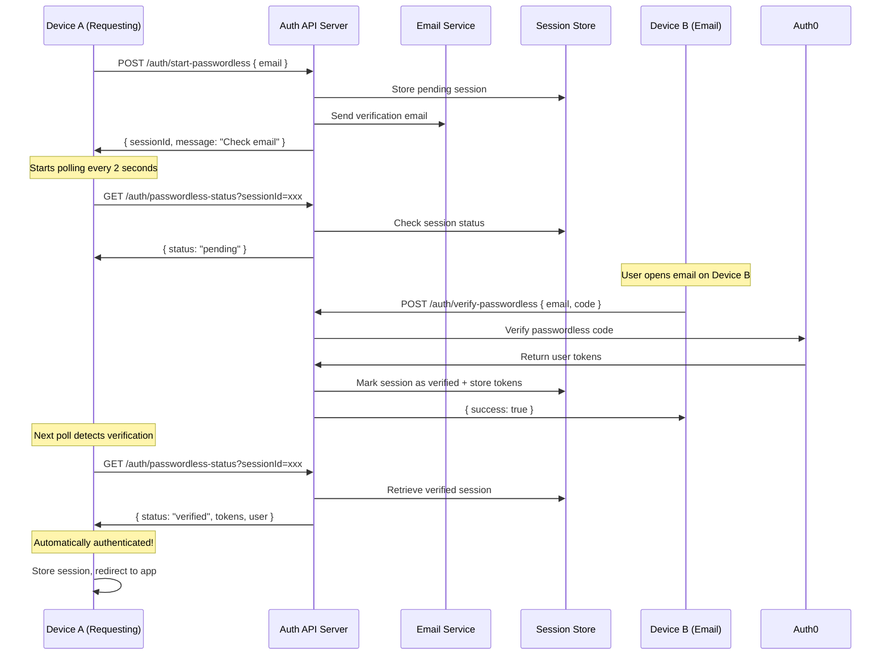

# Cross-Device Authentication

## Overview

Cross-device authentication allows a user to start authentication on one device (Device A) and complete verification on another device (Device B) where they receive the email. This enables scenarios like:

- User starts login on a work computer
- User receives verification email on their phone
- User confirms on phone, work computer is automatically authenticated

## Architecture

This feature requires the new auth provider architecture documented in [thepia.com/docs/auth/auth-provider-architecture.md](../../thepia.com/docs/auth/auth-provider-architecture.md).

### Flow Diagram



## Implementation Requirements

### Backend Requirements

#### 1. Session Storage

```typescript
interface PendingSession {
  sessionId: string;
  email: string;
  status: 'pending' | 'verified' | 'expired';
  createdAt: number;
  verifiedAt?: number;
  expiresAt: number;
  tokens?: {
    accessToken: string;
    refreshToken: string;
    idToken: string;
    expiresAt: number;
  };
  user?: {
    id: string;
    email: string;
  };
}
```

#### 2. Required Endpoints

```typescript
// Start passwordless authentication
POST /auth/start-passwordless
{
  "email": "user@example.com",
  "clientId": "thepia-app"
}
Response: {
  "sessionId": "sess_abc123",
  "message": "Check your email"
}

// Verify code from email (Device B)
POST /auth/verify-passwordless  
{
  "email": "user@example.com",
  "code": "123456",
  "sessionId": "sess_abc123"  // Optional for updating session
}
Response: {
  "success": true,
  "message": "Login approved for your other device"
}

// Poll for verification status (Device A)
GET /auth/passwordless-status?sessionId=sess_abc123
Response (pending): {
  "status": "pending"
}
Response (verified): {
  "status": "verified",
  "tokens": {
    "accessToken": "...",
    "refreshToken": "...",
    "expiresAt": 1234567890
  },
  "user": {
    "id": "...",
    "email": "..."
  }
}
```

### Frontend Implementation (Device A)

```typescript
// app.thepia.net/src/lib/auth.ts
export async function startCrossDeviceAuth(email: string) {
  // Check if user exists, register if needed
  const { exists } = await checkUser(email);
  if (!exists) {
    await registerOrSignIn(email, 'thepia-app');
  }
  
  // Start passwordless flow
  const { sessionId } = await api.post('/auth/start-passwordless', { 
    email,
    clientId: 'thepia-app'
  });
  
  // Start polling with exponential backoff
  let pollInterval = 2000; // Start at 2 seconds
  const maxInterval = 10000; // Max 10 seconds
  const maxDuration = 600000; // 10 minutes total
  const startTime = Date.now();
  
  const poll = async () => {
    if (Date.now() - startTime > maxDuration) {
      clearInterval(intervalId);
      showError('Verification expired. Please try again.');
      return;
    }
    
    const status = await api.get(`/auth/passwordless-status?sessionId=${sessionId}`);
    
    if (status.status === 'verified') {
      clearInterval(intervalId);
      // Store tokens and complete authentication
      storeSession(status.user, status.tokens.accessToken);
      window.location.href = '/dashboard';
    } else {
      // Exponential backoff
      pollInterval = Math.min(pollInterval * 1.1, maxInterval);
    }
  };
  
  const intervalId = setInterval(poll, pollInterval);
  return { sessionId, polling: true };
}
```

### Email Template

```html
Subject: Confirm your login to Thepia

Someone requested to sign in to Thepia using your email address.

Your verification code is: **123456**

Or click here to confirm: [Confirm Login]

If this wasn't you, ignore this email.
This request will expire in 10 minutes.

Device info: Chrome on Windows
IP address: 192.168.1.100
```

### Verification Page (Device B)

The email link opens a simple verification page:

```svelte
<!-- Device B verification page -->
<script>
  import { onMount } from 'svelte';
  
  let code = '';
  let email = '';
  let sessionId = '';
  let loading = false;
  let success = false;
  
  onMount(() => {
    // Extract parameters from URL
    const params = new URLSearchParams(window.location.search);
    code = params.get('code') || '';
    email = params.get('email') || '';
    sessionId = params.get('session') || '';
    
    // Auto-verify if all params present
    if (code && email) {
      verifyCode();
    }
  });
  
  async function verifyCode() {
    loading = true;
    try {
      const result = await api.post('/auth/verify-passwordless', {
        email,
        code,
        sessionId
      });
      
      if (result.success) {
        success = true;
      }
    } catch (error) {
      console.error('Verification failed:', error);
    }
    loading = false;
  }
</script>

{#if success}
  <div class="success">
    <h2>✅ Login Approved</h2>
    <p>Your other device is now authenticated.</p>
    <p>You can close this window.</p>
  </div>
{:else if loading}
  <div class="loading">
    <p>Verifying your login...</p>
  </div>
{:else}
  <div class="verify">
    <h2>Confirm Your Login</h2>
    <p>Someone requested to sign in to Thepia using {email}</p>
    
    <button on:click={verifyCode} disabled={!code || !email}>
      Confirm Login
    </button>
    
    <p><small>If this wasn't you, ignore this email.</small></p>
  </div>
{/if}
```

## Security Considerations

### Session Security

1. **Session IDs**: Cryptographically random, 32+ characters
2. **Short Expiration**: Sessions expire in 10 minutes
3. **Single Use**: Sessions are invalidated after successful verification
4. **Rate Limiting**: Limit polling frequency and total attempts

### Email Security

1. **Verification Codes**: 6-digit codes, expire in 10 minutes
2. **Device Information**: Include browser/OS info in email
3. **IP Logging**: Log IP addresses for audit trail
4. **Replay Protection**: Codes can only be used once

### CSRF Protection

1. **State Parameters**: Include CSRF tokens in email links
2. **Origin Validation**: Verify request origins
3. **Session Binding**: Bind sessions to specific client configurations

## Error Handling

### Common Error Scenarios

```typescript
// Session expired
{
  "status": "expired",
  "message": "Verification session has expired. Please start again."
}

// Invalid code
{
  "error": "invalid_code", 
  "message": "Invalid verification code. Please try again."
}

// Too many attempts
{
  "error": "rate_limited",
  "message": "Too many verification attempts. Please wait before trying again."
}

// User not found
{
  "error": "user_not_found",
  "message": "No account found with this email address."
}
```

### Frontend Error Handling

```typescript
async function handlePollingError(error: any) {
  if (error.code === 'session_expired') {
    showMessage('Verification expired. Starting new session...');
    // Restart the flow
    return startCrossDeviceAuth(email);
  }
  
  if (error.code === 'rate_limited') {
    // Increase polling interval
    pollInterval = Math.max(pollInterval * 2, 30000);
    return;
  }
  
  // Unknown error - stop polling and show error
  clearInterval(intervalId);
  showError('Authentication failed. Please try again.');
}
```

## Testing Strategy

### Integration Tests

```typescript
describe('Cross-Device Authentication', () => {
  it('should complete authentication across devices', async () => {
    // Device A: Start authentication
    const { sessionId } = await authApi.startPasswordless('test@example.com');
    
    // Simulate email verification on Device B
    await authApi.verifyPasswordless('test@example.com', '123456', sessionId);
    
    // Device A: Poll should return verified status
    const status = await authApi.getPasswordlessStatus(sessionId);
    expect(status.status).toBe('verified');
    expect(status.tokens).toBeDefined();
  });
  
  it('should handle session expiration', async () => {
    const { sessionId } = await authApi.startPasswordless('test@example.com');
    
    // Wait for expiration
    await sleep(11 * 60 * 1000); // 11 minutes
    
    const status = await authApi.getPasswordlessStatus(sessionId);
    expect(status.status).toBe('expired');
  });
});
```

## Configuration

### Client Configuration

```typescript
// app.thepia.net configuration
{
  clientId: 'thepia-app',
  authProvider: 'auth0',
  tokenStrategy: 'passwordless',  // Required for cross-device
  crossDevice: {
    enabled: true,
    sessionTimeout: 600000,      // 10 minutes
    pollInterval: 2000,          // 2 seconds initial
    maxPollInterval: 10000,      // 10 seconds max
    emailTemplate: 'cross-device-login'
  }
}
```

This feature enables the exact cross-device flow you requested while maintaining security and providing a smooth user experience.