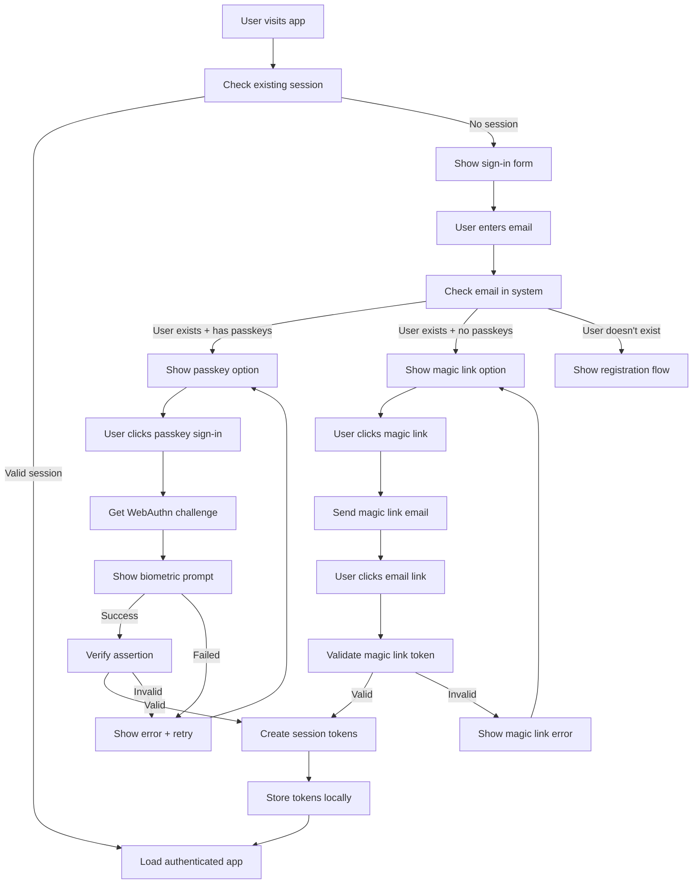
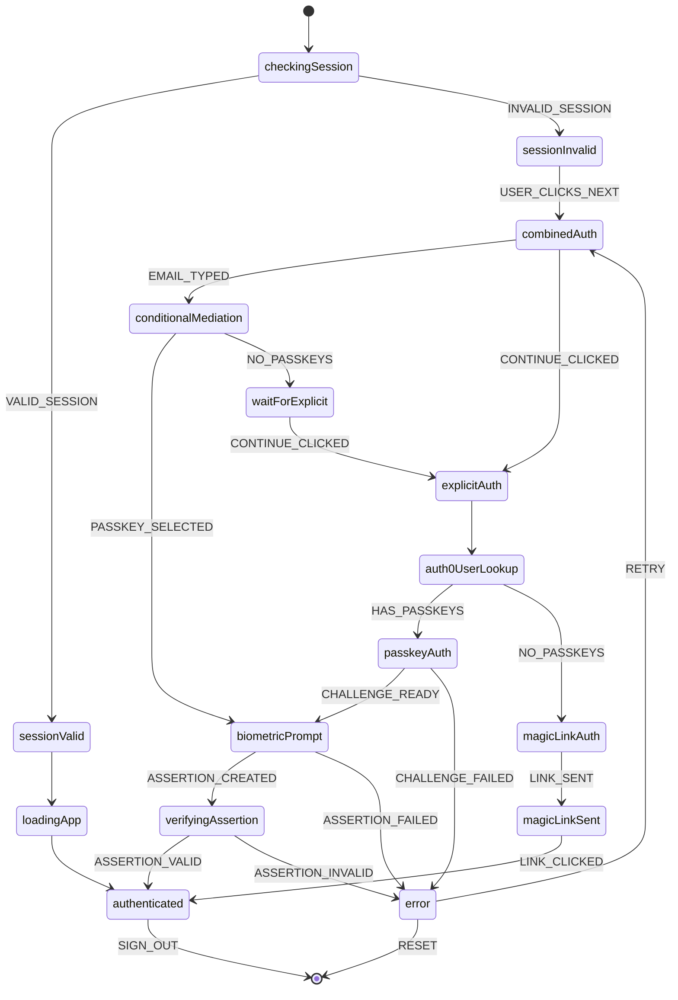
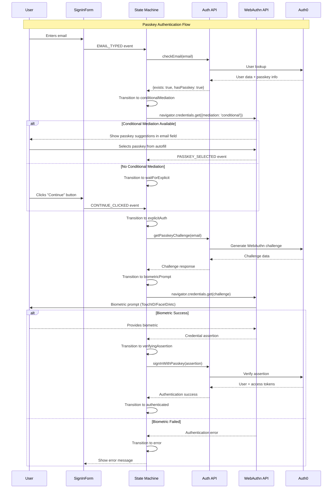
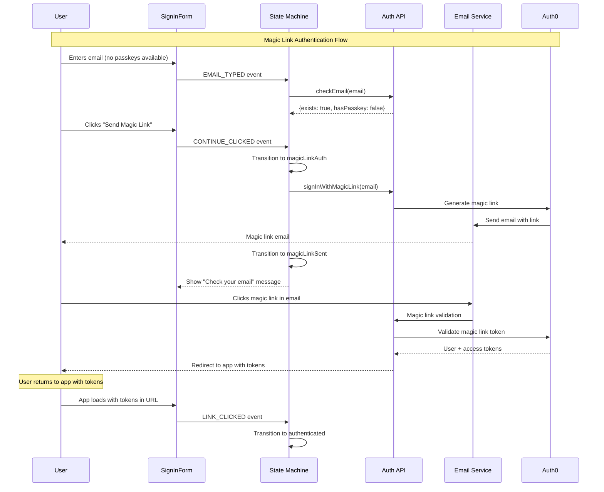
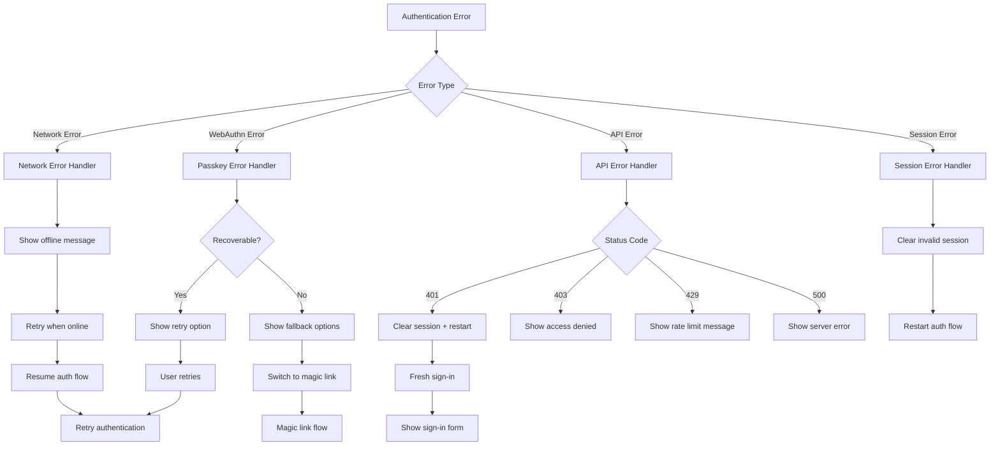
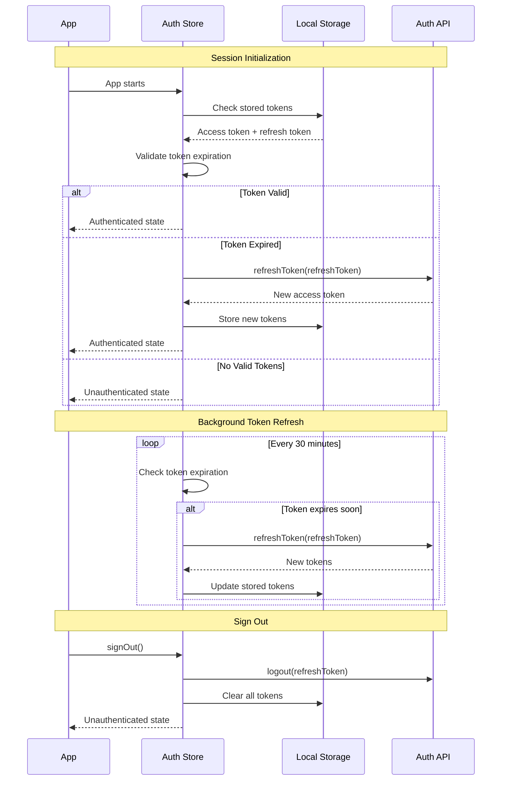
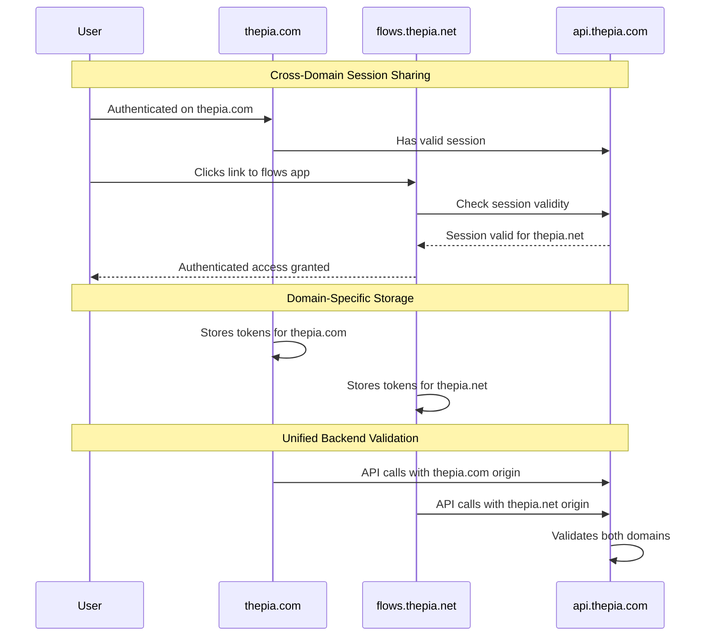
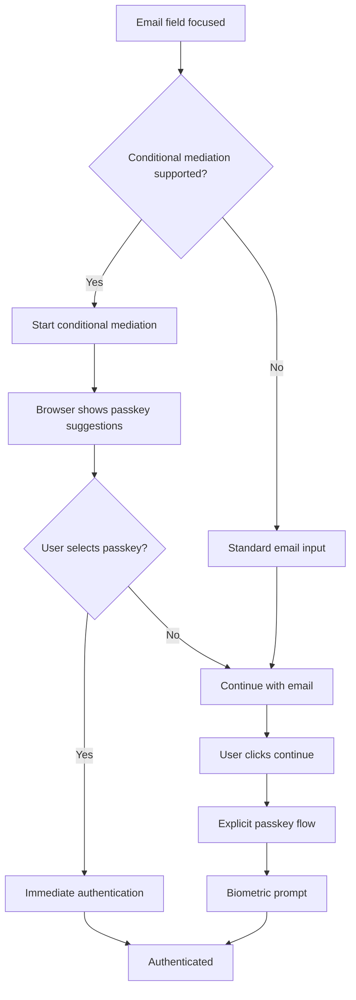

# Authentication Flow Documentation

This document provides detailed flow diagrams and explanations for the Thepia authentication system implemented in `@thepia/flows-auth`.

## Complete Authentication Flow

## State Machine Flow

The authentication system uses a state machine to manage the complex authentication flow:

### State Transitions

## WebAuthn Passkey Flow

### Detailed Passkey Authentication

## Magic Link Flow

### Email-Based Authentication

## Error Handling Flow

### Comprehensive Error Management

## Session Management Flow

### Token Lifecycle

## Cross-Domain Session Flow

### Multi-Domain Authentication

## Performance Optimizations

### Conditional Mediation Flow

This flow provides the optimal user experience by:
- Showing passkey options immediately when available
- Falling back gracefully when not supported
- Minimizing user interaction steps
- Providing clear feedback at each stage

## Related Documentation

- **[State Management](./state-management.md)** - Detailed state machine documentation
- **[API Reference](./api-reference.md)** - Complete API documentation
- **[Security Model](../flows/security.md)** - Security architecture
- **[Troubleshooting](../troubleshooting/README.md)** - Common flow issues
