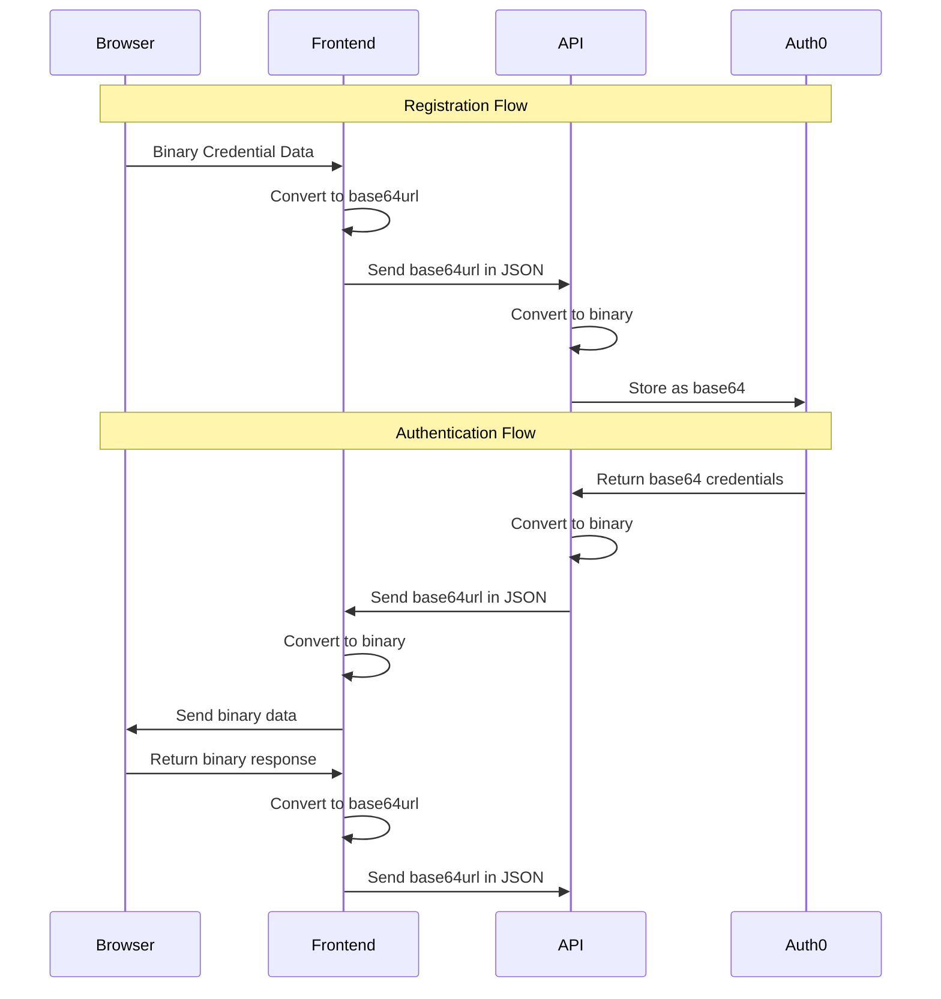

# WebAuthn Implementation

## Overview

Thepia uses WebAuthn for passwordless authentication, allowing users to sign in using biometrics, security keys, or platform authenticators. This document outlines our implementation details and best practices.

## Property Naming Convention

Following ADR 0005, we use `rpId` (lowercase 'd') as our canonical property name throughout the codebase. This aligns with the WebAuthn specification and browser APIs. When interfacing with the `@simplewebauthn/server` package, we map between `rpId` and `rpID` at the library boundaries.

Example:

```typescript
// Internal code uses rpId
interface WebAuthnConfig {
  rpId: string;
  rpName: string;
}

// When calling @simplewebauthn/server, map at the boundary
const options = await generateAuthenticationOptions({
  rpID: config.rpId,  // Map at the boundary
  // ... other options
});

// When receiving from @simplewebauthn/server, map immediately
const { rpID, ...rest } = response;
const mappedResponse = {
  rpId: rpID,  // Map immediately
  ...rest
};
```

## Base64 Encoding Handling

WebAuthn requires careful handling of base64 and base64url encoding across different parts of the authentication flow. This section documents our encoding standards and where conversions occur.

### Encoding Standards

1. **Credential IDs**:
   - Stored in Auth0: Base64 format
   - Sent to browser: Base64url format
   - Internal processing: Uint8Array

2. **Challenges**:
   - Generated by server: Base64url format
   - Stored in challenge store: Base64url format
   - Sent to browser: Base64url format

### Conversion Points

#### 1. Registration Flow

```typescript
// In register-options.ts
const existingCredentials = await auth0Client.getUserCredentials(email);
const excludeCredentials = existingCredentials.map((cred) => {
  // Convert from Auth0's base64 to base64url for browser
  const base64Id = auth0Client.uint8ArrayToBase64(cred.credentialID);
  const base64urlId = base64Id
    .replace(/\+/g, '-')
    .replace(/\//g, '_')
    .replace(/=+$/, '');
  
  return {
    id: base64urlId,
    transports: cred.transports,
  };
});
```

#### 2. Authentication Flow

```typescript
// In challenge.ts
const options = await generateAuthenticationOptions({
  allowCredentials: userCredentials.map((cred) => ({
    // Convert from Auth0's base64 to base64url for browser
    id: uint8ArrayToBase64url(cred.credentialID),
    type: 'public-key',
    transports: cred.transports,
  })),
});
```

#### 3. Verification Flow

```typescript
// In verify.ts
const credentialID = base64urlToUint8Array(authResponse.id);
const storedCredential = userCredentials.find(
  (cred) => uint8ArrayToBase64url(cred.credentialID) === authResponse.id
);
```

### Utility Functions

We provide utility functions in `src/api/utils/webauthn-encoding.ts` to handle all base64 conversions:

```typescript
// Convert Uint8Array to base64url
function uint8ArrayToBase64url(data: Uint8Array): string {
  const base64 = btoa(String.fromCharCode(...data));
  return base64.replace(/\+/g, '-').replace(/\//g, '_').replace(/=+$/, '');
}

// Convert base64url to Uint8Array
function base64urlToUint8Array(base64url: string): Uint8Array {
  const base64 = base64url.replace(/-/g, '+').replace(/_/g, '/');
  const binary = atob(base64);
  return new Uint8Array([...binary].map(char => char.charCodeAt(0)));
}

// Convert between base64 and base64url
function base64urlToBase64(base64url: string): string {
  return base64url.replace(/-/g, '+').replace(/_/g, '/');
}

function base64ToBase64url(base64: string): string {
  return base64.replace(/\+/g, '-').replace(/\//g, '_').replace(/=+$/, '');
}
```

### Best Practices

1. **Always use base64url for browser communication**:
   - WebAuthn API expects base64url format
   - Prevents issues with URL-safe characters

2. **Store in base64 format in Auth0**:
   - Auth0's storage is compatible with base64
   - Maintains compatibility with other systems

3. **Use Uint8Array for internal processing**:
   - Most efficient for binary data
   - Prevents encoding/decoding issues

4. **Convert at boundaries**:
   - Auth0 → Internal: base64 → Uint8Array
   - Internal → Browser: Uint8Array → base64url
   - Browser → Internal: base64url → Uint8Array

5. **Handle padding correctly**:
   - Remove padding when converting to base64url
   - Add padding when converting to base64

### Common Issues

1. **Credential ID mismatch**:
   - Symptom: "WebAuthn verification failed"
   - Cause: Incorrect base64/base64url conversion
   - Solution: Use utility functions consistently

2. **Invalid base64url**:
   - Symptom: Browser rejects credential
   - Cause: Missing padding or invalid characters
   - Solution: Use proper conversion functions

3. **Encoding inconsistency**:
   - Symptom: Credentials not found
   - Cause: Different encoding formats in storage vs. verification
   - Solution: Standardize on base64url for browser communication

### Error Handling

The WebAuthn challenge endpoint (`/auth/webauthn/challenge`) implements the following error cases:

1. **Missing Required Fields**:
   - Status: 400 Bad Request
   - Error: "userId and email are required"
   - Occurs when either userId or email is missing from the request body

2. **User Not Found**:
   - Status: 404 Not Found
   - Error: "User not found"
   - Occurs when the provided email does not match any existing user

3. **No WebAuthn Credentials**:
   - Status: 404 Not Found
   - Error: "No WebAuthn credentials found"
   - Occurs when the user exists but has no registered WebAuthn credentials

4. **Invalid RP ID**:
   - Status: 400 Bad Request
   - Error: "Invalid RP ID"
   - Occurs when the request's origin domain doesn't match the expected RP ID
   - Development: must be `dev.thepia.com`
   - Production: must be `thepia.com`
   - Never allowed: `api.thepia.com`

5. **Server Errors**:
   - Status: 500 Internal Server Error
   - Error: Descriptive message about the failure
   - Occurs for unexpected server-side errors (e.g., database connection issues)

### Best Practices for Error Handling

1. **Client-Side**:
   - Always check response status before processing
   - Display user-friendly error messages
   - Provide clear guidance on how to resolve the error

2. **Server-Side**:
   - Log all errors with appropriate context
   - Use consistent error response format
   - Include relevant error details for debugging
   - Never expose sensitive information in error messages

3. **Testing**:
   - Test all error cases explicitly
   - Verify correct status codes
   - Check error message content
   - Ensure proper error handling in edge cases

## Data Flow and Format Conversions

WebAuthn involves several data format conversions as information flows between the browser, frontend, and API. This section explains these conversions and their locations.

### Data Flow Diagram



### Format Conversions

1. **Browser to Frontend**:

   ```typescript
   // Browser returns binary data (ArrayBuffer)
   const credential = await navigator.credentials.get({
     publicKey: {
       challenge: base64urlToBuffer(challenge),
       // ... other options
     }
   });
   
   // Frontend converts to base64url before sending to API
   const credentialId = bufferToBase64url(credential.id);
   ```

2. **Frontend to API**:

   ```typescript
   // Send as base64url string in JSON
   const response = await fetch('/api/auth/webauthn/verify', {
     method: 'POST',
     body: JSON.stringify({
       id: credentialId, // base64url string
       // ... other data
     })
   });
   ```

3. **API Processing**:

   ```typescript
   // Convert back to binary for processing
   const binaryId = base64urlToUint8Array(request.id);
   ```

### Key Points

1. **Binary Data Never Sent Directly**:
   - Binary data is never sent directly in HTTP requests
   - All binary data is converted to base64url strings for transmission
   - The conversion happens at the boundaries:
     - Browser → Frontend: Binary → base64url
     - Frontend → API: base64url in JSON
     - API → Processing: base64url → Binary

2. **Storage Format**:
   - Auth0 stores credential IDs in base64 format
   - This is converted to base64url when sent to the browser
   - The frontend handles the conversion between formats

3. **Browser Communication**:
   - The WebAuthn API expects binary data
   - All data sent to the browser must be converted to binary
   - All data received from the browser must be converted from binary

### Common Issues

1. **Encoding Mismatch**:
   - Symptom: "WebAuthn verification failed"
   - Cause: Incorrect base64/base64url conversion
   - Solution: Use utility functions consistently

2. **Invalid Format**:
   - Symptom: Browser rejects credential
   - Cause: Wrong encoding format for browser communication
   - Solution: Always use base64url for browser communication

3. **Storage Issues**:
   - Symptom: Credentials not found
   - Cause: Different encoding formats in storage vs. verification
   - Solution: Standardize on base64url for browser communication
