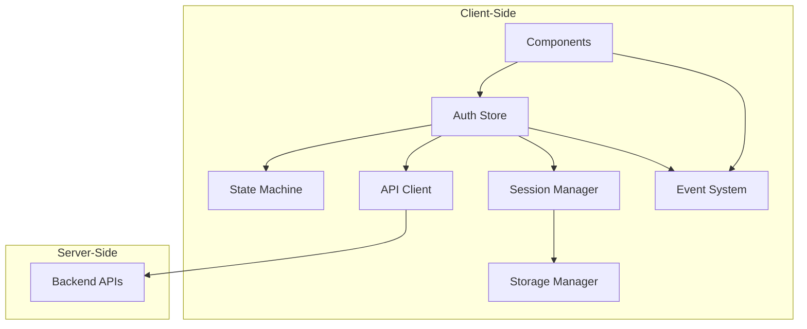

# Development Guide

This directory contains technical documentation for developers working on or integrating with flows-auth.

## 📋 **Development Documentation Index**

### 🏗️ **Architecture & Design**

| Document | Purpose | Audience |
|----------|---------|----------|
| **[API Server Architecture](./api-server-architecture.md)** | Backend implementation requirements and API contracts | Backend developers |
| **[State Machine](./state-machine.md)** | XState-inspired authentication state management | Frontend developers |
| **[Conditional Authentication](./conditional-authentication.md)** | Non-intrusive passkey discovery implementation | Frontend developers |
| **[Error Reporting Principles](./error-reporting-principles.md)** | Structured error handling and reporting | All developers |
| **[Tailwind Integration](./tailwind-integration.md)** | Complete guide for Tailwind CSS in library and consuming apps | Frontend developers, Library maintainers |

### 🔧 **Technical Specifications**

| Topic | Primary Document | Secondary References |
|-------|------------------|---------------------|
| **Component Behavior** | [`../specifications/`](../specifications/) | [`../components/`](../components/) |
| **API Contracts** | [`../testing/thepia-com-api-contracts/`](../testing/thepia-com-api-contracts/) | [`./api-server-architecture.md`](./api-server-architecture.md) |
| **Session Management** | [`../SESSION_MANAGEMENT_REQUIREMENTS.md`](../SESSION_MANAGEMENT_REQUIREMENTS.md) | [`../STORAGE_CONFIGURATION.md`](../STORAGE_CONFIGURATION.md) |
| **Testing Strategy** | [`../testing/README.md`](../testing/README.md) | [`../testing/coverage-strategy.md`](../testing/coverage-strategy.md) |

## 🚀 **Quick Start for Developers**

### **1. Environment Setup**
```bash
# Clone and install
git clone <repository-url>
cd flows-auth
pnpm install

# Build library
pnpm build

# Run tests
pnpm test

# Start demo
pnpm example:flows-app-demo
```

### **2. Development Workflow**
```bash
# Development cycle
pnpm build:watch          # Watch mode for library changes
pnpm test:watch          # Watch mode for tests
pnpm demo:local          # Run demo with local API

# Quality checks
pnpm check               # Biome linting and formatting
pnpm typecheck          # TypeScript validation
pnpm test:coverage      # Test coverage report
```

### **3. Integration Setup**
```typescript
// Basic integration
import { createAuthStore, AccountCreationForm, SignInForm } from '@thepia/flows-auth';

const authStore = createAuthStore({
  apiBaseUrl: 'https://api.example.com',
  domain: 'example.com',
  enablePasskeys: true,
  enableMagicLinks: false
});
```

## 🏛️ **Architecture Overview**

### **Core Design Principles**

1. **Client-Side Only**: Library runs entirely in browser, no SSR dependencies
2. **Cookie-Free**: Privacy-first architecture using sessionStorage/localStorage
3. **Framework Agnostic**: Core logic separated from Svelte presentation layer
4. **State Machine Driven**: Formal state management inspired by XState
5. **API Contract Based**: Clear separation between client and server responsibilities

### **System Components**



### **Data Flow Architecture**

1. **Component Layer**: Svelte components handling user interaction
2. **Store Layer**: Centralized state management with event emission
3. **State Machine**: Formal state transitions and business logic
4. **API Layer**: HTTP client with automatic retry and error handling
5. **Session Layer**: Persistent authentication state management
6. **Storage Layer**: Configurable storage adapters (session/local)

## 🔐 **Authentication Flow Implementation**

### **Multi-Step Registration Process**
```typescript
// Step 1: Email validation and user existence check
const userExists = await authStore.checkUser(email);

// Step 2: Terms of Service acceptance (required)
const termsAccepted = await showTermsOfService();

// Step 3: WebAuthn passkey creation
const registrationResult = await authStore.createAccount({
  email,
  firstName,
  lastName,
  acceptedTerms: true,
  acceptedPrivacy: true,
  invitationToken: token // Optional for email verification
});

// Step 4: Immediate app access with session persistence
if (registrationResult.step === 'success') {
  // User is automatically signed in
  enterApplication(registrationResult.user);
}
```

### **WebAuthn Implementation Details**
- **Platform Authenticator**: Touch ID, Face ID, Windows Hello
- **Cross-Platform Support**: Hardware security keys (YubiKey, etc.)
- **Conditional UI**: Non-intrusive passkey discovery in email fields
- **Error Handling**: Graceful degradation for unsupported devices

## 🧪 **Testing Architecture**

### **Testing Levels**

1. **Unit Tests** (`tests/unit/`): Component logic in isolation
2. **Integration Tests** (`tests/integration/`): Multi-component workflows
3. **Contract Tests** (`tests/contracts/`): API behavior validation
4. **Critical Tests** (`tests/critical/`): High-priority functionality validation

### **Testing Principles**

- **API Contract Testing**: Tests validate expected behavior, not implementation
- **Real Functionality**: Minimal mocking, test against actual services
- **WebAuthn Testing**: Chromium virtual authenticator for passkey flows
- **Cross-Browser**: Automated testing on Chrome, Safari, Firefox, Edge

### **Test Environment Setup**
```bash
# Run specific test categories
pnpm test:unit                    # Unit tests with mocking
pnpm test:integration            # Integration tests against live APIs
pnpm test:critical              # Critical functionality validation
pnpm test:contracts             # API contract validation

# API server detection for integration tests
TEST_API_URL=https://dev.thepia.com:8443 pnpm test:integration
```

## 🛠️ **Development Tools & Standards**

### **Code Quality Tools**
- **Biome**: Unified linting and formatting (replaces ESLint + Prettier)
- **TypeScript**: Strict mode with comprehensive type coverage
- **Vitest**: Fast testing framework with excellent TypeScript support
- **Playwright**: Cross-browser end-to-end testing

### **Build Tools**
- **Vite**: Fast development server and bundling
- **SvelteKit**: Component development and demo applications
- **pnpm**: Fast, efficient package management
- **GitHub Actions**: Automated CI/CD workflows

### **Development Standards**
```typescript
// TypeScript strict configuration
{
  "strict": true,
  "noImplicitAny": true,
  "noImplicitReturns": true,
  "noUncheckedIndexedAccess": true
}

// Biome configuration (exact match required)
{
  "formatter": {
    "indentStyle": "space",
    "lineWidth": 100
  },
  "linter": {
    "rules": {
      "suspicious": { "noExplicitAny": "error" }
    }
  }
}
```

## 🔄 **State Management Deep Dive**

### **Auth Store Architecture**
The auth store follows a unidirectional data flow pattern:

```typescript
interface AuthStore {
  // Current state
  state: 'unauthenticated' | 'loading' | 'authenticated' | 'error';
  user: User | null;
  accessToken: string | null;
  refreshToken: string | null;
  expiresAt: number | null;
  error: AuthError | null;
  
  // Actions
  signIn(email: string, method?: AuthMethod): Promise<SignInResponse>;
  signInWithPasskey(email: string): Promise<SignInResponse>;
  createAccount(userData: RegistrationRequest): Promise<SignInResponse>;
  signOut(): Promise<void>;
  
  // State queries
  isAuthenticated(): boolean;
  getAccessToken(): string | null;
}
```

### **Event System**
All state changes emit events for reactive UI updates:

```typescript
// Listen to auth state changes
authStore.on('sign_in_success', ({ user, method }) => {
  console.log(`User ${user.email} signed in via ${method}`);
});

authStore.on('registration_success', ({ user }) => {
  // Handle successful registration
  showWelcomeMessage(user);
});

authStore.on('session_expired', () => {
  // Handle session expiration
  redirectToSignIn();
});
```

## 📚 **API Integration Guide**

### **Required Backend Endpoints**
Your API server must implement these endpoints:

```http
POST /auth/start-passwordless    # Passwordless email authentication (magic links)
POST /auth/webauthn/verify       # WebAuthn/passkey authentication
POST /auth/register              # User registration
POST /auth/webauthn/challenge    # WebAuthn challenge generation
POST /auth/webauthn/register     # WebAuthn credential registration
POST /auth/refresh               # Token refresh
POST /auth/signout               # Session termination
GET  /auth/profile               # User profile data
```

### **API Contract Validation**
```typescript
// All API responses follow consistent format
interface APIResponse<T> {
  success: boolean;
  data?: T;
  error?: {
    code: string;
    message: string;
    details?: Record<string, any>;
  };
}

// Authentication responses include user and tokens
interface AuthResponse {
  step: 'success' | 'verification_required';
  user: User;
  accessToken: string;
  refreshToken?: string;
  expiresIn?: number;
}
```

## 🔍 **Debugging & Troubleshooting**

### **Development Debugging**
```typescript
// Enable debug logging
const authStore = createAuthStore({
  debug: true,
  errorReporting: {
    enabled: true,
    endpoint: 'http://localhost:3000/dev/error-reports'
  }
});

// Monitor state machine transitions
authStore.stateMachine.subscribe(({ state, context }) => {
  console.log('State transition:', state, context);
});
```

### **Common Issues & Solutions**

| Issue | Cause | Solution |
|-------|-------|----------|
| **WebAuthn fails in dev** | HTTP instead of HTTPS | Use `https://dev.thepia.net:5176` |
| **Session not persisting** | Storage configuration issue | Check `sessionManager` settings |
| **API calls failing** | CORS or authentication | Verify API server configuration |
| **Tests failing** | Mock configuration | Check test setup in `beforeEach()` |

### **Error Reporting Integration**
```typescript
// Production error reporting
import { initializeErrorReporter } from '@thepia/flows-auth';

initializeErrorReporter(store);
```

## 🚀 **Deployment & Production**

### **Production Checklist**
- [ ] **HTTPS required** for WebAuthn functionality
- [ ] **API endpoints** properly configured and tested
- [ ] **Error reporting** configured for production monitoring
- [ ] **Session management** configured for user role requirements
- [ ] **CORS policies** allow client domain access
- [ ] **Rate limiting** implemented for auth endpoints

### **Performance Considerations**
- **Bundle size**: Core library < 50KB gzipped
- **Initial load**: Lazy load heavy WebAuthn utilities
- **API calls**: Automatic retry with exponential backoff
- **Session management**: Efficient storage with automatic cleanup

## 📖 **Further Reading**

### **Internal Documentation**
- **[API Contracts](../testing/thepia-com-api-contracts/)** - Detailed API specifications
- **[Privacy Architecture](../privacy/zero-cookie-architecture.md)** - Cookie-free design principles
- **[Testing Strategy](../testing/README.md)** - Comprehensive testing approach

### **External Resources**
- **[WebAuthn Guide](https://webauthn.guide/)** - WebAuthn concepts and implementation
- **[XState Documentation](https://xstate.js.org/)** - State machine concepts (inspiration only)
- **[Svelte Tutorial](https://svelte.dev/tutorial)** - Component framework basics

## 🔗 **Quick Navigation**

- **[← Back to Main Documentation](../README.md)**
- **[Component Documentation →](../components/README.md)**
- **[Testing Documentation →](../testing/README.md)**
- **[API Specifications →](../specifications/README.md)**