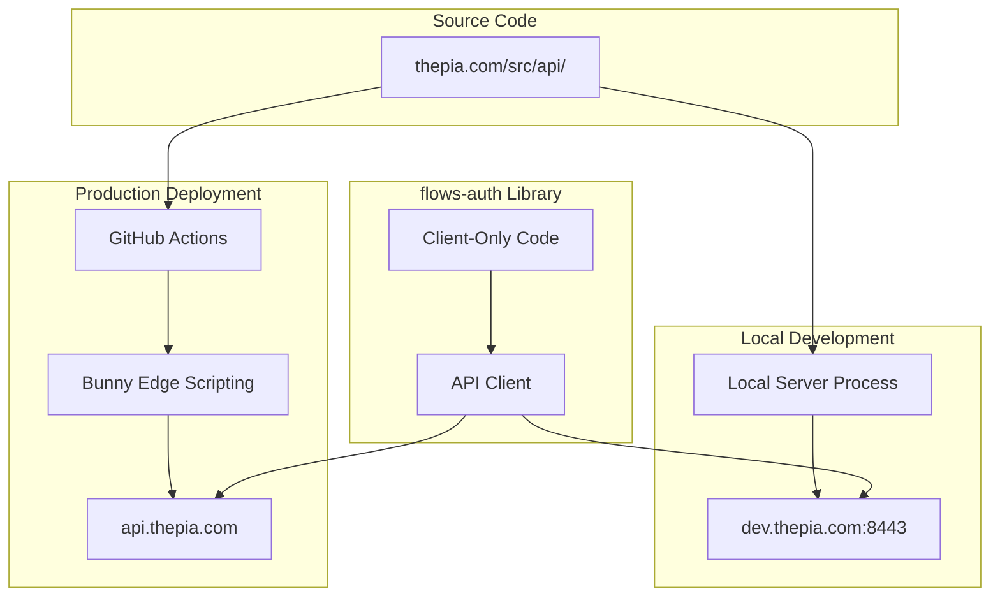

# API Server Architecture & Development

This document explains the structural reality of how the Thepia authentication API server works and how to develop against it.

## 🏗️ Structural Architecture

### **Key Constraint: API Server Source is in thepia.com Repository**

The flows-auth library is a **client-only library** that connects to the Thepia authentication API server. However, there's an important structural constraint:

- **API Server Source Code**: Located in `thepia.com/src/api/` directory
- **flows-auth Repository**: Contains only the client-side library code
- **Implication**: Scripts in flows-auth **cannot start a local API server**

This is a structural shortcoming we must work with, not try to address.

### **API Server Deployment Architecture**



## 🌐 API Server Endpoints

### **Production API Server**
- **URL**: `https://api.thepia.com`
- **Deployment**: Bunny Edge Scripting via GitHub Actions
- **Source**: `thepia.com/src/api/` directory
- **Availability**: Always available (production)
- **Use Case**: Production flows apps, testing against production data

### **Local Development API Server**
- **URL**: `https://dev.thepia.com:8443`
- **Deployment**: Manual start from thepia.com repository
- **Source**: Same `thepia.com/src/api/` directory
- **Availability**: Only when manually started
- **Use Case**: Local development, experimental features, debugging

### **🚨 Token Generation Issue**

**Current Issue**: Both servers use Machine-to-Machine (M2M) tokens instead of proper user authentication tokens.

**Solution**: New auth provider architecture supports proper passwordless tokens per client configuration. See [thepia.com/docs/auth/auth-provider-architecture.md](../../thepia.com/docs/auth/auth-provider-architecture.md).

## 🔧 Development Workflow

### **Default Behavior: Smart Detection**

The flows-auth development scripts implement smart API server detection:

1. **Check for Local API**: First, check if `dev.thepia.com:8443` is responding
2. **Fallback to Production**: If local not available, use `api.thepia.com`
3. **Log Context**: Always display which API server is being used
4. **Configure Environment**: Set appropriate environment variables

### **API Server Auto-Detection Logic**

The flows-auth library uses the following priority order for determining the API server:

```typescript
// 1. Explicit environment variable (highest priority)
const apiBaseUrl = import.meta.env.PUBLIC_API_BASE_URL

// 2. Development script detection
if (localApiHealthCheck('https://dev.thepia.com:8443')) {
  apiBaseUrl = 'https://dev.thepia.com:8443'
}

// 3. Production fallback (default)
apiBaseUrl = 'https://api.thepia.com'
```

This ensures that:
- **Production builds** always use `api.thepia.com` unless explicitly overridden
- **Development** automatically detects local API server when available
- **Manual override** is always possible via environment variables

### **Available Development Scripts**

#### From Library Root (Recommended)

```bash
# Run flows-app-demo with smart API detection
pnpm run example:flows-app-demo

# Run flows-app-demo with local API server
pnpm run example:flows-app-demo:local

# Run flows-app-demo with production API server
pnpm run example:flows-app-demo:production
```

#### From Example Directory

```bash
cd examples/flows-app-demo

# Auto-detection (recommended)
pnpm run dev:auto

# Force local API server (requires local server running)
pnpm run dev:local

# Force production API server
pnpm run dev:production

# Show help and options
./scripts/dev-with-api-detection.sh --help
```

### **Script Output Example**

```bash
🚀 Flows Auth Development Environment
=====================================

🔍 Checking for local API server at https://dev.thepia.com:8443...
✅ Local API server detected and responding

📡 API Server Information:
   Type: Local Development (auto-detected)
   URL: https://dev.thepia.com:8443
   Status: healthy
   Server: thepia-api-local

✅ Environment configured for Local Development
   PUBLIC_API_BASE_URL=https://dev.thepia.com:8443

🎯 Starting flows-app-demo...
💡 Press Ctrl+C to stop
```

## 🚀 Starting Local API Server

### **Prerequisites**

1. **Clone thepia.com repository**:
   ```bash
   git clone https://github.com/thepia/thepia.com
   cd thepia.com
   ```

2. **Install dependencies**:
   ```bash
   pnpm install
   ```

3. **Start local API server**:
   ```bash
   ./scripts/start-local-api.sh
   ```

### **Automatic Local Server Start**

The flows-auth development script can automatically start the local API server if:

1. The `thepia.com` repository is found at `../thepia.com`
2. The user confirms they want to start it
3. The start script exists and is executable

```bash
🔍 Found thepia.com repository at ../thepia.com
💡 You can start the local API server by running:
   cd ../thepia.com && ./scripts/start-local-api.sh

Would you like to start the local API server now? (y/N): y
🚀 Starting local API server...
⏳ Waiting for local API server to start...
✅ Local API server started successfully
```

## ⚙️ Configuration Management

### **Environment Variables**

The development scripts automatically configure environment variables:

```bash
# Auto-generated in examples/flows-app-demo/.env.local
PUBLIC_API_BASE_URL=https://dev.thepia.com:8443
# API Type: Local Development (auto-detected)
```

### **Client Configuration**

In your flows-auth client code:

```typescript
// Production configuration (default)
const authConfig = {
  apiBaseUrl: 'https://api.thepia.com',
  enablePasskeys: true,
  enableMagicLinks: true,
  domain: 'thepia.net'
};

// Local development configuration
const authConfig = {
  apiBaseUrl: 'https://dev.thepia.com:8443',
  enablePasskeys: true,
  enableMagicLinks: true,
  domain: 'thepia.net'
};

// Environment-based configuration (recommended)
const authConfig = {
  apiBaseUrl: import.meta.env.PUBLIC_API_BASE_URL || 'https://api.thepia.com',
  enablePasskeys: true,
  enableMagicLinks: true,
  domain: 'thepia.net'
};
```

## 🔍 Context Logging & Communication

### **Running Mode Detection**

The system always logs the current running mode:

```typescript
// Example logging in auth store
console.log('🔧 Auth Configuration:', {
  apiBaseUrl: config.apiBaseUrl,
  mode: config.apiBaseUrl.includes('dev.thepia.com') ? 'Local Development' : 'Production',
  timestamp: new Date().toISOString()
});
```

### **Health Check Endpoints**

Both API servers provide health check endpoints:

```bash
# Production health check
curl https://api.thepia.com/health

# Local development health check
curl -k https://dev.thepia.com:8443/health
```

Response format:
```json
{
  "status": "healthy",
  "server": "thepia-api-production",
  "timestamp": "2024-01-15T10:30:00Z",
  "version": "1.2.3"
}
```

## 🧪 Testing Against Different API Servers

### **Integration Tests**

Configure tests to run against both API servers:

```typescript
// tests/integration/api-environment.test.ts
describe('API Environment Tests', () => {
  test('should work with production API', async () => {
    const config = { apiBaseUrl: 'https://api.thepia.com' };
    // Test implementation
  });
  
  test('should work with local API', async () => {
    const config = { apiBaseUrl: 'https://dev.thepia.com:8443' };
    // Test implementation
  });
});
```

### **Test Scripts**

```bash
# Test against current environment
pnpm test:integration

# Test specifically against local API
pnpm run dev:local && pnpm test:integration:env

# Test specifically against production API
pnpm run dev:production && pnpm test:integration:env
```

## 🚨 Important Considerations

### **Structural Limitations**

1. **Cannot Start API Server**: flows-auth scripts cannot start the API server
2. **Dependency on thepia.com**: Local development requires thepia.com repository
3. **Manual Coordination**: Developers must manually start local API server
4. **Version Sync**: Ensure API server version matches expected client interface

### **Best Practices**

1. **Always Log Context**: Make it clear which API server is being used
2. **Graceful Fallbacks**: Default to production API when local unavailable
3. **Clear Error Messages**: Guide developers on how to start local API
4. **Environment Isolation**: Use different domains for local vs production
5. **Health Checks**: Always verify API server availability before proceeding

### **Development Workflow Recommendations**

1. **Start with Auto-Detection**: Use `pnpm run dev:auto` by default
2. **Local Development**: Clone thepia.com repo alongside flows-auth
3. **Experimental Features**: Use local API server for testing new features
4. **Production Testing**: Use production API for final validation
5. **Clear Communication**: Always display which API server is active

This architecture ensures that flows-auth remains a clean, client-only library while providing flexible development options for working with the authentication API server.
