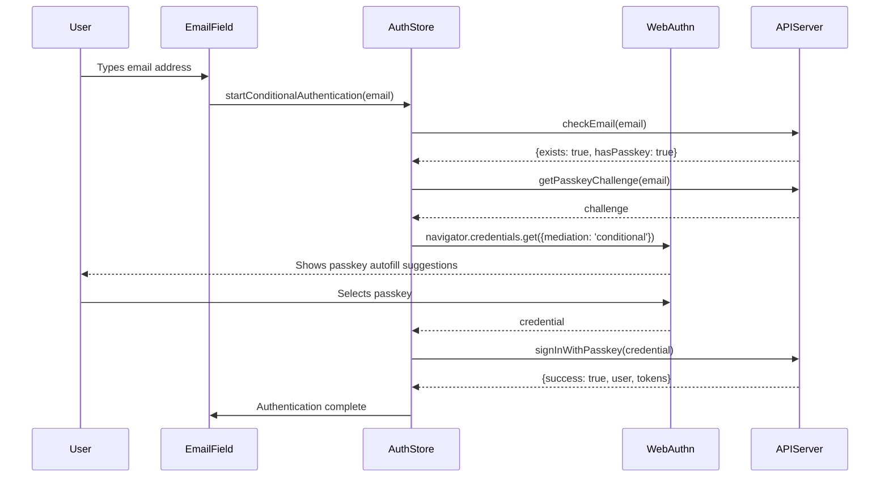

# Conditional Authentication & WebAuthn Implementation

This document explains how conditional authentication (passkey autofill) works in flows-auth and how to implement it correctly.

## 🔑 What is Conditional Authentication?

Conditional authentication enables **non-intrusive passkey discovery** that shows browser autofill suggestions for passkeys when users type their email, without showing error popups if no passkeys exist.

### Key Benefits

- **Seamless UX**: Passkeys appear as autofill suggestions in email fields
- **No Error Popups**: Fails silently when no passkeys are available
- **Standards Compliant**: Uses WebAuthn conditional mediation API
- **Cross-Platform**: Works on all devices that support WebAuthn

## 🏗️ Implementation Architecture

### Flow Overview



## 🔧 Technical Implementation

### 1. Email Field Configuration

The email input must have specific attributes for conditional authentication:

```svelte
<input
  bind:value={email}
  on:input={handleEmailChange}
  id="email"
  type="email"
  autocomplete="email webauthn"  <!-- Critical for passkey autofill -->
  required
  disabled={loading}
/>
```

**Key Requirements:**
- `autocomplete="email webauthn"` - Enables passkey autofill
- `type="email"` - Ensures proper email validation
- Debounced input handler to avoid excessive API calls

### 2. Conditional Authentication Logic

```typescript
// Email change handler with debouncing
async function handleEmailChange(event: Event) {
  const target = event.target as HTMLInputElement;
  email = target.value;
  
  if (!email.trim() || !supportsWebAuthn || loading) return;

  // Clear previous timeout
  if (emailChangeTimeout) {
    clearTimeout(emailChangeTimeout);
  }

  // Debounce email changes (1 second delay)
  emailChangeTimeout = setTimeout(async () => {
    const emailRegex = /^[^\s@]+@[^\s@]+\.[^\s@]+$/;
    if (email && emailRegex.test(email) && !conditionalAuthActive) {
      try {
        await startConditionalAuthentication();
      } catch (err) {
        // Conditional auth should fail silently
        console.log('⚠️ Conditional authentication failed (expected if no passkeys):', err);
      }
    }
  }, 1000);
}
```

### 3. WebAuthn Conditional Mediation

```typescript
// In webauthn.ts
export async function authenticateWithPasskey(
  challenge: PasskeyChallenge,
  conditional = false
): Promise<PasskeyCredential> {
  const requestOptions: CredentialRequestOptions = {
    publicKey: {
      challenge: base64ToArrayBuffer(challenge.challenge),
      rpId: challenge.rpId,
      allowCredentials: challenge.allowCredentials?.map(cred => ({
        ...cred,
        id: base64ToArrayBuffer(cred.id as unknown as string)
      })) as PublicKeyCredentialDescriptor[],
      userVerification: 'required',
      timeout: challenge.timeout || 60000
    }
  };

  // Add conditional mediation for email-triggered auth
  if (conditional && await isConditionalMediationSupported()) {
    (requestOptions as any).mediation = 'conditional';  // Key for autofill
  }

  const credential = await navigator.credentials.get(requestOptions) as PublicKeyCredential;
  // ... rest of implementation
}
```

### 4. Auth Store Integration

```typescript
// In auth-store.ts
async function startConditionalAuthentication(email: string): Promise<boolean> {
  const startTime = Date.now();
  
  if (!email.trim() || !isWebAuthnSupported()) return false;

  try {
    console.log('🔍 Starting conditional WebAuthn authentication for:', email);

    // Check if conditional mediation is supported
    if (!await isConditionalMediationSupported()) {
      console.log('⚠️ Conditional mediation not supported');
      return false;
    }

    // Get challenge from server - will fail silently if user doesn't exist
    const challenge = await api.getPasskeyChallenge(email);
    
    // Use conditional authentication with browser autofill integration
    const credential = await authenticateWithPasskey(challenge, true);
    const serializedCredential = serializeCredential(credential);
    
    // Complete authentication with server
    const response = await api.signInWithPasskey({
      email,
      challengeId: challenge.challenge,
      credential: serializedCredential
    });

    if (response.step === 'success' && response.user && response.access_token) {
      // Update auth state and notify components
      saveTokens(response);
      updateState({
        state: 'authenticated',
        user: response.user,
        access_token: response.access_token,
        // ... rest of state
      });
      
      return true;
    }

    return false;
  } catch (error: any) {
    // Conditional auth should fail silently for most errors
    console.log('⚠️ Conditional authentication failed (expected if no passkeys exist):', error.message);
    return false;
  }
}
```

## 🚨 Common Issues & Solutions

### Issue 1: Passkey Suggestions Not Appearing

**Symptoms:**
- Email field doesn't show passkey autofill suggestions
- No browser passkey prompts when typing email

**Solutions:**
1. **Check autocomplete attribute**: Must be `"email webauthn"`
2. **Verify conditional mediation support**: Use `isConditionalMediationSupported()`
3. **Ensure HTTPS**: Conditional authentication requires secure context
4. **Check RP ID**: Must match the domain where passkeys were created

### Issue 2: API Server Connection Issues

**Symptoms:**
- Console errors about failed API calls
- Conditional authentication always fails

**Solutions:**
1. **Verify API server**: Check if `dev.thepia.com:8443` or `api.thepia.com` is responding
2. **Check CORS**: Ensure API server allows requests from your domain
3. **Environment variables**: Verify `PUBLIC_API_BASE_URL` is set correctly
4. **Error reporting endpoint**: flows-auth now defaults to `https://api.thepia.com/dev/error-reports` instead of the broken `http://localhost:3000` default

### Issue 3: WebAuthn Errors

**Symptoms:**
- "NotAllowedError" or "SecurityError" in console
- Passkey prompts appear but fail

**Solutions:**
1. **Check RP ID configuration**: Must match passkey creation domain
2. **Verify challenge format**: Ensure proper base64 encoding/decoding
3. **User verification**: Check if device supports required verification method

## 🧪 Testing Conditional Authentication

### Manual Testing Steps

1. **Setup**: Ensure you have passkeys registered for test email
2. **Clear state**: Remove any existing auth tokens
3. **Open browser**: Navigate to flows-auth demo
4. **Type email**: Slowly type email address in field
5. **Verify autofill**: Should see passkey suggestions appear
6. **Select passkey**: Click on passkey suggestion
7. **Authenticate**: Complete biometric authentication
8. **Verify success**: Should be signed in automatically

### Browser Support

| Browser | Conditional Mediation | Notes |
|---------|----------------------|-------|
| Chrome 108+ | ✅ Full Support | Best experience |
| Safari 16+ | ✅ Full Support | iOS/macOS only |
| Firefox 119+ | ✅ Full Support | Recent addition |
| Edge 108+ | ✅ Full Support | Chromium-based |

### Debug Logging

Enable debug logging to troubleshoot issues:

```typescript
// In auth config
const authConfig = {
  apiBaseUrl: 'https://dev.thepia.com:8443',
  enablePasskeys: true,
  errorReporting: {
    enabled: true,
    debug: true  // Enables detailed WebAuthn logging
  }
};
```

## 📚 Related Documentation

- [API Server Architecture](./api-server-architecture.md) - How to configure API endpoints
- [WebAuthn Configuration](../flows/frontend-thepia-net-updates.md) - Domain-specific WebAuthn setup
- [Getting Started](../GETTING_STARTED.md) - Basic flows-auth setup

## 🔗 External References

- [WebAuthn Conditional Mediation Spec](https://w3c.github.io/webauthn/#enum-credentialmediationrequirement)
- [Passkey Autofill Guide](https://web.dev/passkey-form-autofill/)
- [WebAuthn Browser Support](https://caniuse.com/webauthn)
