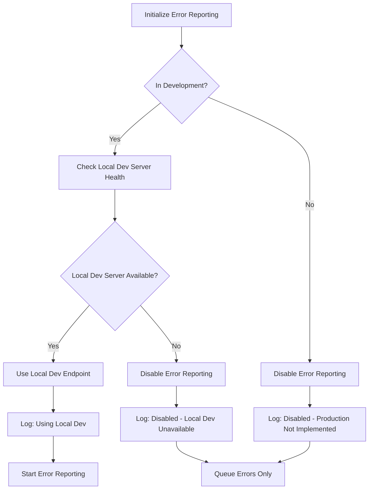

# Error Reporting Principles & Smart Server Detection

This document outlines the principles for frontend error reporting in Thepia applications, ensuring robust error handling with intelligent server detection and fallback strategies.

## 🎯 Core Principles

### **1. Never Report to Unavailable Servers**

**Principle**: The frontend should never attempt to report errors to servers that are not running or available.

**Implementation**:
- Always check server availability before attempting to report
- Use health check endpoints to verify server status
- Implement quick timeouts (2-3 seconds) for availability checks
- Gracefully handle server unavailability without blocking the application

**Example**:
```javascript
async function isLocalApiAvailable() {
  try {
    const response = await fetch('https://dev.thepia.com:8443/health', {
      method: 'GET',
      timeout: 2000 // Quick timeout
    });
    return response.ok;
  } catch (error) {
    return false; // Server not available
  }
}
```

### **2. Smart Environment Detection with Fallbacks**

**Principle**: In development environments, prefer local API servers when available, but automatically fallback to production servers when local is unavailable.

**Detection Strategy**:
1. **Environment Detection**: Identify if running in development or production
2. **Server Availability Check**: Test if local API server is responding
3. **Intelligent Routing**: Route to appropriate server based on availability
4. **Fallback Logic**: Use production API when local API is unavailable

**Example**:
```javascript
async function detectEnvironmentAndServers() {
  const isDevelopment = hostname.includes('localhost') || 
                       hostname.includes('dev.thepia.net');
  
  if (isDevelopment) {
    const localApiAvailable = await isLocalApiAvailable();
    return {
      environment: 'development',
      useLocalApi: localApiAvailable,
      fallbackToProduction: !localApiAvailable
    };
  }
  
  return { environment: 'production', useLocalApi: false };
}
```

### **3. Clear Communication of Error Reporting Strategy**

**Principle**: Always communicate to developers which error reporting server is being used and why.

**Implementation**:
- Log error reporting configuration during initialization
- Display server type and availability status in development tools
- Show fallback notices when local API is unavailable
- Provide visual indicators in development UI

**Example**:
```javascript
console.log('[Error Reporting] Initialized:', {
  serverType: 'Local API (dev.thepia.com:8443)',
  endpoint: config.endpoint,
  fallbackToProduction: false
});
```

### **4. Production Override Options**

**Principle**: Provide explicit options to force production error reporting even in development environments.

**Use Cases**:
- Testing production error reporting workflows
- Debugging production-specific issues
- Validating error reporting against production systems

**Implementation**:
```javascript
// Normal auto-detection
await initializeTasksErrorReporting();

// Force production reporting
await initializeTasksErrorReportingProduction();
```

## 🏗️ Architecture Implementation

### **Current Implementation Status**

**Development Only**: Frontend error reporting is currently implemented only for development environments.

**Production Status**: Intentionally not implemented yet because:
- Requires careful throttling and rate limiting design
- Needs protection against abuse and spam
- PostHog handles server/service monitoring (not frontend errors)
- May integrate frontend errors into PostHog in the future

### **Server Endpoint Configuration**

Current implementation (development only):

```javascript
const ERROR_REPORTING_ENDPOINTS = {
  // Development: Console logging via Astro dev route
  localDev: 'https://dev.thepia.com:8443/dev/error-reports',
  // Production: Intentionally not implemented 
  productionApi: null
};
```

### **Smart Detection Flow**



### **Visual Status Indicators**

Development UI should show:
- Current error reporting server
- Server availability status
- Fallback notices when applicable
- Queue size and flush capabilities

## 🔧 Implementation Guidelines

### **Health Check Integration**

All API servers must provide health check endpoints:

```bash
# Local development health check
curl -k https://dev.thepia.com:8443/health

# Production health check  
curl https://api.thepia.com/health
```

Expected response:
```json
{
  "status": "healthy",
  "server": "thepia-api-local",
  "timestamp": "2024-01-15T10:30:00Z"
}
```

### **Timeout and Retry Strategy**

- **Health Check Timeout**: 2-3 seconds maximum
- **Error Report Timeout**: 10 seconds maximum
- **Retry Strategy**: 3 attempts with exponential backoff
- **Queue Management**: Store failed reports for retry when server becomes available

### **Development Workflow Integration**

Error reporting should integrate seamlessly with development workflows:

1. **Local API Server Running**: Use local API for error reporting
2. **Local API Server Stopped**: Automatically fallback to production API
3. **Production Testing**: Explicit option to force production reporting
4. **Offline Development**: Queue errors for later transmission

## 📊 Status Communication

### **Console Logging**

Development environments should log:
```javascript
[Tasks App] Error reporting initialized:
  serverType: "Local API (dev.thepia.com:8443)"
  endpoint: "https://dev.thepia.com:8443/api/error-reports"
  useLocalApi: true
  fallbackToProduction: false
```

When fallback occurs:
```javascript
[Tasks App] Error reporting initialized:
  serverType: "Production API (fallback)"
  endpoint: "https://api.thepia.com/api/error-reports"
  useLocalApi: false
  fallbackToProduction: true
```

### **Visual Indicators**

Development UI should include:
- Error reporting status widget
- Server type and endpoint display
- Fallback notices
- Queue status and manual flush options

## 🚨 Anti-Patterns to Avoid

### **❌ Blind Server Assumptions**
```javascript
// DON'T: Assume local server is always available
const endpoint = isDev ? 'https://dev.thepia.com:8443/api/error-reports' : productionEndpoint;
```

### **❌ Silent Failures**
```javascript
// DON'T: Fail silently when server is unavailable
try {
  await reportError(event);
} catch (error) {
  // Silent failure - no communication to developer
}
```

### **❌ Long Health Check Timeouts**
```javascript
// DON'T: Use long timeouts that block application startup
const response = await fetch(healthEndpoint, { timeout: 30000 });
```

### **❌ No Fallback Strategy**
```javascript
// DON'T: Fail completely when local server is unavailable
if (!localApiAvailable) {
  throw new Error('Cannot initialize error reporting');
}
```

## ✅ Best Practices

1. **Quick Health Checks**: Use 2-second timeouts for availability checks
2. **Graceful Fallbacks**: Always provide production API fallback
3. **Clear Communication**: Log and display current error reporting strategy
4. **Queue Management**: Store errors when servers are unavailable
5. **Override Options**: Provide explicit production reporting options
6. **Visual Status**: Show error reporting status in development UI
7. **Integration Testing**: Test both local and production error reporting paths

This approach ensures robust error reporting that adapts to development environments while maintaining reliability and clear communication with developers.