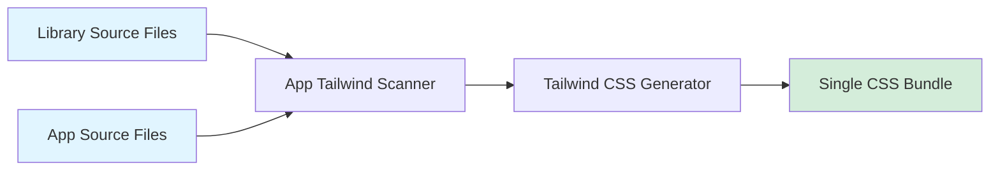

# Tailwind CSS Integration Guide

Complete guide for using Tailwind CSS with `@thepia/flows-auth` library components in Astro and SvelteKit applications.

## Table of Contents

- [Architecture Overview](#architecture-overview)
- [Core Principles](#core-principles)
- [Astro Integration](#astro-integration)
- [SvelteKit Integration](#sveltekit-integration)
- [Component Development](#component-development)
- [Maintenance Guidelines](#maintenance-guidelines)
- [Troubleshooting](#troubleshooting)

## Architecture Overview

### Library-App Tailwind Model

The `@thepia/flows-auth` library uses a **consumer-compiled Tailwind architecture**:

1. **Library components** use inline Tailwind utility classes in templates
2. **Consuming applications** scan library source files during their build
3. **Tailwind generates utilities** based on classes found in both app and library
4. **Single CSS output** from the consuming app (no duplication)



### Why This Approach?

- ✅ **Zero duplication** - Single Tailwind build in consuming app
- ✅ **Consistent theming** - App's Tailwind config applies to all components
- ✅ **Smaller bundles** - No duplicate utility classes
- ✅ **Hot reload** - Changes to library components trigger Tailwind rebuild
- ✅ **Customization** - Apps can extend/override utilities

### What Doesn't Work

- ❌ **`@apply` in library components** - Requires Tailwind in library build
- ❌ **JavaScript template strings** - Tailwind can't scan dynamic strings
- ❌ **Pre-compiled library CSS** - Leads to duplication and theme conflicts
- ❌ **Scoped component CSS for utilities** - Defeats purpose of Tailwind

## Core Principles

### 1. Template-Based Classes

**✅ CORRECT: Classes visible in template**
```svelte
<!-- AuthButton.svelte -->
<button
  class="flex items-center justify-center gap-2 font-medium rounded-lg
         {variant === 'primary' ? 'auth-btn-primary' : ''}
         {size === 'sm' ? 'px-3 py-1.5 text-sm' : ''}
         {fullWidth ? 'w-full' : ''}"
>
  {displayText}
</button>
```

**❌ WRONG: Classes in JavaScript functions**
```svelte
<script>
  function getButtonClasses() {
    return "flex items-center gap-2"; // Tailwind can't scan this!
  }
</script>

<button class={getButtonClasses()}>Click</button>
```

### 2. Conditional Classes

Use Svelte's inline conditional syntax to keep classes scannable:

```svelte
<button
  class="btn-base
         {variant === 'primary' ? 'bg-blue-500 text-white' : ''}
         {variant === 'secondary' ? 'bg-gray-200 text-gray-900' : ''}
         {isDisabled ? 'cursor-not-allowed opacity-50' : 'cursor-pointer'}"
>
```

### 3. Brand-Specific Styling

Keep brand theming and complex interactions in scoped CSS:

```svelte
<button class="flex items-center gap-2 px-4 py-2 rounded-lg auth-btn-primary">
  Sign In
</button>

<style>
  /* Brand colors use CSS variables - NOT Tailwind */
  .auth-btn-primary {
    background: var(--color-brand-primary, #988ACA);
    color: white;
    border: 2px solid transparent;
  }

  .auth-btn-primary:hover:not(:disabled) {
    background: var(--color-brand-primary-hover, #7B6BB7);
    transform: translateY(-1px);
    box-shadow: 0 6px 20px rgba(152, 138, 202, 0.5);
  }
</style>
```

### 4. Utility vs Custom CSS

**Use Tailwind for:**
- Layout (flex, grid, spacing)
- Sizing (w-full, h-4, min-h-[2.75rem])
- Typography (text-sm, font-medium)
- Common states (opacity-50, cursor-pointer)

**Use scoped CSS for:**
- Brand-specific colors (CSS variables)
- Complex hover/active effects
- Animations beyond Tailwind's defaults
- Component-specific design tokens

## Astro Integration

### Setup Steps

#### 1. Install Dependencies

```bash
pnpm add @thepia/flows-auth @thepia/branding
pnpm add -D tailwindcss @tailwindcss/vite
pnpm astro add svelte
```

#### 2. Create Tailwind Config

**File**: `tailwind.config.js`

```javascript
// Tailwind v4 uses @source in CSS, config.js is for plugins only
import thepiaPlugin from '@thepia/branding/tailwind/source';

export default {
  plugins: [thepiaPlugin]
};
```

#### 3. Create App Stylesheet

**File**: `src/styles/app.css`

```css
@import "tailwindcss";
@import "@thepia/branding/tailwind/variables";
@import "@thepia/branding/css/components";

/* CRITICAL: Tell Tailwind to scan library source files */
@source "../../node_modules/@thepia/flows-auth/src/**/*.svelte";

/* Tailwind v4 @theme configuration */
@theme {
  --color-primary: var(--color-brand-primary);
  --color-primary-50: var(--color-palette-thepia-50);
  /* ... additional theme mappings */
}
```

**Key Points:**
- `@source` directive is REQUIRED for Tailwind v4 in Astro
- Must use relative path from CSS file location
- Glob pattern `**/*.svelte` scans all library components

#### 4. Configure Astro

**File**: `astro.config.mjs`

```javascript
import { defineConfig } from 'astro/config';
import svelte from '@astrojs/svelte';
import tailwindcss from '@tailwindcss/vite';

export default defineConfig({
  integrations: [svelte()],
  vite: {
    plugins: [tailwindcss()],
    ssr: {
      noExternal: ['phosphor-svelte'] // If using Phosphor icons
    }
  }
});
```

#### 5. Import Stylesheet in Layout

**File**: `src/layouts/Layout.astro`

```astro
---
import '../styles/app.css';
---

<html>
  <head>
    <title>Your App</title>
  </head>
  <body>
    <slot />
  </body>
</html>
```

### Verification

Check that Tailwind is generating utilities:

```bash
# Build the project
pnpm build

# Check for Tailwind utilities in CSS output
cat dist/_astro/*.css | grep "\.flex{"
# Should output: .flex{display:flex}
```

## SvelteKit Integration

### Setup Steps

#### 1. Install Dependencies

```bash
pnpm add @thepia/flows-auth @thepia/branding
pnpm add -D tailwindcss @tailwindcss/vite
```

#### 2. Create Tailwind Config

**File**: `tailwind.config.js`

```javascript
import thepiaPlugin from '@thepia/branding/tailwind/source';

export default {
  content: [
    './src/**/*.{html,js,svelte,ts}',
    './node_modules/@thepia/flows-auth/src/**/*.svelte',
    './node_modules/@thepia/branding/**/*.{js,svelte,ts}'
  ],
  plugins: [thepiaPlugin]
};
```

**Note**: SvelteKit uses the `content` array, unlike Astro which uses `@source`.

#### 3. Create App Stylesheet

**File**: `src/app.css`

```css
@import "tailwindcss";
@import "@thepia/branding/tailwind/variables";
@import "@thepia/branding/css/components";

@theme {
  --color-primary: var(--color-brand-primary);
  /* ... theme mappings */
}
```

#### 4. Configure Vite

**File**: `vite.config.ts`

```typescript
import { sveltekit } from '@sveltejs/kit/vite';
import tailwindcss from '@tailwindcss/vite';
import { defineConfig } from 'vite';

export default defineConfig({
  plugins: [
    sveltekit(),
    tailwindcss()
  ]
});
```

#### 5. Import in Root Layout

**File**: `src/routes/+layout.svelte`

```svelte
<script>
  import '../app.css';
</script>

<slot />
```

## Component Development

### Converting Existing Components

Follow this process to convert components to use Tailwind:

#### Step 1: Identify Utility Classes

Map existing CSS to Tailwind utilities:

| Old CSS | Tailwind Utility | Notes |
|---------|------------------|-------|
| `display: flex` | `flex` | ✅ Exact match |
| `align-items: center` | `items-center` | ✅ Exact match |
| `gap: 0.5rem` | `gap-2` | ✅ 0.5rem = theme spacing |
| `padding: 1rem 1.5rem` | `px-6 py-4` | ✅ Convert to t/r/b/l |
| `border-radius: 0.5rem` | `rounded-lg` | ✅ 0.5rem = lg |
| `max-width: 400px` | Custom value | ⚠️ Use exact: `max-w-[400px]` |

#### Step 2: Move Classes to Template

**Before:**
```svelte
<script>
  function getClasses() {
    return `flex items-center gap-2 ${fullWidth ? 'w-full' : ''}`;
  }
</script>

<button class={getClasses()}>Click</button>

<style>
  button {
    display: flex;
    align-items: center;
    gap: 0.5rem;
  }
</style>
```

**After:**
```svelte
<script>
  // No class generation function needed
</script>

<button class="flex items-center gap-2 {fullWidth ? 'w-full' : ''}">
  Click
</button>

<!-- No scoped CSS for layout utilities -->
```

#### Step 3: Keep Brand-Specific CSS

```svelte
<button class="flex items-center gap-2 px-4 py-2 rounded-lg auth-btn-primary">
  Click
</button>

<style>
  /* Brand theming stays in CSS */
  .auth-btn-primary {
    background: var(--color-brand-primary);
    color: white;
  }

  .auth-btn-primary:hover:not(:disabled) {
    background: var(--color-brand-primary-hover);
    box-shadow: 0 6px 20px rgba(152, 138, 202, 0.5);
  }
</style>
```

#### Step 4: Replace Animations

**Before:**
```svelte
<div class="spinner" />

<style>
  .spinner {
    animation: spin 1s linear infinite;
  }

  @keyframes spin {
    from { transform: rotate(0deg); }
    to { transform: rotate(360deg); }
  }
</style>
```

**After:**
```svelte
<div class="animate-spin w-4 h-4 border-2 border-transparent border-t-current rounded-full" />

<!-- No CSS needed - Tailwind provides animate-spin -->
```

### Creating New Components

When creating new components, follow this pattern:

```svelte
<script lang="ts">
  export let variant: 'primary' | 'secondary' = 'primary';
  export let size: 'sm' | 'md' | 'lg' = 'md';
  export let fullWidth = false;
  export let disabled = false;
</script>

<button
  class="
    flex items-center justify-center gap-2 font-medium rounded-lg
    transition-all duration-200 focus:outline-none focus:ring-2
    {variant === 'primary' ? 'auth-btn-primary' : ''}
    {variant === 'secondary' ? 'auth-btn-secondary' : ''}
    {size === 'sm' ? 'px-3 py-1.5 text-sm' : ''}
    {size === 'md' ? 'px-4 py-2 text-base' : ''}
    {size === 'lg' ? 'px-5 py-3 text-lg' : ''}
    {fullWidth ? 'w-full' : ''}
    {disabled ? 'cursor-not-allowed opacity-50' : 'cursor-pointer'}
  "
  {disabled}
>
  <slot />
</button>

<style>
  /* Brand-specific styling only */
  .auth-btn-primary {
    background: var(--color-brand-primary, #988ACA);
    color: white;
    border: 2px solid transparent;
  }

  .auth-btn-primary:hover:not(:disabled) {
    background: var(--color-brand-primary-hover, #7B6BB7);
    transform: translateY(-1px);
    box-shadow: 0 6px 20px rgba(152, 138, 202, 0.5);
  }

  .auth-btn-secondary {
    background: transparent;
    color: var(--color-brand-primary, #988ACA);
    border: 2px solid var(--color-brand-primary, #988ACA);
  }

  .auth-btn-secondary:hover:not(:disabled) {
    background: var(--color-brand-primary, #988ACA);
    color: white;
  }
</style>
```

## Maintenance Guidelines

### Pre-Commit Checklist

Before committing component changes:

- [ ] All Tailwind classes are in template markup (not JS functions)
- [ ] Build succeeds: `pnpm build`
- [ ] Library CSS file size didn't increase significantly
- [ ] Tested in both astro-demo and auth-demo
- [ ] No visual regressions in existing components
- [ ] Brand theming still works with CSS variables

### Testing Tailwind Integration

#### Test in Astro Demo

```bash
cd examples/astro-demo
pnpm build

# Verify Tailwind utilities exist
cat dist/_astro/*.css | grep "\.flex{"
cat dist/_astro/*.css | grep "\.items-center{"
```

#### Test in SvelteKit Demo

```bash
cd examples/auth-demo
pnpm build

# Check build output
cat .svelte-kit/output/client/_app/immutable/assets/*.css | grep "\.flex{"
```

### Visual Regression Testing

After refactoring components:

1. **Start both demos side-by-side**
   ```bash
   # Terminal 1
   cd examples/astro-demo && pnpm dev

   # Terminal 2
   cd examples/auth-demo && pnpm dev
   ```

2. **Compare visually:**
   - Button sizes and spacing
   - Colors and hover states
   - Responsive behavior
   - Loading states
   - Error states

3. **Test interactions:**
   - Click buttons
   - Hover effects
   - Focus states
   - Disabled states

### Common Pitfalls

#### Pitfall 1: Classes in Template Strings

```svelte
<!-- ❌ WRONG -->
<script>
  const buttonClass = `flex items-center gap-2`;
</script>
<button class={buttonClass}>Click</button>

<!-- ✅ CORRECT -->
<button class="flex items-center gap-2">Click</button>
```

#### Pitfall 2: Computed Class Functions

```svelte
<!-- ❌ WRONG -->
<script>
  $: classes = getButtonClasses(variant, size);
</script>
<button class={classes}>Click</button>

<!-- ✅ CORRECT -->
<button class="flex items-center {variant === 'primary' ? 'bg-blue-500' : ''}">
  Click
</button>
```

#### Pitfall 3: Using `@apply` in Library

```svelte
<!-- ❌ WRONG - Library components can't use @apply -->
<button class="btn-custom">Click</button>

<style>
  .btn-custom {
    @apply flex items-center gap-2 px-4 py-2;
  }
</style>

<!-- ✅ CORRECT - Use inline classes -->
<button class="flex items-center gap-2 px-4 py-2 btn-brand">
  Click
</button>

<style>
  .btn-brand {
    background: var(--color-brand-primary);
  }
</style>
```

## Troubleshooting

### Utilities Not Generated

**Symptom**: Component renders but has no Tailwind styling.

**Diagnosis:**
```bash
# Check if Tailwind is scanning library files
cat dist/_astro/*.css | grep "\.flex{"
# If empty, Tailwind isn't scanning the library
```

**Solutions:**

**For Astro:**
1. Verify `@source` directive in `app.css`:
   ```css
   @source "../../node_modules/@thepia/flows-auth/src/**/*.svelte";
   ```

2. Check path is relative to CSS file location

3. Rebuild from scratch:
   ```bash
   rm -rf dist node_modules/.vite
   pnpm install
   pnpm build
   ```

**For SvelteKit:**
1. Verify `content` array in `tailwind.config.js`:
   ```javascript
   content: [
     './src/**/*.{html,js,svelte,ts}',
     './node_modules/@thepia/flows-auth/src/**/*.svelte'
   ]
   ```

2. Rebuild:
   ```bash
   rm -rf .svelte-kit
   pnpm build
   ```

### Classes in JavaScript Strings Not Working

**Symptom**: Classes work when inline but not from variables.

**Cause**: Tailwind scans template markup, not JavaScript runtime values.

**Solution**: Move all classes to template:

```svelte
<!-- ❌ WRONG -->
<script>
  const btnClass = "flex items-center gap-2";
</script>
<button class={btnClass}>Click</button>

<!-- ✅ CORRECT -->
<button class="flex items-center gap-2">Click</button>
```

### Visual Regression After Refactoring

**Symptom**: Component looks different after converting to Tailwind.

**Diagnosis:**
1. Compare exact pixel values
2. Check browser DevTools computed styles
3. Look for missing CSS classes

**Solution:**
- Create exact mapping table before converting
- Test each section incrementally
- Keep browser DevTools open to verify computed values

### Bundle Size Increased

**Symptom**: Library CSS file grew after adding Tailwind.

**Cause**: Duplicate CSS or incorrect architecture.

**Solution:**
1. Verify consuming app scans library files (not library itself)
2. Remove any Tailwind PostCSS from library build
3. Check library dist/style.css - should only contain brand CSS, not utilities

## Best Practices Summary

### ✅ DO

- Use inline Tailwind classes in component templates
- Keep brand theming in scoped CSS with CSS variables
- Test in both Astro and SvelteKit demos
- Use `@source` directive in Astro apps
- Use `content` array in SvelteKit apps
- Verify utilities are generated after changes

### ❌ DON'T

- Use classes in JavaScript functions or template strings
- Use `@apply` in library components
- Pre-compile Tailwind CSS in the library
- Forget to add `@source` directive in Astro
- Skip visual regression testing
- Change exact pixel values without verification

## Further Reading

- [Tailwind v4 Documentation](https://tailwindcss.com/docs)
- [Astro Islands](https://docs.astro.build/en/concepts/islands/)
- [SvelteKit Styling](https://kit.svelte.dev/docs/styling)
- [@thepia/branding Documentation](../../branding/README.md)

---

**Last Updated**: 2025-10-04
**Applies To**: @thepia/flows-auth v1.0.5+, Tailwind CSS v4.1.14+
