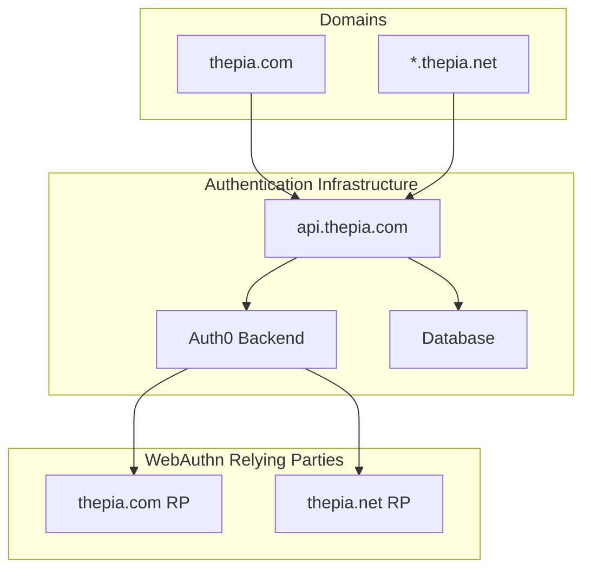
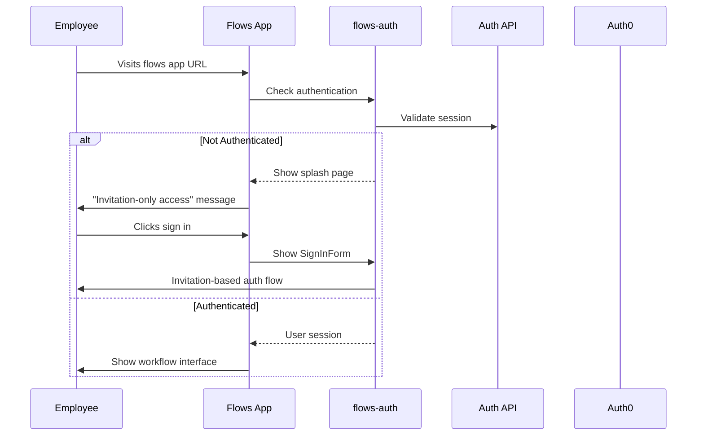
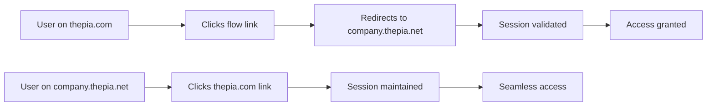
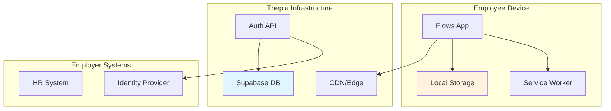
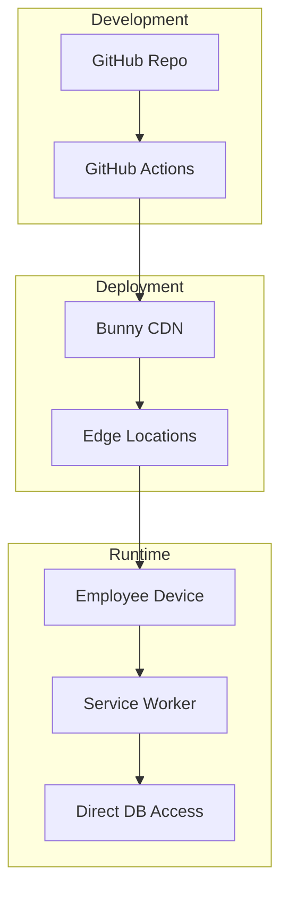

# Thepia Flows Authentication Integration

This document explains how the `@thepia/flows-auth` library integrates with Thepia Flows applications and the multi-domain authentication strategy.

## Multi-Domain Architecture

Thepia operates across two primary domains with a unified authentication backend:

### Domain Structure

- **`thepia.com`** - Main Thepia platform and marketing site
- **`thepia.net`** - All workflow applications and flows
  - `offboarding.company.thepia.net`
  - `onboarding.company.thepia.net` 
  - `compliance.company.thepia.net`
  - Custom employer-specific subdomains

### Unified Backend



## Authentication Flow for Flows

### 1. Invitation-Based Access Flow

Thepia Flows applications use invitation-based authentication for workplace access:



### 2. Employer Isolation

Each employer gets complete data isolation:

- **Subdomain Isolation**: `company.thepia.net` 
- **Database Segregation**: Employer-specific data boundaries
- **Authentication Scoping**: Users can only access their employer's flows
- **Branding Isolation**: White-labeled UI per employer

### 3. Cross-Domain Session Sharing

The authentication system enables seamless transitions:



## Implementation in Flows Apps

### Basic Integration

```svelte
<!-- src/routes/+layout.svelte -->
<script>
  import { SignInForm, createAuthStore } from '@thepia/flows-auth';
  import { onMount } from 'svelte';
  
  // Configure for thepia.net domain
  const authConfig = {
    apiBaseUrl: 'https://api.thepia.com',
    enablePasskeys: true,
    enableMagicLinks: true,
    domain: 'thepia.net'
  };
  
  const authStore = createAuthStore(authConfig);
  
  let showSplash = true;
  let currentUser = null;
  
  // Subscribe to auth state
  authStore.subscribe(state => {
    currentUser = state.user;
    showSplash = !state.user;
  });
  
  onMount(() => {
    // Check for existing session
    authStore.checkSession();
  });
</script>

{#if showSplash}
  <div class="splash-page">
    <h1>Employee Access Required</h1>
    <p>This application is for authorized employees only.</p>
    
    <SignInForm 
      config={authConfig}
      on:success={() => showSplash = false}
      on:error={handleAuthError}
    />
  </div>
{:else}
  <!-- Authenticated content -->
  <slot />
{/if}
```

### Configuration Options

#### Default: Privacy-First Configuration

```javascript
// Default cookie-free flows configuration
const flowsAuthConfig = {
  apiBaseUrl: 'https://api.thepia.com',
  enablePasskeys: true,
  enableMagicLinks: true,
  domain: 'thepia.net',

  // Privacy-first settings (default)
  privacy: {
    mode: 'zero-cookie',           // Complete cookie-free operation
    localStorageOnly: true,        // Browser-controlled storage
    userControlled: true           // User can clear data anytime
  },

  // Flows-specific options
  employerDomain: 'company.thepia.net',
  requireEmployeeVerification: true,
  sessionTimeout: 8 * 60 * 60 * 1000, // 8 hours for work sessions

  // UI customization
  branding: {
    logo: '/employer-logo.svg',
    primaryColor: '#company-color',
    companyName: 'Company Name'
  }
};
```

#### Enterprise: Extended Authentication (When Required)

```javascript
// Enterprise flows configuration with additional auth methods
const enterpriseFlowsConfig = {
  apiBaseUrl: 'https://api.thepia.com',
  enablePasskeys: true,
  enableMagicLinks: true,
  domain: 'thepia.net',

  // Enterprise authentication requirements
  enterprise: {
    enableSAML: true,              // SAML/SSO integration
    enableLegacyAuth: true,        // Legacy system support
    sessionManagement: true,       // Centralized session control
    auditLogging: true,            // Detailed session tracking
  },

  // Still privacy-conscious
  privacy: {
    mode: 'enterprise-extended',   // Minimal additional storage
    minimizeData: true,            // Store only essential data
    transparentToUser: true,       // Clear about what's stored
    userControlled: true           // User can still clear data
  },

  // Enterprise flows options
  employerDomain: 'company.thepia.net',
  requireEmployeeVerification: true,
  sessionTimeout: 8 * 60 * 60 * 1000,

  // Enterprise branding
  branding: {
    logo: '/employer-logo.svg',
    primaryColor: '#company-color',
    companyName: 'Company Name',
    showPrivacyMode: true          // Display privacy mode to users
  }
};
```

## Security Considerations for Flows

### Employee Verification

Flows applications implement additional security layers:

1. **Email Domain Verification**: Ensure users belong to the employer
2. **Role-Based Access**: Different permissions for different employee types
3. **Session Monitoring**: Track and audit employee access
4. **Device Registration**: Optional device binding for high-security environments

### Data Protection



### Privacy Compliance

- **100% Cookie-Free**: Zero cookies used, no consent banners needed
- **GDPR Compliance**: Inherits all compliance from Shadow GDPR framework
- **Data Minimization**: Only collect necessary employee data
- **Right to Erasure**: Complete data deletion capabilities
- **Audit Logging**: Comprehensive access and action logging
- **Local Storage Only**: All session data stays in employee's browser

## Deployment Architecture

### CDN-Based Deployment

Flows applications are deployed using a CDN-based architecture:



### Authentication in CDN Environment

The flows-auth library is designed for CDN deployment:

- **Static Assets**: All authentication UI is static
- **Client-Side Logic**: Authentication happens in the browser
- **API Integration**: Direct calls to api.thepia.com
- **No Server Dependencies**: Works without application servers

## Testing Strategy

### Authentication Testing

```javascript
// Example test for flows authentication
import { render, fireEvent } from '@testing-library/svelte';
import { SignInForm } from '@thepia/flows-auth';

test('flows app authentication', async () => {
  const config = {
    apiBaseUrl: 'https://api.thepia.com',
    enablePasskeys: true,
    domain: 'thepia.net'
  };
  
  const { getByRole, getByLabelText } = render(SignInForm, { config });
  
  // Test email input
  const emailInput = getByLabelText('Email address');
  await fireEvent.input(emailInput, { target: { value: 'employee@company.com' } });
  
  // Test passkey button appears
  const passkeyButton = getByRole('button', { name: /sign in with passkey/i });
  expect(passkeyButton).toBeInTheDocument();
});
```

### Integration Testing

- **Cross-Domain Testing**: Verify session sharing between domains
- **Employee Verification**: Test employer domain validation
- **Offline Functionality**: Test service worker authentication
- **Device Compatibility**: Test across mobile and desktop devices

## Monitoring and Analytics

### Authentication Metrics

Track key authentication metrics for flows:

- **Sign-in Success Rate**: By domain and employer
- **Passkey Adoption**: WebAuthn usage statistics  
- **Session Duration**: Employee engagement metrics
- **Error Rates**: Authentication failure analysis

### Security Monitoring

- **Failed Authentication Attempts**: Potential security threats
- **Unusual Access Patterns**: Anomaly detection
- **Cross-Domain Activity**: Session sharing monitoring
- **Device Registration**: New device alerts

## Related Documentation

- **[Multi-Domain Strategy](./multi-domain.md)** - Detailed domain architecture
- **[Deployment Guide](./deployment.md)** - Production deployment
- **[Security Model](./security.md)** - Security architecture
- **[Thepia Flows Documentation](https://github.com/thepia/thepia.com/tree/main/docs/flows)** - Complete flows system documentation

For complete implementation examples, see the [flows-app-demo](../../examples/flows-app-demo) in this repository.
