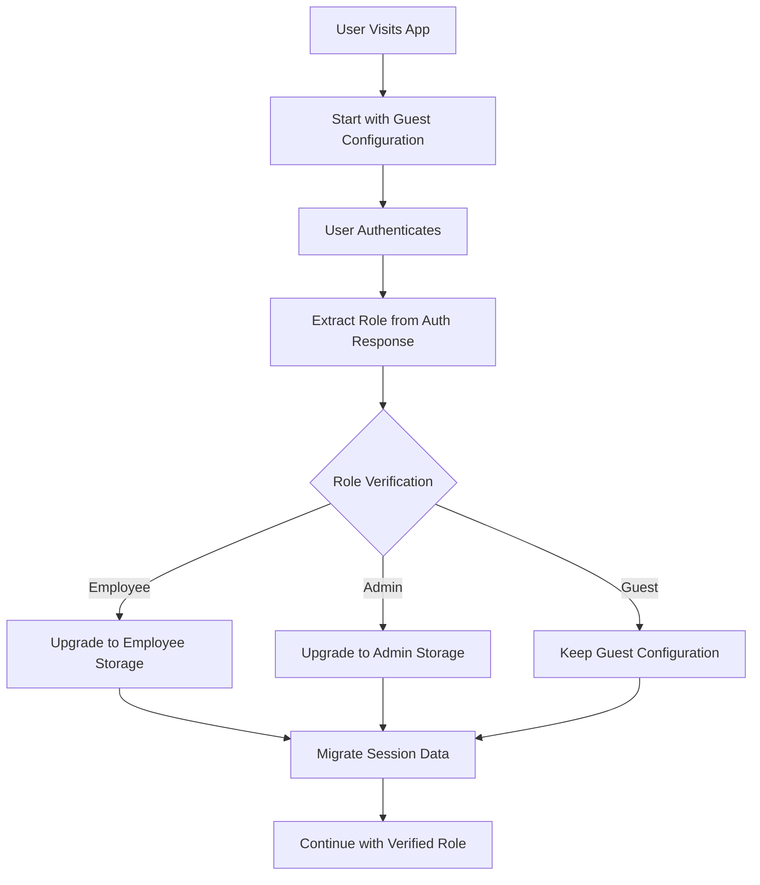

# Dynamic Role Configuration Specification

## Overview

This specification defines the enhanced authentication architecture that addresses the "chicken-and-egg" problem of role-based session configuration. Instead of requiring predetermined user roles, the system now uses conservative defaults with dynamic upgrades based on verified authentication.

## Problem Statement

The original implementation required specifying user roles before authentication:

```typescript
// ❌ PROBLEMATIC: How do we know they're an employee before auth?
configureSessionStorage({
  userRole: 'employee', // This requires prior knowledge
  sessionTimeout: 7 * 24 * 60 * 60 * 1000
});
```

This creates a security vulnerability where applications must guess user roles or assume all users are employees.

## Solution Architecture

### 1. Security-First Flow



### 2. Core Components

#### Auth Store Extensions
- `updateStorageConfiguration()` - Dynamic configuration updates
- `migrateSession()` - Session data migration between storage types
- `getApplicationContext()` - Application-level role hints

#### Session Migration
- Preserve authentication state during storage transitions
- Handle migration failures gracefully
- Maintain token validity across storage types

#### Application Context
- Domain-based role hints (`internal.company.com` = employees)
- URL-based role hints (`/admin/login` = admin)
- Application-level hints (corporate intranet = all employees)

## API Specification

### 1. Auth Store Interface Extensions

```typescript
interface AuthStore {
  // ... existing methods

  // NEW: Dynamic configuration methods
  updateStorageConfiguration(update: StorageConfigurationUpdate): Promise<void>;
  migrateSession(fromType: StorageType, toType: StorageType): Promise<SessionMigrationResult>;
  getApplicationContext(): ApplicationContext | null;
}
```

### 2. Configuration Interfaces

```typescript
interface StorageConfigurationUpdate {
  type: 'sessionStorage' | 'localStorage';
  userRole: 'employee' | 'guest' | 'admin';
  sessionTimeout: number;
  migrateExistingSession: boolean;
  preserveTokens: boolean;
}

interface ApplicationContext {
  // Domain-based hints
  domain?: string;
  
  // URL-based hints  
  urlPath?: string;
  
  // Application-level hints
  userType?: 'all_employees' | 'all_guests' | 'mixed';
  
  // Security override
  forceGuestMode?: boolean;
}

interface SessionMigrationResult {
  success: boolean;
  fromStorage: StorageType;
  toStorage: StorageType;
  dataPreserved: boolean;
  tokensPreserved: boolean;
  error?: string;
}
```

### 3. Enhanced Auth Configuration

```typescript
interface AuthConfig {
  // ... existing config
  
  // NEW: Application context for role hints
  applicationContext?: ApplicationContext;
  
  // NEW: Storage configuration callback
  onStorageConfigurationUpdate?: (update: StorageConfigurationUpdate) => void;
}
```

## Implementation Requirements

### 1. Backward Compatibility
- Existing applications continue to work without changes
- Deprecated: Pre-authentication role specification
- Graceful degradation for legacy configurations

### 2. Security Requirements
- Always start with conservative guest settings
- Require verified authentication before role upgrades
- Fail securely if migration fails
- Audit log all role changes

### 3. Performance Requirements
- Session migration must complete within 500ms
- No authentication interruption during migration
- Minimal impact on initial page load

### 4. Error Handling
- Graceful fallback to guest mode on errors
- Clear error messages for debugging
- Rollback mechanism for failed migrations

## Usage Patterns

### 1. Standard Public Application

```typescript
// Start with conservative defaults
const authStore = createAuthStore({
  apiBaseUrl: 'https://api.company.com',
  applicationContext: {
    userType: 'mixed',
    forceGuestMode: true
  }
});

// Upgrade after authentication
authStore.subscribe(($auth) => {
  if ($auth.isAuthenticated && $auth.user) {
    const role = $auth.user.metadata?.role;
    
    if (role === 'employee') {
      authStore.updateStorageConfiguration({
        type: 'localStorage',
        userRole: 'employee',
        sessionTimeout: 7 * 24 * 60 * 60 * 1000,
        migrateExistingSession: true,
        preserveTokens: true
      });
    }
  }
});
```

### 2. Corporate Intranet (All Employees)

```typescript
const authStore = createAuthStore({
  apiBaseUrl: 'https://internal.company.com',
  applicationContext: {
    userType: 'all_employees',
    domain: 'internal.company.com'
  }
});

// Still starts with guest mode for security, but expects employee upgrade
```

### 3. Admin Portal

```typescript
const authStore = createAuthStore({
  apiBaseUrl: 'https://admin.company.com',
  applicationContext: {
    userType: 'mixed',
    urlPath: '/admin/login',
    forceGuestMode: true // Security-first for admin access
  }
});
```

## Migration Strategy

### Phase 1: Add New Interfaces
- Define new TypeScript interfaces
- Add new auth store methods (stubbed)
- Update documentation

### Phase 2: Implement Session Migration
- Create SessionMigrator utility
- Implement safe data transfer
- Add comprehensive tests

### Phase 3: Update Applications
- flows.thepia.net: Remove hardcoded employee role
- Add dynamic configuration subscriptions
- Test all authentication flows

### Phase 4: Deprecate Old Patterns
- Add deprecation warnings
- Update documentation
- Provide migration guides

## Security Considerations

### 1. Role Verification
- Never trust client-side role hints
- Always verify roles against server response
- Log all role changes for audit

### 2. Storage Migration Security
- Validate tokens before migration
- Clear sensitive data on migration failure
- Prevent downgrade attacks

### 3. Application Context Hints
- Use hints for optimization, not security
- Always fail securely if hints are wrong
- Validate hints against actual authentication

## Testing Requirements

### 1. Unit Tests
- Session migration between storage types
- Application context hint processing
- Error handling and rollback scenarios

### 2. Integration Tests  
- Full authentication flow with role upgrades
- Cross-storage session preservation
- Multi-tab session consistency

### 3. Security Tests
- Role escalation prevention
- Migration failure handling
- Token preservation during transitions

## Success Criteria

1. **Security**: No pre-authentication role assumptions
2. **Performance**: < 500ms migration time
3. **Compatibility**: Zero breaking changes for existing apps
4. **Reliability**: < 0.1% migration failure rate
5. **Usability**: Clear error messages and debugging