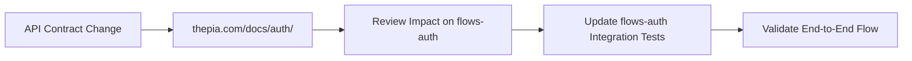

# Client Integration Strategy

**How flows-auth integrates with thepia.com API contracts**

## Repository Ownership Model

### **thepia.com (API Authority)**
- **Owns**: API implementation, contracts, test scenarios
- **Maintains**: Production-stable authentication server
- **Documentation**: `thepia.com/docs/auth/` - Complete API specifications
- **Responsibility**: Defines what the API server does

### **flows-auth (Client Integration)**
- **Owns**: Auth UI components, auth store, client integration tests
- **Maintains**: Client-side authentication experience
- **Documentation**: `flows-auth/docs/testing/` - Integration testing strategy
- **Responsibility**: Defines how client integrates with documented API

---

## Integration Testing Strategy

### **Core Principle: Reference thepia.com Scenarios**

flows-auth integration tests **must reference** specific thepia.com API contract scenarios:

```typescript
// ✅ CORRECT: Reference thepia.com scenario
describe('User Authentication Integration', () => {
  it('should handle existing user with passkey (T001)', async () => {
    // This test validates flows-auth integrates correctly with
    // thepia.com scenario T001: "Valid existing user with passkey"
    const result = await checkUserExists('test-with-passkey@thepia.net');
    expect(result.hasPasskey).toBe(true);
  });
  
  it('should handle non-existent user (T003)', async () => {
    // References thepia.com scenario T003: "New user (does not exist)"
    const result = await checkUserExists('test-new-user@thepia.net');
    expect(result.userExists).toBe(false);
  });
});
```

### **Test Scenario Mapping**

| flows-auth Test | thepia.com Scenario | API Contract |
|----------------|-------------------|--------------|
| User with passkey flow | T001 | POST /auth/check-user → hasPasskey: true |
| User without passkey | T002 | POST /auth/check-user → hasPasskey: false |
| New user registration | T003 | POST /auth/check-user → userExists: false |
| WebAuthn challenge flow | T011 | POST /auth/webauthn/challenge |
| WebAuthn verification | T021 | POST /auth/webauthn/verify |
| Passwordless auth flow | T031 | POST /auth/start-passwordless |

---

## No Mocking Policy

### **Critical Rule: No API Mocking in Integration Tests**

```typescript
// ❌ WRONG: Mocking API in integration test
beforeEach(() => {
  vi.mock('../src/utils/apiClient', () => ({
    checkUser: vi.fn().mockResolvedValue({ userExists: true, hasPasskey: true })
  }));
});

// ✅ CORRECT: Real API integration
describe('API Integration Tests', () => {
  it('should connect to real API server', async () => {
    // Uses real fetch to actual API endpoint
    // Falls back from local to production API as documented
    const response = await fetch(`${API_BASE_URL}/auth/check-user`, {
      method: 'POST',
      headers: { 'Content-Type': 'application/json' },
      body: JSON.stringify({ email: 'test-with-passkey@thepia.net' })
    });
    
    const data = await response.json();
    expect(data.userExists).toBe(true);
  });
});
```

### **API Server Fallback Strategy**

Integration tests automatically fall back between API servers:

1. **Local development**: `https://dev.thepia.com:8443` (if available)
2. **Production fallback**: `https://api.thepia.com` (if local unavailable)
3. **CI environment**: Always use production API

```typescript
const API_URLS = [
  process.env.API_BASE_URL || 'https://dev.thepia.com:8443',
  'https://api.thepia.com'
];

async function getWorkingApiUrl(): Promise<string> {
  for (const url of API_URLS) {
    try {
      const response = await fetch(`${url}/health`);
      if (response.ok) return url;
    } catch (error) {
      console.log(`API ${url} not available, trying next...`);
    }
  }
  throw new Error('No API server available');
}
```

---

## Cross-Repository Coordination

### **API Contract Change Process**

1. **thepia.com updates API contracts** in `docs/auth/`
2. **Scenario IDs remain stable** (T001, T002, etc.) even if implementation changes
3. **flows-auth integration tests continue to reference same scenarios**
4. **Breaking changes** require coordination and migration plan

### **Integration Test Failures**

When integration tests fail, determine root cause:

#### **Contract Issue (thepia.com)**
- API behavior doesn't match documented contract
- Response schema doesn't match specification
- Error codes don't match catalog

#### **Integration Issue (flows-auth)**
- Client expectations don't match API reality
- flows-auth code has bugs in API integration
- Test setup or environment issues

### **Communication Flow**



---

## Client Error Handling Strategy

### **Error Classification**

flows-auth categorizes API errors for proper user experience:

```typescript
interface APIError {
  error: string;
  message: string;
  details?: Record<string, any>;
}

function classifyError(error: APIError): ErrorType {
  // Reference thepia.com error catalog
  const userErrors = ['invalid_email', 'missing_email', 'user_not_found'];
  const systemErrors = ['internal_error', 'database_error', 'auth0_error'];
  const networkErrors = ['rate_limited', 'service_unavailable'];
  
  if (userErrors.includes(error.error)) return 'user_fixable';
  if (systemErrors.includes(error.error)) return 'system_issue';
  if (networkErrors.includes(error.error)) return 'retry_later';
  
  return 'unknown';
}
```

### **User-Friendly Error Messages**

Map thepia.com error codes to user-friendly messages:

```typescript
const ERROR_MESSAGES = {
  // From thepia.com error catalog
  invalid_email: 'Please enter a valid email address',
  user_not_found: 'No account found with this email address',
  challenge_expired: 'Authentication expired. Please try again.',
  rate_limited: 'Too many attempts. Please wait before trying again.',
  service_unavailable: 'Service temporarily unavailable. Please try again later.'
};

function getUserMessage(apiError: APIError): string {
  return ERROR_MESSAGES[apiError.error] || 'Something went wrong. Please try again.';
}
```

---

## Test Data Management

### **Auth0 Test Accounts**

flows-auth integration tests use test accounts managed in thepia.com:

```typescript
// Reference thepia.com test data setup
const TEST_ACCOUNTS = {
  withPasskey: 'test-with-passkey@thepia.net',      // T001 scenarios
  withoutPasskey: 'test-without-passkey@thepia.net', // T002 scenarios  
  multiDevice: 'test-multi-device@thepia.net',       // T051-T060 scenarios
  suspended: 'test-suspended@thepia.net',            // T007 scenarios
  nonExistent: 'test-new-user@thepia.net'           // T003 scenarios
};
```

### **Environment Configuration**

```typescript
// Test environment setup
const TEST_CONFIG = {
  apiBaseUrl: process.env.API_BASE_URL || 'https://dev.thepia.com:8443',
  fallbackApiUrl: 'https://api.thepia.com',
  testAccountDomain: '@thepia.net',
  timeouts: {
    apiRequest: 10000,      // 10 seconds
    webauthnChallenge: 60000 // 1 minute
  }
};
```

---

## Performance Requirements

### **Integration Test Performance**

- **Test execution time**: < 30 seconds for full integration test suite
- **API response time**: < 500ms for authentication endpoints
- **Parallel execution**: Tests can run concurrently (no shared state)
- **Retry logic**: Automatic retry for network errors (3 attempts max)

### **Monitoring Integration Health**

```typescript
// Track integration test success rates
const testMetrics = {
  totalTests: 0,
  passedTests: 0,
  failedTests: 0,
  apiErrors: new Map<string, number>(),
  avgResponseTime: 0
};

afterEach(() => {
  // Collect metrics after each test
  testMetrics.totalTests++;
  // ... update metrics
});
```

---

## Success Criteria

### **Integration Test Quality**
- ✅ 100% of integration tests reference thepia.com scenarios
- ✅ 0 inappropriate mocking in integration tests
- ✅ All tests pass against both local and production API
- ✅ Clear error messages when tests fail

### **API Contract Alignment**
- ✅ flows-auth behavior matches thepia.com contracts
- ✅ Error handling covers all documented error scenarios
- ✅ Client gracefully handles all API error conditions
- ✅ Performance meets or exceeds API contract requirements

### **Cross-Repository Coordination**
- ✅ API changes are communicated before breaking flows-auth
- ✅ flows-auth changes validated against API contracts
- ✅ Clear process for handling breaking changes
- ✅ Integration issues resolved quickly with root cause analysis

---

**This strategy ensures flows-auth maintains high-quality integration with thepia.com's stable production API while enabling rapid iteration on the client experience.**