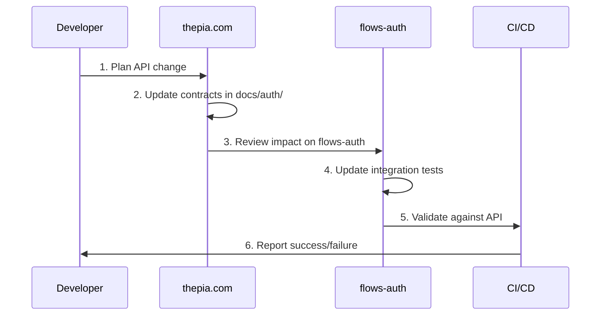
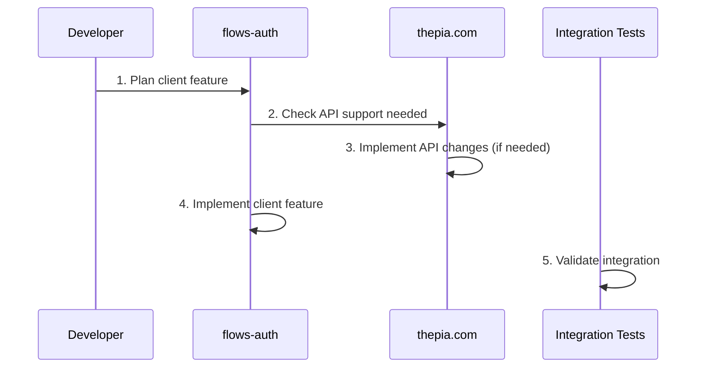

# Cross-Repository Coordination

**Change management process between thepia.com and flows-auth repositories**

## Repository Ownership Recap

### **thepia.com (Stable Production)**
- **Status**: Production-stable authentication server
- **Responsibility**: API implementation, contracts, server behavior
- **Change Philosophy**: Conservative, stability-first
- **Documentation Authority**: API contracts, test scenarios, implementation guides

### **flows-auth (Early Development)**
- **Status**: Rapid iteration on client authentication experience
- **Responsibility**: Auth UI, client integration, user experience
- **Change Philosophy**: Agile, user-experience driven
- **Documentation Authority**: Client integration strategy, testing policies

---

## Change Coordination Workflow

### **API Contract Changes (thepia.com → flows-auth)**



#### **Step-by-Step Process**

1. **Plan Change in thepia.com**
   - Document proposed change in `thepia.com/docs/auth/`
   - Identify affected API endpoints and scenarios
   - Assess backward compatibility impact

2. **Update API Contracts**
   - Modify endpoint specifications
   - Update test scenarios (maintaining scenario IDs when possible)
   - Document migration path for breaking changes

3. **Impact Assessment on flows-auth**
   - Review which integration tests reference affected scenarios
   - Identify required changes to auth-store, auth0Service
   - Plan UI/UX updates if needed

4. **Coordinate Implementation**
   - Implement thepia.com changes
   - Update flows-auth integration tests
   - Validate end-to-end functionality

### **Client Feature Changes (flows-auth → thepia.com)**



#### **Step-by-Step Process**

1. **Feature Planning in flows-auth**
   - Define user experience requirements
   - Identify API capabilities needed
   - Check existing thepia.com contracts

2. **API Requirements Assessment**
   - Determine if existing API endpoints support feature
   - Plan new endpoints or modifications needed
   - Document API contract changes required

3. **Coordinated Implementation**
   - Implement API changes in thepia.com (if needed)
   - Implement client feature in flows-auth
   - Update integration tests to cover new scenarios

---

## Communication Protocols

### **Single Team Advantage**
Since both repositories are managed by the same development team, coordination is simplified:

- **Shared context**: Full understanding of both client and server needs
- **Direct communication**: No cross-team coordination overhead
- **Unified decision making**: Single authority for prioritization

### **Documentation-First Approach**

#### **For API Changes**
1. **Document before implementing** - Update thepia.com contracts first
2. **Version scenarios** - Maintain stable scenario IDs (T001, T002, etc.)
3. **Migration guides** - Clear upgrade path for breaking changes

#### **For Client Changes**
1. **Integration test first** - Write tests that reference thepia.com scenarios
2. **API gap analysis** - Identify missing server capabilities early
3. **End-to-end validation** - Ensure complete flow works

---

## Breaking Change Management

### **Definition of Breaking Changes**

#### **API Breaking Changes (thepia.com)**
- Response schema changes (removing fields, changing types)
- Request schema changes (new required fields, validation changes)  
- HTTP status code changes
- Error code changes
- Authentication/authorization changes

#### **Client Breaking Changes (flows-auth)**
- Auth store interface changes
- Component API changes
- Event structure changes
- Configuration requirement changes

### **Breaking Change Process**

#### **Phase 1: Planning (Week -2)**
1. **Document breaking change** in respective repository
2. **Assess impact** on other repository
3. **Plan migration strategy** with backward compatibility period
4. **Set timeline** for implementation and migration

#### **Phase 2: Implementation (Week -1)**
1. **Implement with backward compatibility** when possible
2. **Create migration tools/scripts** if needed
3. **Update all documentation** including migration guides
4. **Test migration path** thoroughly

#### **Phase 3: Migration (Week 0)**
1. **Deploy backward-compatible version**
2. **Migrate dependent systems**
3. **Validate functionality** end-to-end
4. **Remove deprecated functionality** after grace period

### **Backward Compatibility Strategies**

#### **API Versioning (thepia.com)**
```typescript
// Support both old and new request formats
interface CheckUserRequest {
  email: string;
  // New optional field with default
  includeDeviceCount?: boolean; // defaults to false for compatibility
}

interface CheckUserResponse {
  userExists: boolean;
  hasPasskey: boolean;
  email: string;
  userId?: string;
  // New optional field
  deviceCount?: number; // only included if requested
}
```

#### **Feature Flags (flows-auth)**
```typescript
// Gradual rollout of new features
const features = {
  multiDeviceUI: process.env.ENABLE_MULTI_DEVICE === 'true',
  deviceManagement: process.env.ENABLE_DEVICE_MGMT === 'true'
};

if (features.multiDeviceUI) {
  // New multi-device interface
} else {
  // Legacy single-device interface
}
```

---

## Testing Coordination

### **Integration Test Strategy**

#### **Scenario Stability**
- **Scenario IDs remain stable** (T001, T002, etc.) across API changes
- **flows-auth tests continue working** even when API implementation changes
- **New scenarios added** rather than modifying existing ones when possible

#### **Test Environment Coordination**
```typescript
// Shared test environment configuration
const TEST_ENVIRONMENTS = {
  local: {
    apiUrl: 'https://dev.thepia.com:8443',
    auth0Domain: 'dev-thepia.auth0.com'
  },
  staging: {
    apiUrl: 'https://api-staging.thepia.com', 
    auth0Domain: 'staging-thepia.auth0.com'
  },
  production: {
    apiUrl: 'https://api.thepia.com',
    auth0Domain: 'thepia.auth0.com'
  }
};
```

### **Test Data Coordination**

#### **Auth0 Test Account Management**
- **thepia.com manages** Auth0 test account creation scripts
- **flows-auth references** test accounts in integration tests
- **Shared test data** ensures consistency across repositories

```typescript
// Shared test account definitions
export const TEST_ACCOUNTS = {
  // Defined in thepia.com, used by flows-auth
  withPasskey: 'test-with-passkey@thepia.net',
  multiDevice: 'test-multi-device@thepia.net', 
  suspended: 'test-suspended@thepia.net'
};
```

---

## Deployment Coordination

### **Deployment Dependencies**

#### **API-First Deployment**
1. **Deploy thepia.com API changes** first (with backward compatibility)
2. **Validate API functionality** independently
3. **Deploy flows-auth client changes** second
4. **Validate end-to-end integration**

#### **Client-First Deployment** (for new features)
1. **Deploy flows-auth with feature flags** disabled
2. **Deploy thepia.com API support**
3. **Enable feature flags** in flows-auth
4. **Monitor and validate** functionality

### **Rollback Strategy**

#### **Independent Rollback**
- Each repository can rollback independently
- Backward compatibility ensures continued operation
- Monitor for integration issues after rollback

#### **Coordinated Rollback**
- For breaking changes, coordinate rollback sequence
- API rollback first, then client rollback
- Restore to last known good state

---

## Monitoring and Alerting

### **Integration Health Monitoring**

#### **API Health (thepia.com)**
```typescript
// Monitor API contract compliance
const contractMetrics = {
  responseTime: histogram('api_response_time_seconds'),
  errorRate: counter('api_errors_total'),
  contractViolations: counter('contract_violations_total')
};
```

#### **Client Integration Health (flows-auth)**
```typescript
// Monitor client integration success
const integrationMetrics = {
  testSuccessRate: gauge('integration_test_success_rate'),
  apiConnectivity: gauge('api_connectivity_status'),
  authFlowCompletion: counter('auth_flow_completion_total')
};
```

### **Alert Coordination**

#### **Cross-Repository Alerts**
- **API errors** in thepia.com trigger flows-auth investigation
- **Integration test failures** in flows-auth trigger API contract review
- **Shared alert channels** for coordination

---

## Success Metrics

### **Coordination Effectiveness**
- **Time to resolve cross-repo issues**: < 24 hours
- **Breaking change migration time**: < 1 week
- **Integration test reliability**: > 95% success rate
- **Documentation consistency**: 100% alignment between repos

### **Development Velocity**
- **Feature delivery time**: Unimpeded by coordination overhead
- **Bug resolution time**: Clear ownership and fast resolution
- **Change confidence**: High confidence in cross-repo impacts

### **System Reliability**
- **Production stability**: No coordination-related outages
- **Integration reliability**: Consistent auth experience
- **Backward compatibility**: Smooth transitions for all changes

---

**This coordination process ensures both repositories can evolve rapidly while maintaining production stability and system integrity.**