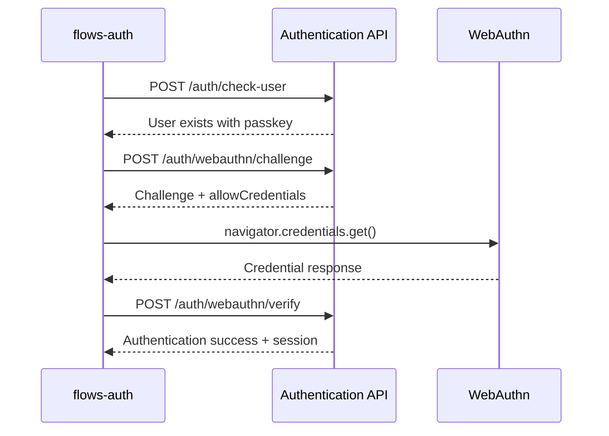

# Thepia Authentication API

**Version**: 1.0  
**Base URL**: `https://api.thepia.com`  
**Local Development**: `https://dev.thepia.com:8443`

## Overview

The Thepia Authentication API provides passwordless authentication using WebAuthn (passkeys) and magic links. This API serves both `thepia.com` and `thepia.net` domains with unified authentication.

## Key Features

- **Passwordless Only** - No traditional passwords supported
- **WebAuthn/Passkeys** - Biometric and hardware key authentication
- **Magic Link Fallback** - Email-based authentication
- **Multi-Domain Support** - Unified backend for thepia.com and thepia.net
- **Zero Cookies** - Privacy-first architecture

## Authentication Flow



## API Endpoints

### **Authentication**
- `POST /auth/check-user` - Check if user exists and has passkey
- `POST /auth/webauthn/challenge` - Get WebAuthn challenge
- `POST /auth/webauthn/verify` - Verify WebAuthn response
- `POST /auth/start-passwordless` - Start passwordless authentication (magic links)
- `POST /auth/verify-magic-link` - Verify magic link token

### **Session Management**
- `POST /auth/refresh` - Refresh authentication session
- `POST /auth/signout` - End authentication session
- `GET /auth/profile` - Get authenticated user profile

### **Health & Status**
- `GET /health` - API health check
- `GET /dev/error-reports` - Development error reporting endpoint

## Error Handling

All API endpoints return consistent error responses:

```json
{
  "error": "error_code",
  "message": "Human readable error message",
  "details": {
    "field": "Additional error context"
  }
}
```

## Rate Limiting

- **Authentication endpoints**: 10 requests per minute per IP
- **Magic link requests**: 3 requests per 5 minutes per email
- **General endpoints**: 100 requests per minute per IP

## Request/Response Format

- **Content-Type**: `application/json`
- **Character Encoding**: UTF-8
- **Date Format**: ISO 8601 UTC
- **All requests must include proper JSON formatting**

## Security Requirements

- **HTTPS Only** - All production endpoints require TLS
- **CORS Configured** - Supports thepia.com and thepia.net origins
- **WebAuthn Compliant** - Follows W3C WebAuthn specification
- **Rate Limited** - Protection against abuse

---

**For detailed endpoint specifications, see [API Contracts](./api-contracts/)**
